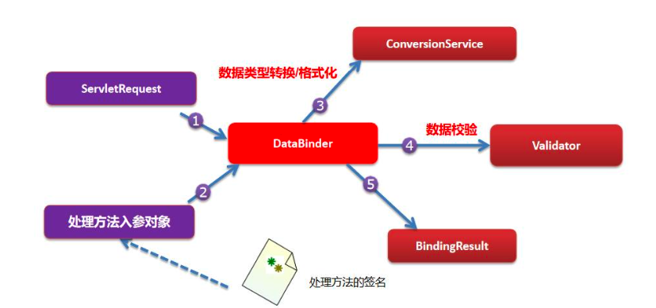

# Ssm-latter

## spring

文档,官网spring.io

### IOC

- 定义

	- 传统创建对象,需要new或者从配置文件中取出属性信息,反射创建对象,这些都需要手动去管理对象

	- ioc就是一个容器, 我们写多个对象配置文件,
然后ioc读取配置文件, 反射创建, 然后放入一个并发map中,当需要使用对象就get出来
- quickstart

  - 创建maven工程,引入依赖
  spring-version:5.3.8
  spring-context
  spring-beans
  spring-core
  spring-expression
  lombok:1.18.12
  - 创建spring配置文件.beans.xml

```xml
<bean id="user" class="bean.User">
  <property name="username" value="Alice"/>
  <property name="age" value="24"/>
</bean>
```

- 定义User实体类

  ```java
  @Data
  public class User {
    private String username;
    private Integer age;
  }
  ```

- 从容器获取bean, 从xml文件中获取的话这个容器

  ```java
  new ClassPathXmlApplicationContext("beans.xml").getBean("user");
  ```

- 类路径,SpringBeanTest.class这个类运行时的路径
  SpringBeanTest.class.getResource("").getPath()

- 类路径,SpringBeanTest.class这个类运行时的根路径
  SpringBeanTest.class.getClassLoader().getResource("").getPath()

- 遍历所有定义的bean的名字
  String[] definitionNames = ctx.getBeanDefinitionNames();

- beanFactory

1.bf的属性beanDefinitionMap类型是并发Map
2.存放的的是beans.xml中bean节点配置的bean对象的信息,
3.在beanDefinitionMap中属性table
4.table数数组,类型是ConcurrentHashMap$Node
5.因为是数组, 所有可以存放很多的bean对象信息,就是beans.xml配置
6.初始的大小是512,当超过时会自动扩容
7.通过hash算法,user对象信息保存在index=502位置上,
8.保存的类型是Node
9.key是beans.xml中id

10.value是对象的信息,属性值/类信息/是不是懒加载
11.在beanFactory中,属性singletonObjects,类型是并发Map
还有一个属性table类型是Node的数组
12,如果beans.xml文件中配置的对象是单例的, 就会初始化放到这个table里面
13.在beanfactory中,还有一个属性beanDefinitionNames
14记录类beans.xml中配置的bean的名称,方便查找

- 字段beanDefinitionMap:并发Map
从beans.xml中读取的bean配置信息

	- table:512长度
类型为Node
- key:bean的id
	
- value:bean定义信息,属性/是否单例/是否懒加载
	
- 字段:singletonObjects:并发Map
单例对象存放的地方

	- table:512长度
类型为Node
- key:bean的id
	
- value:就是实例化的对象
	
- next:指向下一个节点
		hash:hash值

- 如果在beans.xml中没有配置id,则id会默认为全类名#index配置
bean.User#0
bean.User#1
ctx.getBean("bean.User#0")

- 自定义beanFactory

  - 需求:
  使用dom4j+反射
  // 自定义一个beanFactory的singletonObjects的并发map
  // 1.解析beans.xml dom4j
  // 2.得到对象的id,class,属性和属性值
  // 3.使用反射生成对象,并赋值
  // 4.将创建好的bean对象放入singletonObjects
  // 5.提供getBean(id),可以返回对应的bean对象

  - 实现:

    ```java
    class BeanFactory_ {
      private ConcurrentHashMap<String, Object> singletonObjects = new ConcurrentHashMap<>();
      public Object getBean(String id) {
        return singletonObjects.get(id);
      }
      public BeanFactory_(String config) {
        // 读取beans.xmll文件
        SAXReader reader = new SAXReader();
        try {
          Document document = reader.read(this.getClass().getClassLoader().getResource(config));
          // ============遍历====================
          Element rootElement = document.getRootElement();
          // 获取root的直接子元素
          List<Element> elements = rootElement.elements();
          for (Element bean : elements) {
            // 获取bean的属性id
            String id = bean.attributeValue("id");
            // 获取class,反射创建对象
            String clazz = bean.attributeValue("class");
            Class<?> c = Class.forName(clazz);
            Object obj = c.newInstance();
            // 放入单例池中
            singletonObjects.put(id, obj);
            // 获取字段的属性,并且设置属性
            List<Element> properties = bean.elements("property");
            for (Element property : properties) {
              String name = property.attributeValue("name");
              String value = property.attributeValue("value");
              Field field = c.getDeclaredField(name);
              field.setAccessible(true);
              // 根据字段类型来设置值
              if (field.getType() == Integer.class) {
                field.set(obj, Integer.parseInt(value));
              } else if (field.getType() == String.class) {
                field.set(obj, value);
              }
            }
          }
        } catch (Exception e) {
          throw new RuntimeException(e);
        }
      }
    }
    ```

    

- bean配置方式

  - 基于xml

    - 获取bean的方式

      - 通过类型来获取,前提:Class只有一个实例对象
      ctx.getBean(Car.class)

      - 通过静态工厂获取bean

  ```xml
  <!--class指定静态工厂类,方法是工厂方法,可以返回bean对象, <constructor-arg表示方法参数,
  根据该参数从工厂方法中获取bean-->
  <bean id="zangxin02" class="ioc.MyStaticFactory" factory-method="getUser">
  	<constructor-arg value="zangxin"/>
  </bean> 
  ```

  // 工厂类 

  ```java
  public class MyStaticFactory {
    private static Map<String, User> userMap;
    static {
      userMap = new HashMap<>();
      userMap.put("alice", new User("alice", 23, null));
      userMap.put("zangxin", new User("zangxin", 25, null));
    }
    public static User getUser(String key) {
      return userMap.get(key);
    }
  }
  ```

  

  - 实例工厂获取bean


// 实例工厂要先创建工厂bean, 因为他的方法是非静态的

```xml
<bean class="ioc.MyInstanceFactory" id="myInstanceFactory"/>
<bean id="alice02" factory-bean="myInstanceFactory"
factory-method="getUser">
	<constructor-arg value="alice"/>
</bean>
```

```java
public class MyStaticFactory {
  private static Map<String, User> userMap;
  static {
    userMap = new HashMap<>();
    userMap.put("alice", new User("alice", 23, null));
    userMap.put("zangxin", new User("zangxin", 25, null));
  }
  public static User getUser(String key) {
    return userMap.get(key);
  }
}
```


- 通过FactoryBean获取bean(重点)


```xml
<!--这里的class指定要使用的FactoryBean
key表示就是MyFactoryBean的属性key-->
<bean id="alice03" class="ioc.MyFactoryBean">
	<property name="key" value="alice"/>
</bean>
```

```java
public class MyFactoryBean implements FactoryBean<User> {
  // 这个key就是在配置时,指定的要获取的对象对应的key
  private String key;
  private Map<String, User> userMap;

  public void setKey(String key) {
    this.key = key;
  }

  {
    userMap = new HashMap<>();
    userMap.put("alice", new User("alice", 23, null));
    userMap.put("zangxin", new User("zangxin", 25, null));
  }

  @Override
  public User getObject() throws Exception {
    return userMap.get(key);
  }

  @Override
  public Class<?> getObjectType() {
    return User.class;
  }

  @Override
  public boolean isSingleton() {
    return true;
  }
}
```

复用bean,使用parent属性

```xml
<bean id="alice04" class="bean.User" parent="alice"/>
```

 复用bean,使用abstract,只能作为parent,不能获取

```xml
<bean id="alice05" class="bean.User" abstract="true" p:username="alice05" p:age="24" p:car-ref="audi">
```
 属性注入方式

setter配置属性

\<property/\>是通过setter来设置值的,前提:对象有setter


```xml
<bean class="bean.Car" id="car">
  <property name="id" value="1"/>
  <property name="name" value="bmw"/>
  <property name="price" value="1000000"/>
</bean>
```
constructor配置属性

通过索引

```xml
<bean id="bmw" class="bean.Car">
    <constructor-arg value="2" index="0"/>
    <constructor-arg value="宝马" index="1"/>
    <constructor-arg value="400000" index="2"/>
</bean>
```
通过属性名

```xml
<bean id="bench" class="bean.Car">
    <constructor-arg value="2" name="id"/>
    <constructor-arg value="奔驰" name="name"/>
    <constructor-arg value="400000" name="price"/>
</bean>
```
 通过属性的类型

```xml
<bean id="audi" class="bean.Car">
    <constructor-arg value="2" type="java.lang.Integer"/>
    <constructor-arg value="奥迪" type="java.lang.String"/>
    <constructor-arg value="400000" type="java.lang.Double"/>
</bean>
```
通过命名空间p

```xml
<bean id="fort" class="bean.Car" p:id="3" p:name="福特" p:price="500000"/>
```
ref引用其他对象作为属性

```xml
<bean class="bean.User" id="zangxin">
  <property name="username" value="zangxin"/>
  <property name="age" value="22"/>
  <property name="car" ref="fort"/>
</bean>
<bean id="fort" class="bean.Car" p:id="3" p:name="福特" p:price="500000"/>
```
不用ref用内部bean也可以

```xml
<bean class="bean.User" id="alice">
    <property name="username" value="Alice"/>
    <property name="age" value="24"/>
    <property name="car">
        <bean class="bean.Car" p:id="4" p:name="保时捷" p:price="50000000"/>
    </property>
</bean>
```
注入集合(map,propertis,list,set)/数组类型

```xml
<bean id="manager" class="bean.Manager">
  <property name="name" value="chaos"/>
  <property name="userList">
    <!--List赋值-->
    <list>
      <ref bean="alice"/>
      <ref bean="zangxin"/>
      <bean class="bean.User" p:username="hyy" p:age="25" p:car-ref="audi"/>
    </list>
  </property>
  <!--map赋值-->
  <property name="userMap">
    <map>
      <entry key="alice" value-ref="alice"/>
    </map>
  </property>
  <!--给数组赋值-->
  <property name="userName">
    <array value-type="java.lang.String">
      <value>alice</value>
      <value>znagxin</value>
    </array>
  </property>
  <!--给set赋值-->
  <property name="userSet">
    <set value-type="bean.User">
      <ref bean="alice"/>
      <ref bean="zangxin"/>
    </set>
  </property>
  <!--给properties赋值-->
  <property name="pros">
    <props>
      <prop key="username">root</prop>
      <prop key="password">root</prop>
      <prop key="url">jdbc:mysql://localhost:3306/</prop>
    </props>
  </property>
</bean>
```
通过 util 名称空间创建 list

可以达到复用效果

```xml
<util:list id="bookList">
  <value>存在与时间</value>
  <value>西游记</value>
  <value>狼道</value>
  <value>金字塔模式</value>
  <value>红楼梦</value>
  <value>金瓶梅典藏版</value>
</util:list>

<bean id="bookStore1" class="bean.BookStore">
  <property name="bookList" ref="bookList"/>
</bean>

<bean id="bookStore2" class="bean.BookStore">
  <property name="bookList" ref="bookList"/>
</bean>
```
级联属性赋值

```xml
 <bean id="dept" class="bean.Dept"/>
<bean id="emp" class="bean.Emp">
    <property name="name" value="jack"/>
    <property name="dept" ref="dept"/>
    // 把dept的name属性设置为软件开发部门
    <property name="dept.name" value="软件开发部门"/>
</bean>
```
通过.properties文件给bean注入值


```xml
<!--指定配置文件的位置,location指定属性文件的位置,要带上classpath-->
<context:property-placeholder location="classpath:user.properties"/>
<!--使用配置文件,${}来应用配置文件中的key-->
<bean id="zangxin03" class="bean.User" p:username="${username}" p:age="${age}"/>
```
user.propeties文件要放在resources目录下,最终打包在类的根路径
username=zangxin
age=27

属性文件有中文, 需要转换成uicode编码

 bean的创建顺序

 在 spring 的 ioc 容器, 默认是按照配置的顺序创建 bean 对象

depends-on指定顺序


```xml
<bean id="student01" class="com.hspedu.bean.Student" depends-on="department01"/>
<bean id="department01" class="com.hspedu.bean.Department" />
```
会先创建 department01 对象，再创建 student01 对象

如果A引用B, B在A的前面

先创建B

再创建A并setterB


如果A,引用了(ref)B, 配置顺序A在B前面会怎么样?

 A先创建

B在创建
A setter B

bean对象的单例和多例scope和 懒加载

默认scope=singleton

使用多例 scope=prototype

细节

1.默认是单例singleton, 在启动容器时, 默认就会创建 , 并放入到singletonObjects集合

2.当 \<bean scope="prototype"\> 设置为多实例机制后, 该 bean 是在 getBean()时才创 建
3.如果是单例 singleton, 同时希望在 getBean 时才创建, 可以 指定懒加载 lazy-init="true" (注意默认是 false)

4.通常情况下, lazy-init 就使用默认值 false , 在开发看来, 用空间换时间是值得的, 除非有特殊的要求.
5.如果 scope="prototype" 这时你的 lazy-init 属性的值不管是 ture, 还是 false 都是在getBean 时候，才创建对象


bean的生命周期

1. 初始化 init 方法和 destory 方法, 是程序员来指定 
2.  销毁方法就是当关闭容器时，才会被调用.
3. 执行顺序

LifeCycle.LifeCycle 无参构造器
LifeCycle.setName setter方法
LifeCycle.init 初始化方法
使用 bean.LifeCycle@5884a914
LifeCycle.destroy 销毁方法

```xml
<!--bean的生命周期-->
<bean id="lifeCycle" class="bean.LifeCycle" init-method="init" destroy-method="destroy">
  <property name="name" value="生命周期"/>
</bean>
```
```java
public class LifeCycle {
  private String name;
  public LifeCycle() {
    System.out.println("LifeCycle.LifeCycle 无参构造器");
  }
  public void setName(String name) {
    System.out.println("LifeCycle.setName setter方法");
    this.name = name;
  }
  /**
  * init和destroy名称随便自定义
  * 要使用需要在xml中指定init-method
    */
  public void init() {
    System.out.println("LifeCycle.init 初始化方法");
  }
  public void destroy() {
    System.out.println("LifeCycle.destroy 销毁方法");
  }
}
```

测试

```java
// bean的生命周期
ClassPathXmlApplicationContext ctx = new ClassPathXmlApplicationContext("/beans.xml");
Object lifeCycle = ctx.getBean("lifeCycle");
System.out.println("使用 " + lifeCycle);
// 关闭,销毁放在只有调用关闭容器方法时,才调用
ctx.close();
```


- bean的后置处理器
- 该处理器/对象会在 bean 初始化方法调用前和初始化方法调用后被调用

```java
public class MyBeanPostProcessor implements BeanPostProcessor {
  /**

  * 在bean的init方法前被调用, 没有配置init方法也会被调用
    *
  * @param bean     传入在ioc容器中创建/配置bean对象
  * @param beanName 传入在ioc容器创建/配置bean的id
  * @return 对传入的bean进行修改/处理(如果有需要的话), 返回
    */
  @Override
  public Object postProcessBeforeInitialization(Object bean, String beanName) throws BeansException {
    System.out.println("postProcessBeforeInitialization : beanName=" + beanName + " " + bean);
    return bean;
  }
  /**
  * 在bean init方法后被调用, 没有配置init方法也会被调用
  *
  * @param bean     传入在ioc容器中创建/配置bean对象
  * @param beanName 传入在ioc容器创建/配置bean的id
  * @return 对传入的bean进行修改/处理(如果有需要的话), 返回
  */
  @Override
  public Object postProcessAfterInitialization(Object bean, String beanName) throws BeansException {
    System.out.println("postProcessAfterInitialization : beanName=" + beanName + " " + bean);
    return bean;
  }
}
```

```xml
<bean id="myBeanPostProcessor" class="bean.MyBeanPostProcessor"/>
```


// 输出

```text
LifeCycle.LifeCycle 无参构造器
LifeCycle.setName setter方法
postProcessBeforeInitialization : beanName=lifeCycle LifeCycle(name=生命周期)
LifeCycle.init 初始化方法
postProcessAfterInitialization : beanName=lifeCycle LifeCycle(name=生命周期)
使用 LifeCycle(name=生命周期)
LifeCycle.destroy 销毁方法
```

bean后置处理器对beans.xml文件中所有bean都有效

原理: AOP(反射+动态代理)

 用处:可以对 IOC 容器中所有的对象进行统一处理 ,

比如日志处理/权限的校验/安全的验证/事务管理.


- xml的自动装配autowire

  - byType

  ```xml
  <!--自动装配 autowire byType按属性的类型装配, 在ioc容器中找,
  如果有就用setter注入,如果没有或者有2个以上,就会报错,不知道装配哪一个-->
  <bean id="orderDao" class="bean.OrderDao"/>
  <bean id="orderService" class="bean.OrderService" autowire="byType"/>
  <bean id="orderController" class="bean.OrderController" autowire="byType"/>
  ```

  

  - byName(setter的name)

  ```xml
  <!--byName按id名称自动装配 会自动去找id为setXxx的id名为为Xxx的bean自动装配, 找不到就报错-->
  <bean id="orderDao" class="bean.OrderDao"/>
  <bean id="orderService" class="bean.OrderService" autowire="byName"/>
  <bean id="orderController" class="bean.OrderController" autowire="byName"/>
  ```

  

- spring el表达式

  - spring expression language, 简称为SpEL支持运行时查询并可以操 作对象。
  和 EL 表达式一样，SpEL 根据 JavaBean 风格的 getXxx()、setXxx()方法定义的属性访问
  对象,
   SpEL 使用#{...}作为定界符，所有在大框号中的字符都将被认为是 SpEL 表达式


  ```xml
  <!--spring el表达式-->
  <bean id="spELBean" class="bean.SpELBean">
    <!--使用字符赋值-->
    <property name="name" value="#{'zangxin'}"/>
    <!--引用对象属性赋值-->
    <property name="username" value="#{zangxin03.username}"/>
    <!--引用对象赋值-->
    <property name="user" value="#{zangxin}"/>
    <!--普通方法返回值赋值-->
    <property name="crySound" value="#{spELBean.cry('喵喵喵')}"/>
    <!--静态方法返回值赋值-->
    <property name="bookName" value="#{T(bean.SpELBean).read('存在与时间')}"/>
    <!--计算-->
    <property name="result" value="#{3.14*2*2}"/>
  </bean>
  ```

  

- 基于注解

  - 开启注解

  - 注解需要aop依赖spring-aop
    在xml文件中加入注解扫描

    ```xml
    <!--开启注解扫描-->
    <context:component-scan base-package="baseonannot.commponent"/>
    ```

    

  - 组件注解

  	- 下面组件可以被spring扫描放入容器中
  1.@Component 通用组件
  2.@Controller 标识一个控制器对象(在springmvc是有特定含义)
  3.@Service 标识业务层对象
  4.@Repository 标识持久层对象
  - Spring 的 IOC 容器不能检测一个使用了@Controller 注解的类到底是不是一个真正的控 制器。注解的名称是用于程序员自己识别当前标识的是什么组件。其它的@Service @Repository 也是一样的道理 [也就是说spring的IOC容器只要检查到注解就会生成对象， 但是这个注解的含义 spring 不会识别，注解是给程序员编程方便看的]
  	
  - 单例和多例@Scope注解

  	- prototypes 多例
  singleton 单例(默认)

  - 包扫描细节

    - 只扫描特定类文件

    ```xml
    <context:component-scan base-package="com.hspedu.spring.component" resource-pattern="User*.class" />
    ```

    resource-pattern="User*.class": 表示只扫描满足要求的 类.[使用的少，不想扫描，不写注解就可以, 

    - 不扫描某些注解

    ```xml
    <!-- 排除哪些类 , 以 annotaion 注解为例,不扫描标注了Controller的注解 --> 
    <context:component-scan base-package="baseonannot.commponent">
      <context:exclude-filter type="annotation" expression="org.springframework.stereotype.Controller"/>
    </context:component-scan>
    ```

    - 扫描某些注解

    ```xml
    <!--只扫描特定注解, service和dao-->
    <context:component-scan base-package="baseonannot.commponent" use-default-filters="false">
     <context:include-filter type="annotation" expression="org.springframework.stereotype.Service"/>
     <context:include-filter type="annotation" expression="org.springframework.stereotype.Repository"/>
    </context:component-scan>
    ```

    

  - 注解默认名字

  	- 默认类名首字母小写作为id的值(concurrentHashpMap的key)

  	- 也可以使用注解的value属性来设置id值
  @Repository("dao")
  public class UserDao {}

  - 手撕注解

    - 1.在beans.xml中配置了包扫描的路径,指定要扫描的包
      2.ClassPathXmlApplicationnContext加载beans.xml文件,
      3.根据包扫描来找到标有有注解的类
      4.实例化对象,放入到容器中,singletonObjects
      5.提供getBean方法

```java
/**
 * 组件,被注解修饰的类都会被扫描
 */
@Target(ElementType.TYPE)
@Retention(RetentionPolicy.RUNTIME)
public @interface MyComponent {
  String value() default "";
}
```


```java
/**
* 根据传入的MySpringConfig去扫描包
*/
public class MyAnnotationFactory {
  private Class configClass;
  /**
   * 存放对象, key=id, value=对象
   */
  private final ConcurrentHashMap<String, Object> ioc = new ConcurrentHashMap<>();
  public MyAnnotationFactory(Class config) throws Exception {
    this.configClass = config;
    Annotation anno = configClass.getDeclaredAnnotation(MyComponentScan.class);
    if (anno instanceof MyComponentScan ms) {
      String path = ms.value();
      // 包->路径: baseonannot/commponent
      path = path.replace(".", "/");
      ClassLoader classLoader = MyAnnotationFactory.class.getClassLoader();
      String dirPath = classLoader.getResource(path).getPath();
      File file = new File(dirPath);
      File[] files = file.listFiles();
      // 遍历路径下的.class文件,有注解才加入到容器
      for (File f : files) {
        String ap = f.getAbsolutePath();
        // 不是字节码文件,不处理
        if (!ap.endsWith(".class")) {
          continue;
        }
        // 获取类名: UserDao
        String className = ap.substring(ap.lastIndexOf("/") + 1, ap.lastIndexOf("."));
        // 结果全类名: baseonannot.commponent.UserService
        String fullName = path.replace("/", ".") + "." + className;
        // 反射加载类, forName和loadClass的区别是:forName会执行调用该类的静态方法,下面的方式不会
        Class<?> clazz = classLoader.loadClass(fullName);
        // 如果没有MyComponent注解就不加入容器里去
        MyComponent cptAnno = clazz.getDeclaredAnnotation(MyComponent.class);
        if (cptAnno == null) {
          continue;
        }
        // 反射创建对象
        Class<?> targetClass = Class.forName(fullName);
        Object obj = targetClass.newInstance();
        // 设置默认的id
        String id = cptAnno.value();
        if (id.equals("")) {
          id = className.substring(0, 1).toLowerCase(Locale.ROOT) + className.substring(1);
        }
        ioc.put(id, obj);
      }
    }
  }

  public Object getBean(String id) {
    return ioc.get(id);
  }

  public Map<String, Object> getIoc() {
    return ioc;
  }
}
```


```java
/**
* 类似于beans.xml
* 该类标识了一个注解@componentScan
* 告诉要扫描哪些包
*/
@MyComponentScan(value = "baseonannot.commponent")
class MySpringConfig {}
```


```java
/**
 * 指定扫描的包路径
 */
@Target(ElementType.TYPE)
@Retention(RetentionPolicy.RUNTIME)
@interface MyComponentScan {
  String value() default "";
}
```


```
细节
反射加载类, forName和loadClass的区别是:
forName会执行调用该类的静态方法,
classLoader.loadClass不会
```
// 首字母小写-spring的stringUtils工具类
id = StringUtils.uncapitalize(className)


 自动装配

 在 IOC 容器中查找待装配的组件的类型，如果有唯一的 bean 匹配，则使用该 bean 装配

如待装配的类型对应的 bean 在 IOC 容器中有多个，则使用待装配的属性的属性名作为 id 值再进行查找, 找到就装配，找不到就抛异常

可以和@Qualifier("userDao")配合使用,指定id

 @Resource,这个是jdk的注解,版本高于8的需要额外引入依赖

name属性 bean 的名字

type属性 bean 的类型

所以如果使用 name 属 性,则使用 byName 的自动注入策略,而使用 type 属性时则使用 byType 自动注入策略

如果@Resource 没有指定 name 和 type,则先使用byName注入策略, 如果匹配不上, 再使用 byType 策略, 如果都不成功，就会报错

泛型依赖注入

在泛型父类中注入, 子类就不用注入了

```java
public abstract class BaseDao<T> {
  public abstract void save();
}
```


```java
public abstract class BaseService<T> {
  @Autowired
  private BaseDao<T> baseDao;
  public void save() {
    baseDao.save();
  }
}
```
后置处理器

init和destroy方法变成两个接口了

InitializingBean 对应init方法,在setter后面执行

DisposableBean 对应destroy, 在close容器前执行

如果bean的scope是prototype, 那么每次getBean一次都会创建一次bean, 也会调用无参,setter,init,后置处理器

prototype时不再调用destroy方法了


### AOP

- 一个需求,统计方法执行耗时

  - 传统方法,使用模板方法

  ```java
  public abstract class Vehicle {
    protected abstract void run0();
    public void run() {
      System.out.println("计时开启");
      run0();
      System.out.println("计时结束");
    }
  }
  public class Car extends Vehicle{
    @Override
    public void run0() {
      System.out.println("小汽车行驶");
    }
  }
  public class RunVehicle {
    public static void main(String[] args) {
      run(new Car());
    }
  
    public static void run(Vehicle vehicle) {
      vehicle.run();
    }
  }
  ```

  

- 动态代理(核心)

  - 动态代理核心

    ```java
    public class VehicleProxyProvider {
    /**
    * 被代理的对象
    */
      private Vehicle targetVehicle;
    /**
    * 获取代理对象的方法
    */
      public Vehicle getProxy() {
        /**
        * 调用处理器: 作用是对方进行增强功能:前置或者后置进行处理
        * targetVehicle 被代理的对象
        * method 被代理的方法
        * args 被代理方法的参数
        * proxy 代理对象
        */
        InvocationHandler handler = (proxy, method, args) -> {
          System.out.println("前置处理");
          // 这里反射调用被代理对象的方法,如果有结果就返回
          Object result = method.invoke(targetVehicle, args);
          System.out.println("后置处理");
          return result;
        };
        Class clazz = this.targetVehicle.getClass();
        /**
        * 这里创建一个代理对象
        * 参数分别是被代理对象的: 类加载器, 被代理对象的接口, 以及调用处理器
          */
        Vehicle obj = (Vehicle) Proxy.newProxyInstance(clazz.getClassLoader(),
                                                       clazz.getInterfaces(), handler);
        return obj;
      }
      public VehicleProxyProvider(Vehicle targetVehicle) {
        this.targetVehicle = targetVehicle;
      }
    }
    ```

    

    // 测试

     ```java
    VehicleProxyProvider provider = new VehicleProxyProvider(new Car());
    Vehicle proxy = provider.getProxy();
    proxy.run();
     ```

    

  - 引入横向切入点

    ```java
    SmartAnimal proxyAnimal = (SmartAnimal) Proxy.newProxyInstance(dog.getClass().getClassLoader(),
    dog.getClass().getInterfaces(), (proxy, method, params) -> {
        try {
            System.out.printf("[前置通知]日志-方法名-%s-参数 %s %s\n", method.getName(), params[0], params[1]);
            Object result = method.invoke(dog, params);
            System.out.printf("[返回后通知]日志-方法名-%s-结果 result= %s\n", method.getName(), result);
            return result;
        } catch (Exception e) {
            System.out.println("[异常通知]发生异常");
        } finally {
            System.out.println("[后置通知]一定会执行的东西");
        }
        return null;
    });
    ```

    

  - 进一步的简易的切面类

  ```java
  // 自定义切面类 
  public class MyAspect {
    public static void afterReturn(Object proxy, Method method, Object result) {
      System.out.printf("[返回后通知]日志-方法名-%s-结果 result= %s\n", method.getName(), result);
    }
    public static void before(Object proxy, Method method, Object[] params) {
      System.out.printf("[前置通知]日志-方法名-%s-参数 %s %s\n", method.getName(), params[0], params[1]);
    }
  }
  // 代理方法
  MyAspect.before(proxy,method, params);
  Object result = method.invoke(dog, params);
  MyAspect.afterReturn(proxy,method, result);
  ```

  - 缺点: 只有实现对应接口的方法才能增强方法
  灵活性差--默认对所有方法进行增强
  硬编码--->完美的解决方案AOP的引出

- aop

	- aspect oriented programming面相切面编程

	- 就是在切面类中写方法, 可以指定这些方法在目的类的任意位置去执行

	- 实现方式

		- 基于动态代理的方式[内置 aop 实现],前面就是

		- aspectj框架

- aspectj

  - 1.引入aspectj包
  aspectjweaver:1.9.5
  aspectjrt:1.9.5
  spring-aspects:5.3.8

  - 2.在beans.xml中配置开启aspectj自动代理

    ```xml
    <aop:aspectj-autoproxy/>
    ```

  - 五种通知方法

  	- 对应try-catch-finally位置
  @Before
  // 目标方法的位置
  @AfterReturning
  @AfterThrowing
  @After
  // 结合四个的环绕通知
  @Around

  - quickstart

```java
@Aspect // 表示是一个切面类
@Component // 标记-加入spring ioc容器
public class SmartAnimalAspect {
  @Before("execution(public int aop.aspectj.SmartDog.getSum(..))")
  private void before(JoinPoint joinPoint) {
    String methodName = joinPoint.getSignature().getName();
    Object[] args = joinPoint.getArgs();
    System.out.printf("[前置通知]日志-方法名-%s-参数 %s %s\n", methodName, args[0], args[1]);
  }
}
```

细节

 1.切入表达式的更多配置，比如使用模糊配置

@Before(value="execution(* com.hspedu.aop.proxy.SmartDog.*(..))")

2.表示所有访问权限，所有包的下所有有类的所方法，都会被执行该前置通知方法

3.@Before(value="execution(* *.*(..))")

3.当 spring 容器开启了 开启基于注解的 AOP 功能  \<aop:aspectj-autoproxy/\> , 获取注入的对象, 需要以接口的类型来获取, 因为你注入的对象.getClass() 已经是代理类型了!

4.当 spring 容器开启了 开启基于注解的 AOP 功能  \<aop:aspectj-autoproxy/\>,  获取注入的对象, 也可以通过 id 来获取, 但是也要转成接口类型

5.如果按类型获取, 则不能使用子类型,只能使用接口类型来获取, 然而接口类型的子类只有一个,才能获取,因为会报found 2错误

6.可以使用id来获取,但是要用接口来接收,因为代理对象是一个接口的子类, 但是绝对不是子类类型,会报类型转换异常

 7.不可以去掉子类上的@Component注解,

容器中没有子类型的bean, 就算有也获取不到, 只有代理bean

```java
UsbInterface camera = (UsbInterface) ctx.getBean("camera"); 正确✅
```
```java
Camera camera1 = ctx.getBean(Camera.class); ❌错误
```

8.总结

通过id来获取,使用接口来接收

切入表达式

execution([权限修饰符] [返回类型] [简单类名/全类名] \[方法名\]([参数列表]) )

切入表达式也可以指向类的方法, 这时切入表达式会对该类/对象生效

切入表达式也可以指向接口的方法, 这时切入表达式会对实现了接口的类/对象生效

 切入表达式也可以对没有实现接口的类

使用cglib

jdk代理和cglib代理

jdk 动态代理 必须有接口, 只能增强接口中定义的方法

动态代理可以不改变原来代码的情况下,增强方法功能

jdk动态代理原理: 实现父接口

cglib动态代理 没有接口也行, 但是类不能声明为final

cglib动态代理原理: 继承原来的类,重写父类方法

JoinPoint,切入点

```java
public void beforeMethod(JoinPoint joinPoint){}
```


常用方法

```java
joinPoint.getSignature().getName(); // 获取目标方法名
joinPoint.getSignature().getDeclaringType().getSimpleName(); // 获取目标方法所属 类的简单类名
joinPoint.getSignature().getDeclaringTypeName(); // 获取目标方法所属类的类名
joinPoint.getSignature().getModifiers(); // 获取目标方法声明类型(public、private、protected)
Object[] args = joinPoint.getArgs(); // 获取传入目标方法的参数，返回一个数组 
joinPoint.getTarget(); // 获取被代理的对象
joinPoint.getThis(); // 获取代理对象自己
```
返回通知获取结果

在返回通知afterReturn那里获取,那里可以拿到返回结果

```java
/**
* 获取返回值
* returning = "res" 和 Object res 参数名必须保持一致
*/
@AfterReturning(value = "execution(public * NoInterfaceCar.run())", returning = "res")
public void noInterfaceAfterReturn(JoinPoint joinPoint, Object res) {
  System.out.println("返回结果 res=" + res);
}
```


- 在异常通知中获取异常信息
AfterThrowing

	- 

```java
/** 
* 获取异常信息
* throwing = "ex" 和参数Throwable ex 名字保持一致
*/
@AfterThrowing(value = "execution(public * NoInterfaceCar.run())", throwing = "ex")
public void noInterfaceAfterThrowing(JoinPoint joinPoint, Throwable ex) {
  System.out.println("发生了异常: " + ex.getMessage());
}
```


- 环绕通知,可以完成上面4个通知
  Around

  ```java
  @Around("execution(*  TestAroundAdvice.run(..))")
  public Object testAround(ProceedingJoinPoint joinPoint) {
    Object result = null;
    try {
      Object[] args = joinPoint.getArgs();
      System.out.println("前置通知[方法参数] " + Arrays.toString(args));
      result = joinPoint.proceed(args);
      System.out.println("返回通知[返回结果] " + result);
    } catch (Throwable e) {
      System.out.println("异常通知: " + e.getMessage());
      throw new RuntimeException(e);
    } finally {
      System.out.println("后置通知:");
    }
    return result;
  }
  ```

  

- 切入点表达式复用

  - 定义切入点表达式
  使用时直接引用,提高了复用性

  - 定义

    ```java
    @Pointcut("execution(int aop.aspectj.NoInterfaceCar.*(..))")
    public void myPointCut() {}
    ```

    

  - //使用

    ```java
    @Before("myPointCut()")
    public void noInterfaceBefore() {
      System.out.println("在NoInterfaceCar.run之前");
    }
    @AfterReturning(value = "myPointCut()", returning = "res")
    public void noInterfaceAfterReturn(JoinPoint joinPoint, Object res) {
      System.out.println("返回结果 res=" + res);
    }
    ```

- 多个切面的执行顺序

  - 可以用@Order来指定顺序, 数字越小优先级越高

  - 顺序或Filter顺序一致的, 都是往返跑模式,栈数据结构


  ```java
  @Aspect
  @Component
  @Order(1)
  public class Aspect1 {}
  ```

  ```java
  @Aspect
  @Component
  @Order(2)
  public class Aspect2 {}
  ```

  


```text
// 执行结果
Aspect1[前置通知]
Aspect2[前置通知]
小狗汪汪汪叫😊❤️~~~~
Aspect2[返回后通知])
Aspect2[后置通知]
Aspect1[返回后通知])
Aspect1[后置通知]
```


- 基于xml配置aop

  - xml配置

```xml
<!--使用xml配置aop切面编程-->
<!--配置一个切面类对象-->
<bean id="dogAspect" class="aop.xmlconfig.Aspect1Xml"/>
<!--配置一个Dog对象-->
<bean id="dog" class="aop.xmlconfig.Dog"/>
<!--配置一个切面类, 细节引入aop命名空间-->
<aop:config>
  <!--指定切入点,切入点标签要放在切面标签前面-->
  <aop:pointcut id="myPointCut" expression="execution(* aop.xmlconfig.Dog.*(..))"/>
  <!--指定切面类对象-->
  <aop:aspect ref="dogAspect" order="10">
    <aop:before method="before" pointcut-ref="myPointCut"/>
    <aop:after-returning method="afterReturn" pointcut-ref="myPointCut" returning="res"/>
    <aop:after-throwing method="afterThrowing" pointcut-ref="myPointCut" throwing="ex"/>
    <aop:after method="after" pointcut-ref="myPointCut"/>
  </aop:aspect>
</aop:config>
```


### 后置处理器深入

- AOP和后置处理器的关系

  - 现象

  	- // 切面编程, 在init前是原生对象, 在init后就是代理对象了
  postProcessBeforeInitialization在bean的init方法之前调用 class diy.aop.MyCal
  MyCal--init~~~
  postProcessAfterInitialization在bean的init方法之后调用 class jdk.proxy2.$Proxy19

  - AOP底层是基于BeanPostProcessor的

  - 原理

    - 引入注解@EnableAspectJAutoProxy

      - 自动为被 @Aspect 标记的切面类创建代理，使切面中的通知（Advice）能够拦截目标 Bean 的方法调用。
      - 取代\<aop:aspectj-autoproxy\> 配置
      - 属性proxyTargetClass

      	- 控制代理类型。若为 true，强制使用 CGLIB 基于类的代理；若为 false，对接口使用 JDK 动态代理，否则回退到 CGLIB

      	- 目标类未实现接口时需设为 true
      - 使用案例

```java
@Configuration
@EnableAspectJAutoProxy(proxyTargetClass = true, exposeProxy = true)
@ComponentScan(basePackages = "com.example")
public class AppConfig {
  // 其他 Bean 定义
}
```

```java
@Aspect
@Component
public class LoggingAspect {
  @Before("execution(* com.example.service.*.*(..))")
  public void logBefore(JoinPoint joinPoint) {
    System.out.println("方法执行前: " + joinPoint.getSignature().getName());
  }
}
```

工作原理

注册后置处理器

通过 @Import(AspectJAutoProxyRegistrar.class) 注册 AnnotationAwareAspectJAutoProxyCreator，该后置处理器在 Bean 初始化时生成代理。

切面检测与代理创建

Spring 容器扫描所有 @Aspect 类，根据切点表达式匹配目标 Bean，并在必要时创建代理以织入通知。

手撕SpringAOP

补充知识

类加载器

Bootstrap  对应路径jre/lib

Ext类加载器 jre/lib/ext

App类加载器 对应路径classpath

容器常用一个方法, 根据一个类是否实现来某个接口, 来判断是否要执行某个业务逻辑,这个就是接口编程

典型的就是标记接口,一个方法都没有, 它的价值就是,用来判断

isAssignableFrom 判断的左边是不是右边的爸爸。

流程

1.读取beans.xml文件中包扫描标签
2.扫描指定包下的.class文件
3.扫描的class信息放入BeanDefinition对象中,再放入到map中
4.初始化单例池,如果bean是单例的就实例化,放入到单例池map中
5.getBean(id)方法的实现
6,如果bean不存在(definitionMap中不存在),抛出异常
7.如果bean是单例的,从singleton池中获取
8.如果这个对象是prototype则,创建bean对象,并返回

9.依赖注入,创建bean时遍历字段,找出有Autowire标记
10.后置处理器机制-->在createBean时在init方法前后执行
11.在后置处理器机制上实现AOP--> 在后置处理器的After方法中执行

```
代码太多了: 参考包diy.diyspring.ioc.SpringApplicationContext
```

### JdbcTemplate

- spring自己的数据访问工具类, 将Jdbc的常用操作封装为模板方法

- 使用

  - 引入依赖

    - mysql-connector-j:8.4.0
    c3p0:0.9.1.2
    spring-jdbc:5.3.8
    spring-orm:5.3.8
    spsring-tx:5.3.8

    - 引入jdbc.propeties

    ```properties
    driverClassName=com.mysql.cj.jdbc.Driver
    url=jdbc:mysql://localhost:3306/spring?rewriteBatchedStatements=true
    username=root
    password=root
    ```

    

    - xml引入数据源

    ```xml
    <context:property-placeholder location="classpath*:jdbc.properties"/>
    <bean id="dataSource" class="com.mchange.v2.c3p0.ComboPooledDataSource">
      <property name="user" value="${username}"/>
      <property name="password" value="${password}"/>
      <property name="jdbcUrl" value="${url}"/>
      <property name="driverClass" value="${driverClassName}"/>
    </bean>
    
    <bean id="jdbcTemplate" class="org.springframework.jdbc.core.JdbcTemplate">
      <property name="dataSource" ref="dataSource"/>
      <property name="lazyInit" value="false"/>
    </bean
    ```

```java
// 测试类
ClassPathXmlApplicationContext ctx;
JdbcTemplate jdbcTemplate;

@BeforeEach
void before() throws Exception {
    ctx = new ClassPathXmlApplicationContext("jdbcTemplate.xml");
    jdbcTemplate = ctx.getBean(JdbcTemplate.class);
}
```


- 查询

  - BeanPropertyRowMapper

    把bean属性映射到结果集的一行的映射器,
    要注意结果集字段要和bean字段名字一样,
    不一样时使用 user_name as username这样的方式起别名

  - 查询Scalar

    ```java
    String sql = "select count(*) from monster";
    Integer count = jdbcTemplate.queryForObject(sql, Integer.class);
    ```

  - 查询一行

    ```java
    String sql = "select * from monster where id = ?";
    Monster monster = jdbcTemplate.queryForObject(sql, new BeanPropertyRowMapper<>(Monster.class), 301);
    ```

  - 查询多行

    ```java
    String sql = "select * from monster";
    List<Monster> monsters = jdbcTemplate.query(sql, new BeanPropertyRowMapper<>(Monster.class));
    // 有条件的
    sql = "select * from monster where id >= ?";
    jdbcTemplate.query(sql, new BeanPropertyRowMapper<>(Monster.class), 300);
    ```

    

- DDL

  - 插入

  ```java
  String sql = "INSERT INTO monster VALUES(null, ?, ?)";
  int update = jdbcTemplate.update(sql, "孙悟空", "猴毛分身");
  ```

  - 修改

  ```java
  String sql = "update monster set skill = ? where id= ?";
  int rows = jdbcTemplate.update(sql, "大闹天宫", 301);
  ```

  - 删除

  ```java
  String sql = "delete from monster where id = ?";
  int rows = jdbcTemplate.update(sql, 307);
  ```

  

- 批量处理

  - 批量插入

  ```java
  String sql = "INSERT INTO monster VALUES(null, ?, ?)";
  List<Object[]> bachArgs = new ArrayList<>();
  bachArgs.add(new Object[]{"牛魔王", "芭蕉扇"});
  bachArgs.add(new Object[]{"白骨精", "幻化欺骗"});
  bachArgs.add(new Object[]{"金角大王", "葫芦吸人"});
  int[] rows = jdbcTemplate.batchUpdate(sql, bachArgs);
  Assertions.assertTrue(rows.length == 3);
  for (int row : rows) {
    // row=-2, 也是成功的标识,当你jdbc.url有rewriteBatchedStatements参数会返回-2
    // row=1,没有上面的参数
    System.out.println(row);
  }
  ```

  

- NamedParameterJdbcTemplate

  - 引入配置

    ```xml
    <bean id="nPJdbcTemplate" class="org.springframework.jdbc.core.namedparam.NamedParameterJdbcTemplate">
      <constructor-arg name="dataSource" ref="dataSource"/>
    </bean>
    ```

      nPJdbcTemplate = ctx.getBean(NamedParameterJdbcTemplate.class);

  - insert

  ```java
  /**
  * 1.使用api: int update(String sql, Map<String, ?> paramMap)
  * 2.准备参数[:id, :name, :skill]
  */
  String sql = "INSERT INTO monster VALUES(:id, :name, :skill)";
  Map<String, Object> paramMap = new HashMap<>();
  paramMap.put("id", null);
  paramMap.put("name", "老鼠精");
  paramMap.put("skill", "夜间行动");
  int rows = nPJdbcTemplate.update(sql, paramMap);
  System.out.println("rows = " + rows); // 1
  // insert2
  // api: int update(String sql, SqlParameterSource paramSource)
  // 这里的:id等参数应该和对象属性名保持一致
    String sql = "INSERT INTO monster VALUES(:id, :name, :skill)";
  Monster monster = new Monster(null, "黑熊精", "偷袈裟");
  // 把bean属性映射为参数
  BeanPropertySqlParameterSource bp = new BeanPropertySqlParameterSource(monster);
  int update = nPJdbcTemplate.update(sql, bp); // 1
  ```

  
### 声明式事务

综合使用ioc,aop,jdbc

- 传统事务

```java
try {
  String sql1 = "update account set balance = balance-100 where id = 1";
  String sql2 = "update account set balance = balance+100 where id = 2";
  connection = JdbcUtil.getConnection();
  // 关闭自动提交事务
  connection.setAutoCommit(false);
  // 执行多个sql
  ps = connection.prepareStatement(sql1);
  ps = connection.prepareStatement(sql2);
  int x = 1/0; // 发生异常
  // 提交事务
  connection.commit();
} catch (Exception e) {
  // 发生异常时回滚事务
  connection.rollback();
  e.printStackTrace();
} finally {
  // 关闭连接,释放资源
  JdbcUtil.close(null, ps, connection);
}
```

- 手动提交管理事务, sql代码不能复用

- 什么是声明式事务

  - 使用

    1.配置数据源和事务管理及开启事务的注解驱动

  ```xml
  <context:property-placeholder location="classpath*:jdbc.properties"/>
  <context:component-scan base-package="tx"/>
  <!--配置数据源-->
  <bean id="ds" class="com.mchange.v2.c3p0.ComboPooledDataSource">
    <property name="user" value="${username}"/>
    <property name="password" value="${password}"/>
    <property name="jdbcUrl" value="${url}"/>
    <property name="driverClass" value="${driverClassName}"/>
  </bean>
  <!--配置jdbcTemplate-->
  <bean id="jdbcTemplate" class="org.springframework.jdbc.core.JdbcTemplate">
    <property name="dataSource" ref="ds"/>
    <property name="lazyInit" value="false"/>
  </bean>
  <!--配置事务管理器-->
  <bean id="tx" class="org.springframework.jdbc.datasource.DataSourceTransactionManager">
    <!--配置数据源,对哪个数据源进行事务管理-->
    <property name="dataSource" ref="ds"/>
  </bean>
  <!--开启基于注解的事务管理-->
  <tx:annotation-driven transaction-manager="tx"/>
  ```

  2.在业务方法上添加注解@Transactional

  - 声明式事务

    - 把一句sql对应成一个dao方法
    涉及到多张表的业务把多个dao的sql封装成一个业务方法, 在业务方法这个切入点上进行事务处理

  - 原理

    - DataSourceTransactionManager

    	- 有三个方法doBegine,doCommit,doRollback

    	- doBegine

    		- 检测是否开启自动提交事务, 如果开启,就关闭

    	- doCommit和doRollback

    		- 提交事务和回滚事务

    	- 底层原理使用cglib动态代理, 代理了加了@Transactional注解的的方法, 如果发生异常就doRollback,否就doCommit

- 事务的传播机制
  propagation

  - 定义: 在一个事务方法中又调用另一个事务方法, 怎么处理事务呢?

  - REQUIRED(默认)

  	- 如果有事务在运行, 当前方法就在这个事务内运行, 如果没有事务运行, 就开启一个新事物

  		- 自始至终只有一个事务

  - REQUIRES_NEW

    - 当前方法必须开启新事物, 在他自己的事务中运行, 如果有事务正则运行,则将他挂起

    	- 独立的事务

    - f1{f2,f3}

      f2失败不影响f3,f3失败也不影响f2

    ```java
    /**
     * 1.multiplyBuyByTx()有两次购买操作
     * 2.buyGoodsByTx和buyGoodsByTx2都是声明式事务
     * 3.buyGoodsByTx和buyGoodsByTx2使用的属性是默认的REQUESTED
     * 即: 当做一个事务进行管理, 如果buyGoodsByTx2失败,buyGoodsByTx也会回滚
     * 4.如果使用REQUIRES_NEW属性, 则buyGoodsByTx2失败, buyGoodsByTx不会回滚
       */
      @Transactional
      public void multiplyBuyByTx() {
      //@Transactional public void buyGoodsByTx(..){}
      goodService.buyGoodsByTx(1, 1, 1);
      goodService.buyGoodsByTx2(1, 1, 1);
    }
    ```

    

 * - SUPPORTS

	- 如果有事务在运行,当前方法就在这个事务中运行, 否则他可以不运行在事务中

    		- 有就用,没有就不用
   
    - NO_SUPPORT

	- 当前方法不应该运行在事务中, 如果事务,则将他挂起
	
- MANDATORY
	
	- 当前方法必须在事务中运行, 没有事务,就抛出异常
	
- Nerver
	
	- 有事务,抛出异常
	
- NESTED
	
	- 如果有事务, 就在事务中运行, 没有就启动一个新的事物,并在他自己的事物中运行

- 事务的隔离级别isolation

  - mysql事务概要

    - 脏读: 一个事务读取了另一个未提交事务修改的数据。

      - 场景 :

        事务 A 修改了某行数据（未提交）。

        事务 B 读取了该行数据。

        事务 A 回滚了修改，导致事务 B 读到了无效的“脏数据”。

      - 解决 READ COMMITTED 及以上

    - 不可重复读同一事务内，多次读取同一行数据，结果不一致（因其他事务修改并提交了该行数据)

      场景: 事务 A 第一次读取某行数据。事务 B 修改该行数据并提交。事务 A 再次读取该行数据，结果不同。

       解决: REPEATABLE READ 及以上

    幻读（Phantom Read）:同一事务内，多次查询同一范围的数据，结果集的行数不同（因其他事务插入或删除了符合该范围的数据并提交）

    场景: 事务 A 第一次查询某个范围的数据。

    事务 B 插入或删除了符合该范围的数据并提交。

    事务 A 再次查询，发现结果集中多了或少了行（“幻影行”）。

    解决: SERIALIZABLE 隔离级别或者MySQL 的 REPEATABLE READ 结合间隙锁（Gap Locks）避免幻读。

    锁

    行锁

    1.SELECT ... FOR UPDATE 是显式加锁机制，用于保护现有行的修改权

    2.其他事务无法对被锁定的行执行修改（如 UPDATE、DELETE）或加其他排他锁。
    3.必须配合事务使用
    4.若查询未使用索引，可能升级为 表锁（InnoDB 会退化为锁全表


```mysql
BEGIN;
SELECT * FROM orders WHERE user_id = 100 FOR UPDATE; -- 锁定 user_id=100 的订单行
UPDATE orders SET status = 'paid' WHERE user_id = 100;
COMMIT;
```
间隙锁: 间隙锁 是 InnoDB 在 REPEATABLE READ 下自动加的锁，用于防止幻读

spring事务隔离级别

DEFAULT 在默认情况下, 声明式事务隔离使用数据库的默认隔离级别, mysql是REPEATABLE_READ

READ_UNCOMMITTED

READ_COMMITTED

REPEATABLE_READ

SERIALIZABLE

事务找超时回滚timeout
以秒为单位

- 此事务的超时时间（以秒为单位）。
默认为底层事务系统的默认超时时间。
专为与 Propagation.REQUIRED 或 Propagation.REQUIRES_NEW 配合使用而设计，因为它仅适用于新启动的事务。

- 默认值是-1, 表示使用mysql默认事务超时时间

## springMVC

### 定义

- springmvc是web层框架

	- 接管了web层组件
控制器,视图,视图解析,返回给用户数据格式,支持mvc的开发模式

	- springMVC通过注解,让pojo成为控制器, 不需要继承HttpServlet类或者接口, 耦合度更低

	- 支持REST风格的URL请求

	- springmvc基于spring

	- springmvc底层是Servlet(javaEE标准)

- 和springboot的关系

	- boot集成了springmvc,spring是一个整合框架, 更容易使用

	- 而且boot配置更简单, 不用选依赖版本号, 因为boot都给你定好了

### 使用+quickstart

- 引入依赖

	- spring-web
spring-webmvc
5.3.8
javax.servlet-api:3.1.0
jsp-api:2.2
参考springmvc_的pom.xml文件

- 创建javaweb工程

  ```java
  @Controller
  public class UserController {
    /**
  
   * 响应用户的登录请求
   * 指定路径 @RequestMapping(value = "/login")
   * 类似于  @WebServlet(urlPatterns = "/login"),
   * 就是让url映射到这个login方法上
   * 当访问http://localhost/springmvc/login时就会调用该方法
   * return "login_ok"; 表示返回结果给视图解析器
   * 视图解析器根据配置, 来决定跳转页面
     */
    @RequestMapping(value = "/login")
    public String login() {
      return "login_ok";
    }
  }
  ```

  

- 在web.xml配置前端控制接管所有请求
  顺便启动springmvc容器

  ```xml
  <servlet>
    <!--配置前端控制器, 接管用户的所有请求-->
    <servlet-name>DispatcherServlet</servlet-name>
    <servlet-class>org.springframework.web.servlet.DispatcherServlet</servlet-class>
    <init-param>
      <param-name>contextConfigLocation</param-name>
      <param-value>classpath*:ApplicationContext-mvc.xml</param-value>
    </init-param>
  </servlet>
  <servlet-mapping>
    <!--匹配所有请求,包括静态资源-->
    <servlet-name>DispatcherServlet</servlet-name>
    <url-pattern>/</url-pattern>
  </servlet-mapping>
  ```

  

- 配置SpringMVC
  ApplicationContext-mvc.xml

  ```xml
  <!--配置要扫描的包-->
  <context:component-scan base-package="com.xxx.web.controller"/>
  <!--配置视图解析器-->
  <bean class="org.springframework.web.servlet.view.InternalResourceViewResolver">
    <!--指定prefix前缀为文件的目录-->
    <property name="prefix"  value="/WEB-INF/pages/"/>
    <!--指定后缀suffix为.jsp文件-->
    <property name="suffix" value=".jsp"/>
  </bean>
  ```

- 访问流程(简要版)

  - 1.浏览器发出请求url
    2.前端控制器接管所有请求,调用处理器映射器handlerMapping
    3.handleMapping返回HandlerExecutionChain处理器执行链和拦截器(多个)和目标handler
    4.前端控制器调用handlerAdapter
    5.handlerAdapter调用handler(Controller-->service-->dao--DB)
    6.handler返回ModelAndView给handlerAdapter
    7.handlerAdapter返回ModelAndView给前端控制器
    8.前端控制器调用视图解析器来解析modelAndView
    9.返回View给前端控制器
    10.对视图渲染-->html,jsp,freemarker,thymeleaf: 即将model中数据填充到view
    11.返回响应


### RequestMapping

- @RequestMapping 注解可以指定控制器/处理器的某个方法的请求的 url

- @RequestMapping可以修饰方法和类

	- 当同时修饰类和方法时， 请求的 url 就是组合 /类请求值/方法请求值

- value属性指定url

	- 路径和WebServlet一样,/代表工程路径

- method属性

	- 指定请求方法,值是枚举类RequestMethod

		- 常用的GET/POST/PUT/DELETE

	- SpringMVC 控制器默认支持GET和POST两种方式, 也就是不指定 method, 还可以接收 GET 和 POST 请求

	- 不支持的方法会报405

- 指定 params 和 headers 支持简单表达式

  -  param1: 表示请求必须包含名为 param1 的请求参数

    @RequestMapping(value = "/login",params = "param1") //必须包含参数param1

  - !param1: 表示请求不能包含名为 param1 的请求参数

    @RequestMapping(value = "/login",params ="!username")

  - param1 != value1: 表示如果请求包含名为 param1 的请求参数，则其值不能为 value1

    @RequestMapping(value = "/login", params = "username!=1") // username!=1,可以没有该参数

  - {"param1=value1", "param2"}: 请求必须包含名为 param1 和 param2 的两个请求参数， 且 param1 参数的值必须为 value1

    @RequestMapping(value = "/login",params ={"username=root","password"})

- url支持Ant风格资源路径
1. ?:匹配文件名中的一个字符

2. *:匹配文件名中的任意字符
3. **:匹配多层路径
- Ant 风格的 url 地址举
	
	- /user/*/createUser: 匹配 /user/aaa/createUser、/user/bbb/createUser 等
	
	- /user/**/createUser: 匹配 /user/createUser、/user/aaa/bbb/createUser
	
	- /user/createUser??: 匹配 /user/createUseraa、/user/createUserbb

- @PathVariable路径变量

  -  @RequestMapping 还可以配合 @PathVariable 映射 URL 绑定的占位符

  - 这样就不需要在 url 地址上带参数名了，更加的简洁明了


  ```java
  http://localhost/springmvc/user/ok/11/alice
  @RequestMapping("/user/ok/{id}/{username}")
  public String m1(@PathVariable Integer id, @PathVariable("username") String name) {}
  ```

  

- 简写形式

  - @GetMapping 等价于 @RequestMapping(value = "/user/**",method = RequestMethod.GET)

  - 还有PostMapping, PutMapping, DeleteMapping

- 注意事项

  - 映射的 URL, 不能重复

  - 如果我们确定表单或者超链接会提交某个字段数据比如(email), 要求提交的参数名和目方法的参数名保持一致, 否则后端接收不到参数

    ```java
    // http://localhost/springmvc/login?username=root&password=root
    @GetMapping(value = "/login")
    public String login(String username, String password) {
      System.out.println("收到请求~~" + username + " " + password);
      return "login_ok";
    }
    ```

    

### postman使用/curl,httpClient都可以用

### REST

- Representational State Transfer

	- 资源表现层状态转化

		- 流行的请求方式

- 在HTTP协议中四个表示操作方式的动词

  - GET

    - 查询  @GetMapping

  - POST

  	- 新增

  - PUT

  	- 更新

  - DELET

  	- 删除

- 传统中url使用参数来说明crud的类型, rest使用不同请求方法来说明crud的类型

- REST 的核心过滤器

  - 当前的浏览器只支持post/get 请求，因此为了得到put/delete的请求方式需要使用Spring 提供的 HiddenHttpMethodFilter 过滤器进行转换.

  -  HiddenHttpMethodFilter:浏览器 form 表单只支持 GET 与 POST 请求，而 DELETE、PUT 等 method 并不支持，Spring 添加了一个过滤器，可以将这些请求转换为标准的 http 方 法，使得支持 GET、POST、PUT 与 DELETE 请求

  - HiddenHttpMethodFilter 能对 post 请求方式进行转换

  - 这个过滤器需要在 web.xml 中配置

  - HiddenHttpMethodFilter的**源码**是把表单中_method参数的值转换put或者delete
    POST /springmvc/book HTTP/1.1
    _method=DELETE

    ```java
    // 只对post方法进行转换
    if ("POST".equals(request.getMethod())) {
      String paramValue = request.getParameter("_method");
      if (StringUtils.hasLength(paramValue)) {
        // 方法名转换成大写
        String method = paramValue.toUpperCase(Locale.ENGLISH);
        // 允许的方法有put | delete
        if (ALLOWED_METHODS.contains(method)) {
          // 这里修改方法为_method传过来的值
          requestToUse = new HttpMethodRequestWrapper(request, method);
        }
      }
    }
    ```

    

- 配置过滤器, 作用是把post请求转换成put和delete

- 在web.xml中

  ```xml
  <filter>
    <filter-name>hiddenHttpMethodFilter</filter-name>
    <filter-class>org.springframework.web.filter.HiddenHttpMethodFilter</filter-class>
  </filter>
  <filter-mapping>
    <!--匹配所有请求-->
    <filter-name>hiddenHttpMethodFilter</filter-name>
    <url-pattern>/*</url-pattern>
  </filter-mapping>
  ```

  

- 配置ApplicationContext-mvc.xml

  ```xml
  <!--加入两个常规配置-->
  <!--支持SpringMvc的高级功能JSR303校验,映射动态请求-->
  <mvc:annotation-driven/>
  <!--将SpringMvc不能处理的请求交给tomcat,比如css/js等静态文件-->
  <mvc:default-servlet-handler/>
  ```

  

- 405问题

  - 这种方式存在问题

    ```java
    @PutMapping("/book")
    public String editBook() {
      System.out.println("修改书籍");
      // 这种方式使用的是转发
        return "success";
    }
    ```

    

  - 405 - 方法不允许
  JSP 只允许 GET、POST 或 HEAD。Jasper 还允许 OPTIONS

  	- 如果 web 项目是运行在 Tomcat 8 及以上，会发现被过滤成 DELETE 和 PUT 请求，到达 控制器时能顺利执行，但是返回时(forward)会报 HTTP 405 的错误提示:消息 JSP 只允许 GET、POST 或 HEAD

  - : 将请求转发(forward)改为请求重定向(redirect):重定向到一个 Handler， 由 Handler 转发到页面

    ```java
    @DeleteMapping("/book")
    public String deleteBook() {
      System.out.println("删除书籍");
      // 重定向会被解析为: /springmvc/success
      return "redirect:/success";
    }
    ```

    ```java
    @GetMapping("/success")
    public String success() {
      return "success";
    }
    ```

    

### SpringMVC映射请求数据

- 如何获取到 http://xxx/url?参数名=参数值&参数名=参数值

	- @RequestParam(value="name", required=false) 
1.@RequestParam : 表示说明一个接受到的参数
 2.value="name" : 接收的参数名是 name 参数.     
3.required=false : 表示该参数可以有，也可以没有 ,
如果 required=true,表示必须传递, 默认是 required=true

	
	```java
	/**
	* http://localhost/springmvc/vote/vote01?name=abc
	*/
	@RequestMapping("/vote01")
	public String test01(@RequestParam(value = "name",required = true) String username) {
	  System.out.println("得到username=" + username);
	  return "success";
	}
	```
	
	
 * - 不写@RequestParam时, 如果前端参数名和后端方法参数名不一样就拿不到参数

- 获取HTTP请求头

```java
@RequestMapping("/vote02")
public String test02(@RequestHeader("Accept-Encoding") String ae,
                     @RequestHeader("Host") String host) {
  System.out.printf("%s,%s\n", ae, host);
  return "success";
}
```


- 用javabean/pojo来接收数据

  -  自动封装, 要求提交的数据名字和对象的属性名一样,提供getter/setter
 * 级联操作: 如果属性是对象, 通过字段名.字段名来匹配
 * 比如: pet.id pet.name, 其中pet是Master的一个字段
 * 如果没有匹配成功, 则对象属性值为null值或默认值

```shell
curl 'http://localhost/springmvc/vote/vote03' \
--data-raw 'id=1001&name=kiyana&pet.id=10001&pet.name=heyy'
```

```java
@Data
public class Master {
  private Integer id;
  String name;
  // 级联属性
  Pet pet;
}
@Data
class Pet {
  Integer id;
  String name;
}
```

```java
@RequestMapping(value = "/vote03")
public String test03(Master master) {
  System.out.println(master);
  return "success";
}
```


- 使用servletAPI

  - 获取request, response

```java
@RequestMapping("/vote04")
public String test04(HttpServletRequest request,
                     HttpServletResponse response,
                     HttpSession hs) {
  String username = request.getParameter("username");
  String password = request.getParameter("password");
  System.out.printf("%s,%s\n", username, password);
  // 从request获取的session和从形参拿到Session是同一个
  System.out.println(hs.getId().equals(request.getSession().getId()));
  return "success";
}
```


### 模型数据model

- 模型数据处理-数据放入 request

  - 开发中, 控制器/处理器中获取的数据如何放入 request 域，然后在前端(VUE/JSP/...)取出显示

  - 把请求参数放到request域中

```java
// 1. springmvc 会自动把获取的 model 模型(形参)，放入到 request 域中，名字就是 master 
// 2. 也可以手动将 master 放入到 request
// 属性名默认是类名小写
//request.setAttribute("master", master);
@RequestMapping("/vote05")
public String test05(Master master) {
  return "vote_ok";
}
```


- <h1>获取数据的显示页面</h1>
  ```jsp
  主人的id:${requestScope.master.id} <br>
  主人的名字:${requestScope.master.name} <br>
  宠物的id:${requestScope.master.pet.id} <br>
  宠物的名字:${requestScope.master.pet.name}
  ```

  

- 通过map添加数据到request域中

  ```java
  @RequestMapping("/vote06")
  public String test06(Master master, Map<String,Object> map) {
    map.put("address", "shanghai");
    // 这会使得master对象为null,在视图获取不到master
    // map.put("master", null);
    return "vote_ok";
  }
  ```

  

- 返回ModelAndView对象,将数据放到request域中

  ```java
  @RequestMapping("/vote07")
  public ModelAndView test07(Master master) {
    ModelAndView mv = new ModelAndView();
    // 添加request域属性
    mv.addObject("address", "shenzhen");
    // 这会使得master对象为null,在视图获取不到master
    // mv.addObject("master", null);
    // 转发的视图名称
    mv.setViewName("vote_ok");
    return mv;
  }
  
  ```

  1) 从本质看，请求响应的方法 return "xx", 是返回了一个字符串，其实本质是返回了一个ModelAndView 对象，只是默认被封装起来的.
    2) ModelAndView 即可以包含 model 数据，也可以包含视图信息
    3) ModelAndView 对象的 addObject 方法可以添加 key-val 数据，默认在 request 域中 
    4) ModelAndView 对象 setView 方法可以指定视图名称

- 数据放入 session

```java
@RequestMapping("/vote08")
public String test08(Master master,HttpSession session) {
  // master对象默认放在request中
  // 我们将master放入到Session中
  session.setAttribute("master", master);
  session.setAttribute("address","america");
  return "vote_ok";
}
```

- @ModelAttribute的prepare方法--controller的前置通知方法

  - 在某个方法上，增加了@ModelAttribute 注解后
  那么在调用该 Handler 的任何一个方法时，都会先调用这个方法, 有点类似于AOP的前置通知,底层还是aop的前置通知

  - 最佳实践

### 视图和视图解析器

- 定义

1.在 springMVC 中的目标方法最终返回都是一个视图(有各种视图).
2.返回的视图都会由一个视图解析器来处理 (视图解析器有很多种)
3.视图解析器返回的是数据和跳转的url, 即model and view

- 自定义视图

为什么自定义视图

在默认情况下，我们都是返回默认的视图, 然后这个返回的视图交由 SpringMVC 的 InternalResourceViewResolver 视图处理器来处理的

在实际开发中，我们有时需要自定义视图,这样可以满足更多更复杂的需求.

- 自定义视图步骤 

  1.配置自定义视图解析器BeanNameViewResolver

  ```xml
  <!--
  BeanNameViewResolver可以解析我们自定义的视图
   配置属性order,表示解析器执行的顺序,值越小,优先级越高
   属性order默认值是Integer.MAX, 就是最小优先级
  -->
  <bean class="org.springframework.web.servlet.view.BeanNameViewResolver">
    <property name="order" value="99"/>
  </bean>
  ```

  定义视图

```java
/**
* 1.MyView继承了AbstractView,可以作为一个视图使用
* 2.@Component("myView")交给容器管理
*/
@Component("myView")
public class MyView extends AbstractView {
  @Override
  protected void renderMergedOutputModel(Map<String, Object> model,
                                         HttpServletRequest request, HttpServletResponse response) throws Exception {
    // 这个方法完成视图渲染
    // 并且决定跳转的页面 /WEB-INF/pages/my_view.jsp
    System.out.println("进入到自定义的视图解析器");
    request.getRequestDispatcher("/WEB-INF/pages/my_view.jsp")
      .forward(request, response);
  }
}
```

返回自定义视图

```java
@RequestMapping("/goods")
@Controller
public class GoodsController {
  @RequestMapping("/buy")
  public String buy() {
    System.out.println("buy()方法被调用");
    // 返回自定义视图
    return "myView";
  }
}
```

总结

1. 自定义视图: 创建一个 View 的 bean, 该 bean 需要继承自 AbstractView, 并实现
renderMergedOutputModel 方法.        

2. 并把自定义 View 加入到 IOC 容器中
3. 自定义视图的视图处理器，使用 BeanNameViewResolver，这个视图处理器也需要配置 到 ioc 容器
4. BeanNameViewResolver 的调用优先级需要设置一下，设置 order 比 Integer.MAX_VAL 小的值. 以确保其在 InternalResourceViewResolver 之前被调用

5. 工作流程 SpringMVC 调用目标方法, 返回自定义 View 在 IOC 容器中的 id

6. SpringMVC 调用 BeanNameViewResolver 解析视图: 从 IOC 容器中获取 返回 id 值对 应的 bean, 即自定义的 View 的对象
7. SpringMVC 调用自定义视图的 renderMergedOutputModel 方法渲染视图
8. 如果在 SpringMVC 调用目标方法, 返回自定义 View 在 IOC 容器中的 id, 不存在， 则仍然按照默认的视图处理器机制处理.

9. 多个视图执行顺序, 由order来指定, 如果没有自定义视图,Springmvc提供了一个默认的InternalResourceViewResolver视图解析器

- 源码分析

  - DispatcherServlet启动时会initStrategies方法调用initViewResolvers(context)方法

  - initViewResolvers方法会把所有ViewResolver.class类放在viewResolvers这个集合里,然后按照order排序,如果没有的话就返回只有默认解析器的单例集合

  - 在doDispatch的方法中调用processDispatchResult处理返回结果, processDispatchResult调用render方法

  - render方法调用resolveViewName, 通过for循环去遍历viewResolvers, ,遍历中调用
  viewResolver.resolveViewName(viewName, locale)方法,如果返回值不为null,就把结果返回上一层,这里注意到order越小的最先被取出,return会break循环

  - BeanNameViewResolver#resolveViewName会先去判断容器有没有有viewName对应的bean, 如果有就返回这个bean给render

  - reder调用bean的render方法(bean是一个View接口的实例对象,就是我们的自定义视图)

  - 这个view.render在Absrtract中重写, 重写方法中调用了一个renderMergedOutputModel方法

    这里用了模板方法的模式

  - 这个renderMergedOutputModel方法就是我们自定义的视图重写的方法.完毕

- 在controller方法中指定转发或者重定向

  - controller方法的默认返回方式是转发,然后用默认视图解析器处理,比如:

    ```java
    @RequestMapping("/buy")
    public String buy() {
      System.out.println("buy()方法被调用");
      // 返回自定义视图
      return "myView";
    }
    ```

  - 也可以在controller方法中指定重定向或者转发的url, 但是重定向不能定向到/WEB-INF目录下

    ```java
    @RequestMapping(value = "order")
    public String order() {
      System.out.println("===========order======");
      // 转发到:http://localhost/springmvc/WEB-INF/pages/my_view.jsp
      // /开头自动解析为工程路径
      return "forward:/WEB-INF/pages/my_view.jsp";
      // 重定向不能到/WEB-INF目录下去
      return "redirect:/WEB-INF/pages/my_view.jsp";
    }
    ```

    

  - debug

  	- forward转发使用的是默认视图解析器
  redirect重定向使用的是RedirectView视图解析器

### 实现SpringMVC(简易版)

- 1.创建web工程,创建一个DispatcherServlet的servlet,继承HttpServlet
2.web.xml文件中定义DispatcherServlet的url为/ 接管所有请求
3.DispatcherServlet启动设置随着tomcat启动时启动
4.配置DispatcherServlet的init-param,指定mvc.xml的路径
5.mvc.xml中配置component-scan标签,指定包扫描路径
6.重写DispatcherServlet的init方法, 读取init参数,获取mvc.xml文件位置
7.解析mvc.xml文件获取包扫描路径
8.通过类加载器获取指定包下面的真实路径下的class文件,遍历获取
9.把class文件放入集合classFullPathList中
10.遍历classFullPathList,创建创建被注解Controller标注的类的实例对象,放入集合ioc中
11.遍历ioc中被Controller标记的对象,遍历对象的所有方法,过滤出有@RequestMapping注解的方法, 得到url路径,封装到Handler对象中(url,controller,method), 放入到handlerList中
12.DispatcherServlet收到请求后,获取uri,然后遍历handlerList,找到匹配的handler对象,用反射调用方法,完成请求,如果没有匹配url, 返回404
=========自动装配功能============
13.自定义Service注解,加入到ioc容器中
14.把Service自动装配到Controller的字段中: 遍历所有bean的所有字段, 获取有Autowired注解的字段的类型, 然后遍历所有ioc容器,根据类型获取bean,用field.set(bean, obj)完成注入
=========封装请求参数================
15.@RequestParam解析请求参数到handler方法形参: 遍历handler的方法的形参列表, 同时遍历request.getParameterMap进行参数名和形参名匹配:
15.1.RequestParam注解,匹配注解value与参数名,
15.2无注解,匹配参数名和形参名, 难点在于形参的位置处理:封装成参数数组,然后放到invoke中
===========视图解析=======================
16.视图解析,对handler方法的返回结果,判断是转发/重定向/默认处理(处理)
17.@ResponseBody注解,返回json数据形式: 判断handler方法上是否有 ResponseBody注解,
有注解使用json工具转换成json,设置content-type为json
- 源码在myspringmvc
	
- 新知识

	- 注解的使用
isAnnotationPresent,判断是有注解
A.class.isAssignableFrom(B.class),判断A是不是B的父类型
遍历文件
Files.walk(path)流方法

### 请求数据格式化

- 定义

	- 在我们提交数据(比如表单时)SpringMVC 怎样对提交的数据进行转换和处理的

- 基本数据类型可以和字符串之间自动完成转换

	- java.lang.Character -> java.lang.Number : CharacterToNumberFactory
java.lang.String -> java.lang.Enum : StringToEnumConverterFactory
.....等

	- 查看接口org.springframework.core.convert.ConversionService

- 特殊数据类型和字符串间的转换

  - 特殊数据类型和字符串之间的转换使用注解(比如日期，规定格式的小数比如货币形式 等)

  - 对于日期和货币可以使用 @DateTimeFormat 和 @NumberFormat 注解. 把这两个注 解标记在字段上即可.

  ```java
  @DateTimeFormat(pattern = "yyyy-MM-dd")
  private Date birthday;
  @NumberFormat(pattern = "###,###.##")
  private Double salary;
  ```

  

### 数据验证

- 定义

	- 对输入的数据(比如表单数据)，进行必要的验证，并给出相应的提示信息。

	- 对于验证表单数据，springMVC 提供了很多实用的注解, 这些注解由 JSR 303 验证框架提供.

- JSR 303 验证框架

  - JSR 303 是 Java 为 Bean 数据合法性校验提供的标准框架，它已经包含在 JavaEE 中

  - JSR 303 通过在 Bean 属性上标注类似于 @NotNull、@Max 等标准的注解指定校验规则， 并通过标准的验证接口对 Bean 进行验证

- Hibernate Validator

	-  Hibernate 没有关系，只是 JSR 303 实现的一个扩展.

	- Hibernate Validator 是 JSR 303 的一个参考实现，除支持所有标准的校验注解外，它还支 持以下的扩展注解:
@Email  被注解的元素必须是email
@Length 被注释的字符串长度必须在指定范围
@NotEmpty 被注释的字符串必须非空
@Range 被注释的元素必须在合适的范围内

- 引入验证和国际化相关依赖

	- hibernate-validator:5.0.0.CR2
hibernate-validator-annotation-processor:5.0.0.CR2
validation-api:1.1.0.Final
classmate:0.8.0
jaxb-api:2.3.1

- 使用

  - 使用springmvc的表单标签便于回显数据

```html
<%@ taglib prefix="form" uri="http://www.springframework.org/tags/form" %>
  <%@ page contentType="text/html;charset=UTF-8" language="java" %>
    <html>

      <head>
        <title>Title</title>
      </head>

      <body>

        <h3>添加妖怪~~</h3>

        <!--使用 springMVC 的标签来完成

1. SpringMVC 表单标签在显示之前必须在 request 中有一个 bean, 该 bean 的属性 和表单标签的字段要对应!
request 中的 key 为: form 标签的 modelAttrite 属性值， 比如这里的 monster
2. SpringMVC 的 form:form 标签的 action 属性值中的 / 不代表 WEB 应用的根目录.
直接写save就行, 这个是springmvc的标签
-->
        <form:form action="save" method="POST" modelAttribute="monster">
          妖怪名字:<form:input path="name"/><form:errors path="name"/> <br><br>
          妖怪年龄~:<form:input path="age"/><form:errors path="age"/><br><br>
          电子邮件:<form:input path="email"/><form:errors path="email"/><br><br>
          生日:<form:input path="birthday"/><form:errors path="birthday"/>要求以"9999-11-11"的形式<br><br>
          薪水:<form:input path="salary"/><form:errors path="salary"/>要求以"123,890.12"的形式<br><br>
          <input type="submit" value="添加妖怪"/>
          <input type="reset">
        </form:form>
      </body>
    </html>
```


- 在bean上配置注解

```java
public class Monster {
  @Range(min = 1)
  private Integer id;
  @Email
  private String email;
  @Range(min = 1, max = 100)
  private Integer age;
  // 不能为空,Asserts that the annotated string,
  // collection, map or array is not {@code null} or empty
  @NotEmpty
  private String name;
  @DateTimeFormat(pattern = "yyyy-MM-dd")
  private Date birthday;
  @NumberFormat(pattern = "###,###.##")
  private Double salary;
}
```


- 在handler方法中添加验证

```java
/**
 * @Valid Monster monster 表示对monster接收的数据进行校验
 * Errors errors表示如果校验出现错误,将检验的错误信息保存到errors中
 * 校验发生时间: 在springmvc底层,反射调用目标方法时,会接收http请求数据
 * 然后根据注解来进行校验, 在验证过程中,如果有error,就把error填充到Error和map中
 */
  @RequestMapping("/save")
  public String save(@Valid Monster monster, Errors errors, Map<String, Object> map) {
  System.out.println("=========monster==========");
  System.out.println("monster = " + monster);
  System.out.println("=========errors==========");
  System.out.println("errors = " + errors);
  System.out.println("=========map==========");
  System.out.println("map = " + map);
  if (errors.hasErrors()) {
    System.out.println("验证出错");
    // 返回到添加界面,显示错误
    return "/datavalid/monster_add";
  }
  return "/datavalid/success";
}
```


- 配置国际化

  - mvc.xml文件中配置

  ```xml
  <!-- 配置国际化错误信息的资源处理 -->
  <bean id="messageSource" class="org.springframework.context.support.ResourceBundleMessageSource">
    <!-- 配置国际化文件名字
      表示 messageSource 会到 src/i18nXXX.properties 去读取错误信息-->
    <property name="basename" value="i18n"></property>
  </bean>
  ```

  

  - i18n.properties

```properties
NotEmpty.monster.name=名字不能为空❤️
typeMismatch.monster.age=年龄在1-100之间
typeMismatch.monster.birthday=生日格式不正确😡
typeMismatch.monster.salary=薪水太低了不太行😛
```


- 使用细节

1. 在需要验证的 Javabean/POJO 的字段上加上相应的验证注解.

2. 目标方法上,在 JavaBean/POJO 类型的参数前, 添加 @Valid 注解. 告知 SpringMVC 该 bean 是需要验证的

3. 在 @Valid 注解之后, 添加一个 Errors 或 BindingResult 类型的参数, 可以获取到验证 的错误信息

4. 需要使用 \<form:errors path="email"\>\</form:errors> 标签来显示错误消息, 这个标签， 需要写在\<form:form\> 标签内生效.

5. 错误消息的国际化文件 i18n.properties , 中文需要是 Unicode 编码，使用工具转码.格式: 验证规则.表单 modelAttribute 值.属性名=消息信息

```properties
 NotEmpty.monster.name=\u540D\u5B57\u4E0D\u80FD\u4E3A\u7A7A
 typeMismatch.monster.age=\u7C7B\u578B\u4E0D\u5339\u914D
```

 

6. 注解@NotNull 和 @NotEmpty 的区别说明, NotNull只校验非null, 而不校验是否为空串, NotEmpty校验非null也非空, 只作用在string, collection, map, array上 ,NotNull所有都可以用
7.SpingMVC 验证时，会根据不同的验证错误, 返回对应的信息

- 注解的结合使用

  - @NotNull + @Range
    防止为空时提交成功,只有@Range, 空的会提交过去

  ```java
  public class Monster {
    @Range(min = 1)
    private Integer id;
    @Email
    @NotEmpty
    private String email;
    @Range(min = 1, max = 100)
    @NotNull
    private Integer age;
    // 不能为空,Asserts that the annotated string,
    // collection, map or array is not {@code null} or empty
    @NotEmpty
    private String name;
    @DateTimeFormat(pattern = "yyyy-MM-dd")
    @NotNull
    private Date birthday;
    @NumberFormat(pattern = "###,###.##")
    @NotNull
    private Double salary;
  }
  ```

  

- 数据类型转换校验核心类-DataBinder

  - 图例 Spring MVC 通过反射机制对目标方法进行解析，将请求消息绑定到处理方法的入参中。 数据绑定的核心部件是 DataBinder，运行机制如下




- 取消某个属性的绑定

	- 在默认情况下，表单提交的数据都会和 pojo 类型的 javabean 属性绑定，如果在开发中，希望取消某个属性的绑定，也就是说，不希望接收到某个表单对应的属性的值，则可以通过 @InitBinder 注解取消绑定.

-  1.编写一个方法, 使用@InitBinder 标识的该方法，可以对 WebDataBinder 对象进行初始 化。WebDataBinder 是 DataBinder 的子类，用于完成由表单字段到 JavaBean 属性的绑定
2. @InitBinder 方法不能有返回值，它必须声明为 void。 
3. @InitBinder 方法的参数通常是是 WebDataBinder

```java
// 取消绑定monster的name提交表单的值给monster.name属性
// 1. setDisallowedFields() 是可变形参，可以指定多个字段
// 2. 当将一个字段/属性，设置为 disallowed,就不在接收表单提交的值
// 3. 那么这个字段/属性的值，就是该对象默认的值 (具体看程序员定义时指定)
// 4. 一般来说，如果不接收表单字段提交数据，则该对象字段的验证也就没有意义了
//  ,要注释掉，比如 注释 //@NotEmpty //@NotEmpty,不注释掉就会在那瞎校验, 不绑定传来null值在还那里拦截
// private String name;
@InitBinder
public void initBinder(WebDataBinder webDataBinder) {
  webDataBinder.setDisallowedFields("name", "age");
}
```


### 处理中文乱码

- 定义

	- 当表单提交数据为中文时，会出现乱码

- 处理

  - 方式1:自定义中文乱码过滤器

```java
// 定义过滤器,实现javax.servlet.Filter接口
public class CharacterEncodingFilter implements Filter {
  @Override
  public void doFilter(ServletRequest request, ServletResponse response, FilterChain chain) throws IOException, ServletException {
    request.setCharacterEncoding("utf8");
    response.setCharacterEncoding("utf8");
    // 一定要放行
    chain.doFilter(request, response);
  }
}
```

```xml
<!--web.xml, 这个过滤器配置最前面-->
<!--中文乱码过滤器-->
<filter>
  <filter-name>characterEncodingFilter</filter-name>
  <filter-class>com.xxx.web.filter.CharacterEncodingFilter</filter-class>
</filter>
<filter-mapping>
  <filter-name>characterEncodingFilter</filter-name>
  <url-pattern>/*</url-pattern>
</filter-mapping>
```


- 方式2:使用springmvc提供字符编码过滤器

  ```xml
  <!--springmvc提供的字符编码过滤器-->
  <filter>
    <filter-name>characterEncodingFilter</filter-name>
    <filter-class>org.springframework.web.filter.CharacterEncodingFilter</filter-class>
    <init-param>
      <param-name>encoding</param-name>
      <param-value>utf8</param-value>
    </init-param>
  </filter>
  <filter-mapping>
    <filter-name>characterEncodingFilter</filter-name>
    <url-pattern>/*</url-pattern>
  </filter-mapping>
  ```

  

  json处理和HttpMessageConverter

- @RespnoseBody注解/返回json数据

  - 必须引入jackson依赖
  jackson-databind:2.13.4.2

  - 需求:返回json数据

```java
// 指定返回的数据格式 json ,靠这个@ResponseBody
@RequestMapping(value = "/json/dog")
@ResponseBody
public Dog getJson() {
  // 如何不返回一个视图, 而返回一个json数据 HttpMessageConvert
  Dog dog = new Dog("大黄", "北京");
  return dog;
}
```


- 注意事项


1.目标方法正常返回 JSON 需要的数据, 可以是一个对象, 也可以是一个集合
2.@ResponseBody 可以直接写在 controller 上，这样对所有方法生效
3.@ResponseBody + @Controller = @RestController 

- @RequestBody注解/接收json数据


1.接收客户端发送 json 字符串数据，
2.使用 SpringMVC 的 @RequestBody 将客户端提交的 json 数据，封装成 JavaBean 对象
3.再把这个 javabean 以 json 对象形式返回
4.一定要指定请求头 ,content-type为json, 告知服务端,发过来的东西是json字符串, 然后后端才知道怎么去处理这个json-->转换成对象

- 前端

  ```javascript
  function sendJsonData() {
    $("#btn").click(function () {
      let username = $("input[name='username']").val()
      let password = $("input[name='password']").val()
      let user = {username, password}; // es6,对象简写
      let jsonUser = JSON.stringify(user)
      console.log(jsonUser)
      $.post({
        url: '<%=request.getContextPath()%>/json/user/',
        // 指定请求类型为json
        contentType: 'application/json;utf8',
        data: jsonUser,
        // 指定返回类型为json
        dataType: 'json',
        success: (data) => {
          console.log(data)
          $("h3").remove()
          let $h3 = $("<h3></h3>");
          $h3.text(JSON.stringify(data))
          $h3.insertAfter($("#btn"))
        }
      })
    });
  }
  ```

  

- 后端

```java
@RequestMapping("/json/user/")
@ResponseBody
public User receiveJson(@RequestBody User user) {
  System.out.println("user = " + user);
  return user;
}
```


- HttpMessageConverter\<T\>

  - SpringMVC 处理 JSON-底层实现是依靠 HttpMessageConverter<T>来进行转换的

    - 请求报文--->HttpInputMessage----->HttpMessageConverter-->-SpringMVC
    响应报文<---HttpOutputMessage<---HttpMessageConverter<---SpringMVC

    -  使用 HttpMessageConverter\<T\> 将请求信息转化并绑定到处理方法的入参中, 或将响应结果转为对应类型的响应信息，Spring 提供了两种途径

    	- 方法1:使用 @RequestBody / @ResponseBody 对目标方法进行标注

    	- 方法2:使用 HttpEntity\<T> / ResponseEntity\<T> 作为目标方法的入参或返回值

    - 1.当 控 制 器 处 理 方 法 使 用 到 @RequestBody/@ResponseBody 或 HttpEntity\<T>/ResponseEntity\<T> 时, 
    2.Spring 首先根据请求头或响应头的 Accept 属性选择 匹配的 HttpMessageConverter, 
    3.进而根据参数类型或泛型类型的过滤得到匹配的 HttpMessageConverter, 
    4.若找不到可用的 HttpMessageConverter 将报错: 415 Unsupported Media Type
    5.客户端瞎设置Accept请求头, 会报HTTP状态 406 - 不可接收

    - debug源码

    	- 1.AbstractJackson2HttpMessageConverter#readJavaType,根据content-type来获取objectMapper, 然后获取目标方法的参数类型, 然后用jackson来反序列化得到目标方法参数, 反射调用
    2.获取反射调用结果writeInternal根据content-Type来匹objectMapper
    ,然后反射结果, 序列化成json字符串

- debugByAI

  - 在 Spring MVC 中，内容类型（如 JSON 或 HTML）的判断和转换器选择是通过 Content-Type 请求头（请求体类型）和 Accept 响应头（响应类型）完成的
  - 请求数据类型的判断（Content-Type）
    当客户端发送请求时，Content-Type 请求头决定了请求体的数据格式（如 application/json）。Spring MVC 会根据该头选择对应的 HttpMessageConverter 来处理请求体（如 @RequestBody）。

  - 调试位置：
    DispatcherServlet#doDispatch
    入口点，处理请求分发，调用 HandlerAdapter。

RequestMappingHandlerAdapter#invokeHandlerMethod
进入具体的处理器方法执行流程。

RequestResponseBodyMethodProcessor#resolveArgument
处理 @RequestBody 参数解析，遍历所有 HttpMessageConverter，找到支持当前 Content-Type 的转换器。

AbstractMessageConverterMethodArgumentResolver#readWithMessageConverters
核心方法：遍历所有 HttpMessageConverter，检查是否支持当前 Content-Type。

```java
for (HttpMessageConverter<?> converter : this.messageConverters) {
  if (converter.canRead(targetType, contentType)) {
    // 使用该转换器读取请求体
  }
}
```
2. 响应数据类型的判断（Accept）

当服务端返回响应时，Accept 请求头决定了客户端期望的响应格式（如 text/html 或 application/json）。Spring MVC 会根据该头选择对应的转换器或视图解析器。

调试位置：

RequestMappingHandlerAdapter#invokeHandlerMethod
进入返回值处理流程。

HandlerMethodReturnValueHandler#handleReturnValue
处理 @ResponseBody 或视图解析。

ContentNegotiationManager#resolveMediaTypes
根据 Accept 头解析客户端支持的媒体类型列表（如 [text/html, application/json]）。

AbstractMessageConverterMethodProcessor#writeWithMessageConverters
核心方法：遍历所有 HttpMessageConverter，找到支持 Accept 头的转换器。

```java
for (HttpMessageConverter<?> converter : this.messageConverters) {
  if (converter.canWrite(targetType, selectedMediaType)) {
    // 使用该转换器写入响应
  }
}
```
3. 关键类和方法

HttpMessageConverter 接口

所有转换器的基类，实现类包括：

MappingJackson2HttpMessageConverter（处理 JSON）

StringHttpMessageConverter（处理文本）

Jaxb2RootElementHttpMessageConverter（处理 XML）

自定义的 HTML 转换器（如 Thymeleaf 或 FreeMarker 视图解析器）。

ContentNegotiationManager(内容协商)
负责解析客户端请求的 Accept 头和 Content-Type。

4. 调试步骤

设置断点：

请求体解析：AbstractMessageConverterMethodArgumentResolver#readWithMessageConverters

响应体生成：AbstractMessageConverterMethodProcessor#writeWithMessageConverters

内容协商：ContentNegotiationManager#resolveMediaTypes

发送请求：

请求头包含 Content-Type: application/json：观察 JSON 转换器（如 MappingJackson2HttpMessageConverter）被调用。

请求头包含 Accept: text/html：观察视图解析器（如 ThymeleafViewResolver）被调用。

观察流程：

检查 contentType 参数的值（如 MediaType.APPLICATION_JSON）。

检查 messageConverters 列表，确认是否包含所需的转换器。

6. 常见问题

转换器未注册：检查是否引入了相关依赖（如 Jackson 或 Thymeleaf）。

Accept 头未生效：确保未强制指定 produces 属性（如 @GetMapping(produces = "application/json")）。

内容协商策略：默认基于 Accept 头，但可能配置为路径后缀（如 /user.json 或 /user.html）。

### 文件下载ResponseEntity\<T\>

- 在 SpringMVC 中，通过返回 ResponseEntity\<T>的类型，可以实现文件下载的功能

```java
@RequestMapping("/downFile")
public ResponseEntity<byte[]> downFile(HttpSession session) throws Exception {
  // 1.先获取到inputStream流
  InputStream in = session.getServletContext().getResourceAsStream("/img/a.jpeg");
  // 2.开辟一个存放文件的byte数组, byte数组支持二进制数据
  byte[] bytes = new byte[in.available()];
  // 3.将加载文件读入byte[]中
  in.read(bytes);
  // 4.创建返回的状态: HttpStatus
  HttpStatus status = HttpStatus.OK;
  // 5.创建heards
  HttpHeaders headers = new HttpHeaders();
  // 6.指定返回的数据,客户端应该以附件的形式处理(下载文件)
  headers.add("Content-Disposition", "attachment;filename=2.jpeg");
  // 7.构建ResponseEntity
  ResponseEntity<byte[]> responseEntity = new ResponseEntity<>(bytes, headers, status);
  return responseEntity;
}

content-type 指示响应内容的格式 
content-disposition 指示如何处理响应内容,inline:直接在页面显示
attchment:以附件形式下载
```


### 文件上传MultipartResolver

1. Spring MVC 为文件上传提供了直接的支持，这种支持是通过即插即用的 MultipartResolver 实 现 的 。 Spring 用 Jakarta Commons FileUpload 技 术 实 现 了 一 个 MultipartResolver 实现类:CommonsMultipartResovler

2. Spring MVC 上下文中默认没有装配 MultipartResovler，因此默认情况下不能处理文件的 上传工作，如果想使用 Spring 的文件上传功能，需现在上下文中配置 MultipartResolver

- 使用

	- 引入依赖 

		- commons-io:2.2
commons-fileupload:1.3.1

	- 配置mvc.xml中MultipartResovle


```xml
<!--配置文件上传需要的bean, id的名字必须是下面这个,否则会失败-->
  <bean id="multipartResolver" class="org.springframework.web.multipart.commons.CommonsMultipartResolver"/>
```


- 上传

  - 前端


```html
<form action="fileUpload" method="post" enctype="multipart/form-data">
  文件介绍:<input type="text" name="introduce"> <br>
  选择文件:<input type="file" name="file"><br>
  <input type="submit" value="上传文件"/>
</form>
```

- 后端

  ```java
  @RequestMapping("/fileUpload")
  public String fileUpload(@RequestParam("file") MultipartFile multipartFile,
                           HttpServletRequest request,String introduce) throws IOException {
    // 还可以可以接收其他参数
    System.out.println("文件介绍introduce = " + introduce);
    // 收到提交的文件名
    String originalFilename = multipartFile.getOriginalFilename();
    System.out.println("文件名: " + originalFilename);
    // 保存上传的文件, 全路径包括文件名字
    String savePath = request.getServletContext().getRealPath("/img/" + originalFilename);
    File saveFile = new File(savePath);
    // 转存到saveToFile
    multipartFile.transferTo(saveFile);
    return "success";
  }
  ```

  transferTo方法原理: 如果文件存在,则删除重写, 还是从tomcat的temp目录中剪贴到我们目标路径中

### 拦截器

- 定义


1. Spring MVC 也可以使用拦截器对请求进行拦截处理，用户可以自定义拦截器来实现特定 的功能.
2. 自定义的拦截器必须实现 HandlerInterceptor 接口

- 自定义拦截器的三个方法

	-  preHandle()

		- 这个方法在业务处理器处理请求之前被调用，在该方法中对用户请求
request 进行处理。

	- postHandle()

		- 这个方法在目标方法处理完请求后执行

	-  afterCompletion()

		- 在DispatcherServlet的render(也就是渲染完成,已经调用了转发方法后)执行后: 这个方法在完全处理完请求后被调用，可以在该方法中进行一些资源 清理的操作。

	- 自定义拦截器执行流程说明

1. 如果 preHandle 方法 返回 false, 则不再执行目标方法, 可以在此指定返回页面

2. postHandle 在目标方法被执行后执行. 可以在方法中访问到目标方法返回的 ModelAndView 对象
3. 若 preHandle 返回 true, 则 afterCompletion 方法 在渲染视图之后被执行.
4. 若 preHandle 返回 false, 则 afterCompletion 方法不会被调用
5. 在配置拦截器时，可以指定该拦截器对哪些请求生效，哪些请求不生效

- 实例

  - 配置mvc.xml

```xml
<!--配置自定义拦截器-->
<!--配置方式1, 拦截所有请求-->
<mvc:interceptors>
  <!--引用@Component注解扫描的自定义拦截器bean-->
  <ref bean="myInterceptor01"/>
</mvc:interceptors>

<!--配置自定义拦截器-->
<!--配置方式2-->
<mvc:interceptors>
  <mvc:interceptor>
    <!--对指定路径进行拦截-->
    <mvc:mapping path="/hi"/>
    <!--引用@Component注解扫描的自定义拦截器bean-->
    <ref bean="myInterceptor01"/>
  </mvc:interceptor>
</mvc:interceptors>

<!--配置方式3-->
<mvc:interceptors>
  <mvc:interceptor>
    <!--对指定路径进行拦截-使用通配符匹配-->
    <mvc:mapping path="/h*"/> //拦截所有h开头的
    <!--引用@Component注解扫描的自定义拦截器bean-->
    <ref bean="myInterceptor01"/>
  </mvc:interceptor>
</mvc:interceptors>

<!--配置方式4-->
<mvc:interceptors>
  <mvc:interceptor>
    <!--对指定路径进行拦截-使用通配符匹配-->
    <mvc:mapping path="/h*"/>
    <!--排除指定路径-->
    <mvc:exclude-mapping path="/hi"/>
    <!--引用@Component注解扫描的自定义拦截器bean-->
    <ref bean="myInterceptor01"/>
  </mvc:interceptor>
</mvc:interceptors>
```


- 自定义拦截器类

```java
// 要注入到springmvc容器中,还要在mvc.xml中配置拦截器
@Component
public class MyInterceptor01 implements HandlerInterceptor {
  @Override
  public boolean preHandle(HttpServletRequest request, HttpServletResponse response, Object handler) throws Exception {
    // 返回false,目标方法将不再执行, 被拦截住了
    // 可以根据业务跳转到指定的页面
    System.out.println("MyInterceptor01.preHandle");
    return true;
  }

  @Override
  public void postHandle(HttpServletRequest request, HttpServletResponse response, Object handler, ModelAndView modelAndView) throws Exception {
    // 该方法可以获取到目标方法的ModelAndView
    System.out.println("MyInterceptor01.postHandle");
  }

  @Override
  public void afterCompletion(HttpServletRequest request, HttpServletResponse response, Object handler, Exception ex) throws Exception {
    // 在视图渲染之后执行,这里可以进行资源清理工作
    System.out.println("MyInterceptor01.afterCompletion");
  }
}
```


- 细节

  - 1、默认配置是都所有的目标方法都进行拦截, 也可以指定拦截目标方法, 比如只是拦截 hi

  - 2、mvc:mapping 支持通配符, 同时指定不对哪些目标方法进行拦截

  - 3、拦截器需要配置才生效，不配置是不生效的.

  - 4、如果 preHandler() 方法返回了 false, 就不会执行目标方法(前提是你的目标方法被拦截 了), 可以在这里根据业务需要指定跳转页面.
    - 应用实例

```java
// 根据url拦截/hi
if (request.getRequestURI().contains("hi")) {
  System.out.println("拦截住hi了");
  return false;
}
return true;

String keyword = request.getParameter("keyword");
if (keyword != null && keyword.contains("病毒")) {
  request.getRequestDispatcher("/WEB-INF/pages/warning.jsp").forward(request, response);
  return false;
}
```


- 多个拦截器

  - 执行顺序按照配置顺序执行

```xml
<mvc:interceptors>
  <mvc:interceptor>
    <!--对指定路径进行拦截-使用通配符匹配-->
    <mvc:mapping path="/*"/>
    <!--引用@Component注解扫描的自定义拦截器bean-->
    <ref bean="myInterceptor01"/>
  </mvc:interceptor>
  <mvc:interceptor>
    /*匹配所有请求
    <mvc:mapping path="/*"/>
    <ref bean="myInterceptor02"/>
  </mvc:interceptor>
</mvc:interceptors>
```

执行顺序, myInterceptor01 > myInterceptor02

- 注意事项


1. 如果第 1 个拦截器的 preHandle() 返回 false , 后面都不在执行

2. 如果第 2 个拦截器的 preHandle() 返回 false , 就直接执行第 1 个拦截器的 afterCompletion()方法, 如果拦截器更多，规则类似
3. 说明: 前面说的规则，都是目标方法被拦截的前提

### 异常处理

- 定义


1. SpringMVC通过HandlerExceptionResolver 处理程序的异常，包括Handler映射、数据 绑定以及目标方法执行时发生的异常。

2. 主要处理 Handler 中用 @ExceptionHandler 注解定义的方法。

3. ExceptionHandlerMethodResolver 内 部 若 找 不 到 @ExceptionHandler 注 解 的 话 ， 会 找
@ControllerAdvice 类的@ExceptionHandler 注解方法, 这样就相当于一个全局异常处理器

- 局部异常

  - 局部异常就是直接在这个 Handler类中编写方法,带有ExceptionHandler注解


  ```java
  // 局部异常,处理本类发生的异常
  @ExceptionHandler({ArithmeticException.class, NullPointerException.class})
  public String localException(Exception e, HttpServletRequest request) {
    System.out.println("异常信息:" + e.getMessage());
    request.setAttribute("reason", e.getMessage());
    return "exception_msg";
  }
  ```

  

- 全局异常

  ```java
  // ExceptionHandlerMethodResolver 内部若找不到 @ExceptionHandler 注解的话，会找 @ControllerAdvice 类的@ExceptionHandler 注解方法, 这样就相当于一个全局异常处理器
  // 该注解表示一个全局异常处理类
  @ControllerAdvice
  public class MyGlobalException {
  
    // 全局异常不管那个handler抛出异常都可以捕获
    @ExceptionHandler({NumberFormatException.class, ClassNotFoundException.class})
    public String globalException(Exception e, HttpServletRequest request) {
      System.out.println("全局异常捕获到了");
      request.setAttribute("reason",e.getMessage());
      return "exception_msg";
    }
  }
  ```

  

- 自定义异常

	- 通过@ResponseStatus 注解, 可以自定义异常的说明

	- @ResponseStatus(reason = "年龄需要在1-100之间",value = HttpStatus.BAD_REQUEST)
public class AgeException extends RuntimeException{}

	- debug

		- org.springframework.web.method.annotation.ExceptionHandlerMethodResolver#resolveMethodByExceptionType这里查看获取的异常处理方法

- 统一异常处理

  如果希望对所有异常进行统一处理，可以使用 SimpleMappingExceptionResolver

  它将异常类名映射为视图名，即发生异常时使用对应的视图报告异常

  需要在 ioc 容器中配置

  - 使用

  ```xml
  <!--配置统一处理异常-->
  <bean class="org.springframework.web.servlet.handler.SimpleMappingExceptionResolver">
    <property name="exceptionMappings">
      <props>
        <!--ArrayIndexOutOfBoundsException异常对应
        /WEB-INF/pages/arrException.jsp页面,因为配置了视图解析器
        -->
        <prop key="java.lang.ArrayIndexOutOfBoundsException">arrException</prop>
      </props>
    </property>
  </bean>
  ```

  - 对未知异常进行统一处理

    - 上面的添加这一行

  ```xml
  <prop key="java.lang.Exception">allException</prop>
  ```

  

- 异常处理的优先级

	- 局部异常 > 全局异常 > SimpleMappingExceptionResolver > tomcat默认页面 

### 总结执行流程+debug

- 处理器映射器, 拿到执行链

	- 其中有目标hanlder,拦截器链(集合)
这样是为了在handler前后执行拦截器

	- 通过handler去获取适配器, 获取到返回的模型和视图

- 解析视图

	- 就是根据视图名称, 来获取转发的url路径

- 渲染

	- 就是把modelmap中数据放入到request域中

## mybatis

文档很好,是中文的

https://mybatis.org/mybatis-3/zh_CN/index.html

### 定义

- 传统方式的特点

	- 1.手动获取连接, 不一定标准,每个人有不同的写法
2.sql写在dao层,硬编码,不利于解耦,分散不利于统一管理
3.非OOP的方式操作数据库

- mybatis

	-  MyBatis 是一个持久层框架, 持久层框架还有hibernate

	-  前身是 ibatis, 在 ibatis3.x 时，更名为 MyBatis

	- MyBatis 在 java 和 sql 之间提供更灵活的映射方案

	- mybatis 可以将对数据表的操作(sql,方法)等等直接剥离，写到 xml 配置文件，实现和 java 代码的解耦

	- MyBatis可以配置缓存

	- mybatis不能建库,建表的操作还是自己完成

### quickstart

- 流程

- 建表

```mysql
CREATE TABLE `monster` (
  `id` int NOT NULL AUTO_INCREMENT,
  `name` varchar(64) COLLATE utf8mb4_general_ci NOT NULL DEFAULT '',
  `skill` varchar(64) COLLATE utf8mb4_general_ci NOT NULL DEFAULT '',
  `age` tinyint unsigned NOT NULL,
  `birthday` datetime NOT NULL DEFAULT CURRENT_TIMESTAMP ON UPDATE CURRENT_TIMESTAMP,
  `email` varchar(64) COLLATE utf8mb4_general_ci NOT NULL DEFAULT '',
  `gender` tinyint NOT NULL COMMENT '性别 0女, 1男',
  `salary` decimal(12,2) NOT NULL,
  PRIMARY KEY (`id`)
) ENGINE=InnoDB AUTO_INCREMENT=329 DEFAULT CHARSET=utf8mb4 COLLATE=utf8mb4_general_ci
```


- 引入依赖

	- mysql-connector-j:8.4.0
mybatis:3.5.7
junit-jupiter:5.9.3
lombok:1.8.28

- 配置mybatis-config.xml文件

  ```xml
  <?xml version="1.0" encoding="UTF-8" ?>
  <!DOCTYPE configuration
          PUBLIC "-//mybatis.org//DTD Config 3.0//EN"
          "https://mybatis.org/dtd/mybatis-3-config.dtd">
  <configuration>
    <environments default="development">
      <environment id="development">
        <transactionManager type="JDBC"/>
        <dataSource type="POOLED">
          <property name="driver" value="com.mysql.cj.jdbc.Driver"/>
          <property name="url" value="jdbc:mysql://localhost:3306/spring?useSSL=true&amp;useUnicode=true&amp;characterEncoding=utf8&amp;rewriteBatchedStatements=true"/>
          <property name="username" value="root"/>
          <property name="password" value="root"/>
        </dataSource>
      </environment>
    </environments>
    <mappers>
      <mapper resource="mapper/MonsterMapper.xml"/>
    </mappers>
  </configuration>
  ```


- 创建实体类

```java
@Data
// 先保持属性名和表字段名保持一致
public class Monster {
  private Integer id;
  private String name;
  private String skill;
  private Integer age;
  private Timestamp birthday;
  private String email;
  private Integer gender;
  private Double salary;
}
```


- MonsterMapper接口

```java
// mapper接口用来声明实体类的curd方法
// 这些方法的实现,对应于xml文件中sql
public interface MonsterMapper {
  int addMonster(Monster monster);
}
```


- 在MonsterMapper.xml写insert,sql语句
```xml
<?xml version="1.0" encoding="UTF-8" ?>
<!DOCTYPE mapper
        PUBLIC "-//mybatis.org//DTD Mapper 3.0//EN"
        "https://mybatis.org/dtd/mybatis-3-mapper.dtd">
<!--该命名空间关联MonsterMapper接口-->
<mapper namespace="mapper.MonsterMapper">
    <!--指定接口中声明的方法-->
    <insert id="addMonster" parameterType="entity.Monster">
        insert into spring.monster(name, skill, age, birthday, email, gender, salary)
        VALUES (#{name}, #{skill}, #{age}, #{birthday}, #{email}, #{gender}, #{salary})
    </insert>
</mapper>
```


- 在mybatis-config.xml中指定mapper.xml的位置

  ```xml
  <mapper resource="mapper/MonsterMapper.xml"/>
  ```

  

- 编写获取mybatis的SqlSession工具类

```java
public class MyBatisUtil {
  private static SqlSessionFactory sqlSessionFactory;
  static {
    try {
      // 获取配置文件
      String resource = "mybatis-config.xml";
      // mybatis提供的加载文件工具, 默认在resources目录中获取,实际在应运行后的类路径
      InputStream in = Resources.getResourceAsStream(resource);
      // 初始化sqlSessionFactory
      sqlSessionFactory = new SqlSessionFactoryBuilder().build(in);
    } catch (IOException e) {
      throw new RuntimeException(e);
    }
  }
  // 编写方法获取SqlSession
  public static SqlSession getSqlSession() {
    return sqlSessionFactory.openSession();
  }
}
```


- 测试

```java
@Test
void addMonster() {
  // 拿到sqlSession
  SqlSession sqlSession = MyBatisUtil.getSqlSession();
  // mybatis根据动态代理生成MonsterMapper接口的实现对象
  MonsterMapper monsterMapper = sqlSession.getMapper(MonsterMapper.class);
  // jdk.proxy2.$Proxy8
  System.out.println(monsterMapper.getClass());
  Monster monster = new Monster(null, "蜘蛛精Pro", "吐丝", 200, null, "spider@gmil.com", 0, 10000.00);
  monsterMapper.addMonster(monster);
  // 注意要commit
  sqlSession.commit();
  // 关闭会话-->将连接放入到连接池中,复用
  sqlSession.close();
}
```


- 注意点

  - 让maven把xml文件中打包到运行目录下

  ```xml
  <build>
    <resources>
      <resource>
        <directory>src/main/java</directory>
        <includes>
          <include>**/*.xml</include>
        </includes>
      </resource>
    </resources>
  </build>
  ```

  

- inset语句获取自增长的主键id

  ```xml
  <insert id="addMonster" parameterType="entity.Monster" useGeneratedKeys="true" keyProperty="id">
  ```

  

- 删除

  - int delete(Integer id);


  ```xml
  <delete id="delete" parameterType="integer">
    delete from monster where id = #{id}
  </delete>
  ```

  

- 修改

  - int update(Monster monster);


  ```xml
  <update id="update" parameterType="entity.Monster">
    update monster set age = #{age}, email = #{email}, salary=#{salary} where id= #{id}
  </update>
  ```

  

- 查询

  - List\<Monster\> selectList();

  ``` xml
  <select id="selectList" resultType="entity.Monster">
    select id, name, skill, age, birthday, email, gender, salary from monster
  </select>
  ```

-  resultType:注意，如果返回的是集合，那应该设置为集合包含的类型，而不是集合本身的类型。 

- 配置假名, 写类名就不用写全名了

  - 类型别名可为 Java 类型设置一个缩写名字。 它仅用于 XML 配置，意在降低冗余的全限定类名书写

```xml
// 注意配置顺序
<typeAliases>
  <typeAlias type="entity.Monster" alias="Monster"/>
</typeAliases>
```


- idea提示

  - 指定数据库的方言,SQL Dialects

  - 配置插件 

  	- MyBatisCodeHelperPro(直接上付费版)

### 查看mybatis sql执行日志

```xml
<settings>
  <setting name="logImpl" value="STDOUT_LOGGING"/>
</settings>
```


### mybatis原理

- mybatis框架示意

	- configuration配置xml, 或者注解

	- SqlSessionFactory, 根据配置文件创建工厂
作用: 创建SqlSession

	- SqlSession: 相当于一个connection,
作用: 操作DB的CRUD

	- Executor(执行器):是一个接口(基本执行器, 缓存执行器)
作用: SqlSession内部是通过执行器完成数据库的操作

	- mappend statement
作用: 对数据库的操作进行封装(比如sql语句,输入参数,输出结果)

	- 给mapper接口生成代理对象(核心)

		- 不是增强方法, 而是实现方法

- 设计

  - configuration读取配置文件
    主要工作就是就写xml文件, 封装对象
    mybatis.xml 获取connection
    mapper.xml获取MapperBean

    - MapperBean的属性
    interfaceName; // 接口名
     List\<Function\> functionList// mapper中sql方法
    - 细分主题 1
    	

    ```java
    // 记录对应mapper.xml的方法信息
    public class Function {
      private String sqlType; // sql type, insert update delete select
      private String funcName; // 方法名
      private String sql; // sql语句
      private Object resultType;// 返回类型
      private String parameterType; // 参数类型
    }
    ```

  - Executor

  	- 提供query查询方法,底层使用原生jdbc查询

  - SqlSession

    - 持有属性, Executor和Configuration

    - 实现了getMapper方法
      根据接口生成动态代理
      - 核心方法

  ```java
  @SuppressWarnings("unchecked")
  public <T> T getMapper0(Class<T> clazz) {
  // 从xxxMapper.xml文件中读取sql语句,和绑定接口和接口方法信息
  MapperBean mapperBean = configuration.readMapper(clazz.getSimpleName() + ".xml");
  return (T) Proxy.newProxyInstance(clazz.getClassLoader(), new Class[]{clazz},
    (proxy, method, args) -> {
        // 只调用mapper中声明的方法,继承object方法不代理,比如toString
        if (method.getDeclaringClass().getName().equals(mapperBean.getInterfaceName())) {
            List<Function> functionList = mapperBean.getFunctionList();
            if (functionList != null && !functionList.isEmpty()) {
                for (Function function : functionList) {
                    // 根据不同的sql类型来调用底层jdbc方法去执行,这里相当于实现了方法
                    // 而不是增强方法
                    if ("select".equals(function.getSqlType())) {
                        return selectOne(function.getSql(), args[0]);
                    }
                }
            }
        } // 给toString()一个返回值
        return proxy.getClass().toString();
    });
  }
  ```

  

### Mybatis原生API, 还是读取mapper.xml

- SqlSession的原生方法

  - 运行时类型DefaultSqlSession

  - 还是读取的xxxMapper.xml中sql语句来完成curd操作的

  - CRUD

    - 增加

  ```java
  Monster monster = new Monster(null, "白龙马", "骑行", 100, Timestamp.valueOf("2002-1-1 12:00:00"), "dragonhourse@gmail.com", 1, 5000.0);
  int rows = sqlSession.insert("mapper.MonsterMapper.addMonster", monster);
  Assertions.assertTrue(rows > 0);
  ```

  - 删除

  ```java
  int rows = sqlSession.delete("mapper.MonsterMapper.delete", 341);
  Assertions.assertTrue(rows > 0);
  ```

  - 修改

  ```java
  Monster monster = new Monster(343, "白龙马", "变成龙飞起来", 100, Timestamp.valueOf("2002-1-1 12:00:00"), "dragonhourse@gmail.com", 1, 5000.0);
  int rows = sqlSession.update("mapper.MonsterMapper.update", monster);
  Assertions.assertTrue(rows > 0);
  ```

  - 查询

  ```java
  List<Monster> monsters = sqlSession.selectList("mapper.MonsterMapper.selectList");
  ```

  

### 注解的方式

- Mapper接口

```java
// 使用注解的方式来配置接口方法
public interface MonsterAnnotationMapper {
  @Insert("insert into spring.monster(name, skill, age, email, gender, salary) " +
          " VALUES (#{name}, #{skill}, #{age}, #{email}, #{gender}, #{salary}) ")
  int addMonster(Monster monster);

  @Delete("delete from monster where id = #{id}")
  int delete(Integer id);

  @Update("update monster set age = #{age}, email = #{email}, salary=#{salary} where id= #{id} ")
  int update(Monster monster);

  @Select("select id, name, skill, age, birthday, email, gender, salary from monster ")
  List<Monster> selectList();

  @Select("select id, name, skill, age, birthday, email, gender, salary from monster where id = #{id}")
  Monster selectById(Integer id);
} 
```


- 使用注解方式,添加时, 如果要返回自增长 id 值, 可以使用@Option 注解 , 组合使用

```java
@Insert("insert into spring.monster(name, skill, age, email, gender, salary) " +
        " VALUES (#{name}, #{skill}, #{age}, #{email}, #{gender}, #{salary}) ")
// 如果属性值和表字段名一样可以省略keyColumn
@Options(useGeneratedKeys = true, keyProperty = "id", keyColumn = "id")
int addMonster(Monster monster);
```


- mybatis-config.xml配置注解接口

```xml
<mapper class="mapper.MonsterAnnotationMapper"/>
```

- 测试
- 注解方式配置的接口运行类型还是jdk.proxy2.$Proxy14代理对象

```java
// 获取注解Mapper对象
annoMapper = sqlSession.getMapper(MonsterAnnotationMapper.class);
```


### xml配置文件

- 属性（properties）

  - 这些属性可以在外部进行配置，并可以进行动态替换

  ```java
  <properties resource="jdbc.properties"/>
  ```

  

- 配置属性,就可以引用配置文件jdbc.properties中属性了

```xml
<dataSource type="POOLED">
<property name="driver" value="${jdbc.driver}"/>
<property name="url" value="${jdbc.url}"/>
<property name="username" value="${jdbc.user}"/>
<property name="password" value="${jdbc.password}"/>
</dataSource>
```


- settings

  - 日志

  ```xml
  <setting name="logImpl" value="STDOUT_LOGGING"/>
  ```

  - 缓存

- typeAliases

  - 别名

    - 逐个引用

    ```xml
    <typeAlias type="entity.Monster" alias="Monster"/>
    ```

    - 整个包下所有类的用别名

    ```xml
    <package name="entity"/>
    ```

- typeHandlers

	- MyBatis 在设置预处理语句（PreparedStatement）中的参数或从结果集中取出一个值时， 都会用类型处理器将获取到的值以合适的方式转换成 Java 类型

- mappers

  - 我们需要告诉 MyBatis 到哪里去找到这些SQL语句


  ```xml
  - <!-- 将包内的映射器接口全部注册为映射器 -->
  <mappers>
    <package name="org.mybatis.builder"/>
  </mappers>
  
  - <!-- 使用相对于类路径的资源引用 -->
  <mappers>
    <mapper resource="org/mybatis/builder/AuthorMapper.xml"/>
  </mappers>
  
  - <!-- 使用映射器接口实现类的完全限定类名,注解方式使用这个 -->
  <mappers>
    <mapper class="org.mybatis.builder.AuthorMapper"/>
  </mappers>
  ```

  

### XML 映射器(Mapper.xml文件)

- 顶级元素

  - cache

  	- 该命名空间的缓存配置

  - cache-ref 

  	- 引用其它命名空间的缓存配置。

  - resultMap

    -  描述如何从数据库结果集中加载对象，是最复杂也是最强大的元素

    -  当对象属性和表的字段没有匹配,就需要使用结果集映射,也可以使用别名,但是复用性低

  ```xml
  <resultMap id="userResultMap" type="User">
    <id property="user_id" column="user_id"/>
    <result property="username" column="user_name"/>
    <result property="usereamil" column="user_email"/>
  </resultMap>
  
  <select id="findAllUser" resultMap="userResultMap" >
      select * from user
  </select>
  ```

  

如果是 MyBatis-Plus处理就比较简单可以使用@TableField来解决

实体字段名和表字段名不一致的问题，还可以使用@TableName 来解决实体类名和表名不一致的问题

	- sql
	
		- 可被其它语句引用的可重用语句块
	
	- insert
	
	- delete
	
	- update
	
	- select

- 非顶级元素

  - parameterType
    参数类型

    - 1. 传入简单类型，比如按照 id 查 Monster

      - 一个查询条件

    ```xml
    <select id="findByName" resultType="entity.Monster" parameterType="string">
      select * from monster where name like concat('%',#{name},'%')
    </select>
    ```

    

    - 2. 传入 POJO 类型，查询时需要有多个筛选条件


  ```xml
  <select id="selectByNameOrId" resultType="Monster" parameterType="Monster">
    select * from monster where (id = #{id}) or (name like concat('%',#{name},'%'))
  </select>
  ```

  

3.传入map类型

```java
// map设置k-v要匹配
map.put("id", 320);
map.put("salary", 400);
```

```xml
<select id="findByIdAndSalaryMap" resultType="entity.Monster" parameterType="map">
  select * from monster where id > #{id} and salary > #{salary}
</select>
```

 resultType

返回map类型


```java
List<Map<String,Object>> findByIdAndSalaryMapAndReturnMap(Map map);
```
```xml
<select id="findByIdAndSalaryMapAndReturnMap" resultType="java.util.Map" parameterType="map">
  select * from monster where id > #{id} and salary > #{salary}
</select>
```


### 动态SQL

- 定义

	- 使用 JDBC 或其它类似的框架，根据不同条件拼接 SQL 语句非常麻烦，
例如拼接时要确保不能忘记添加必要的空格，还要注意去掉列表最后一个列名的逗号等, 而动态sql可以解决这个问题

- 动态sql标签

  - 注意@Param("age")注解用来解决接口形参名与sql中#{age} 或test="age>0"不一致的问题

    ```java
    List<Monster> selectByAge(@Param("age") Integer age123x);
    ```

    

  - 1. if [判断]

    - 请查询 age 大于 0 的， age 不大于 0, 则输出所有

    ```xml
    select * from monster where 1 = 1
    <if test="age >= 0">
      and age > #{age}
    </if>
    ```

    

  - 2. where [拼接 where 子句]

    - where底层会自动去掉多余的and语句,要配合if标签使用

    - 如果没有一个条件满足, 则where也会被去掉

    - 查询 id 大于 20 的，并且名字是 "蜘蛛精Pro" 的所有妖怪, 注意，如果名字为空，
      或者输入的 id 小于 0, 则不拼接 sql 语句

    ```xml
    select * from monster
    <where>
      <if test="id != null and id >= 0">
        and id > #{id}
      </if>
      <if test="name != null and name != ''">
        and name like concat('%',#{name},'%')
      </if>
    </where>
    ```

  - 3. choose/when/otherwise [类似 java 的 switch 语句, 注意是单分支]

    - 有时候，我们不想使用所有的条件，而只是想从多个条件中选择一个使用

    - 如果给的 name 不为空，就按名字查询妖怪，如果指定的 id>0，就按 id 来查询妖
      怪， 要求使用 choose/when/otherwise 标签实现, 传入参数要求使用 Map

    ```xml
    select * from monster
    <choose>
      <when test="name !=null and name != ''">
        where name like concat('%',#{name},'%')
      </when>
      <when test="id != null">
        where id =  #{id}
      </when>
      <otherwise>
        where salary > 100
      </otherwise>
    </choose>
    ```

    

  - 4. foreach [类似 in ], 批量插入用的到

    - 集合要判断空, in (空的)mysql报错

    - 如果ids.size()报错, 添加vm参数
    --add-opens java.base/java.util=ALL-UNNAMED --add-opens java.base/java.lang.reflect=ALL-UNNAMED --add-opens java.base/java.text=ALL-UNNAMED

    - 查询多个id

      ```xml
      <select id="selectByIds" parameterType="list" resultType="Monster">
        select * from monster
        <if test="ids != null and ids.size() != 0">
          <where>
            id in
            <foreach collection="ids" item="id" open="(" close=")" separator=",">
              #{id}
            </foreach>
          </where>
        </if>
      </select>
      ```

      

  - 5. trim [替换关键字/定制元素的功能]

    - trim 可以替换一些关键字.要求:按名字查询妖怪，如果 sql 语句有 and | or |zangxin就替换成where
    只能替换一个, 比如: zangxin zangxin name like concat('%',#{name}, '%')替换成angxin name like concat('%',#{name}, '%'), 还是会报语法错误

    ```xml
    <select id="selectByNameTrim" parameterType="map" resultType="Monster">
      select * from monster
      <trim prefix="where" prefixOverrides="and|or|zangxin">
        <if test="name != null and name != ''">
          zangxin name like concat('%',#{name}, '%')
        </if>
        <if test="age != null">
          and age > #{age}
        </if>
      </trim>
    </select>
    ```

    

  - 6. set set 元素会动态地在行首插入 SET 关键字，并会删掉额外的逗号,set至少有一个字段满足条件,否则就会:  update monster where id = ? 错误

  ```xml
  <update id="updateBySet" parameterType="Monster">
    update monster
    <set>
      <if test="name != null and name != ''">
        name = #{name},
      </if>
      <if test="age !=null ">
        age = #{age},
      </if>
      <if test="email != null and email != ''">
        email = #{email},
      </if>
      <if test="salary != null">
        salary = #{salary},
      </if>
      <if test="skill != null and skill != ''">
        skill = #{skill}
      </if>
    </set>
    where id = #{id}
  </update>
  ```

  

###  resultMap结果集映射

- 一对一(相当于分表)人和身份证的关系描述

  - 级联查询

    - 方式一:多表联查

  ```xml
  <resultMap id="PersonIdCardResultMap" type="Person">
    <!-- id标签的结果可以帮助提高整体性能, 通常指定主键-->
    <id property="id" column="id"/>
    <result property="name" column="name"/>
    <!--级联属性:Person对象的IdCard属性也是一个对象-->
    <association property="idCard" javaType="IdCard">
      <result property="id" column="card_id"/>
      <result property="card_sn" column="card_sn"/>
    </association>
  </resultMap>
  ```

  ```xml
  <select id="getPersonById" parameterType="integer" resultMap="PersonIdCardResultMap">
    <!--     获取Person对象关联属性IdCard对象属性,多表查询-->
    select p.id, p.card_id, p.NAME, id.id, id.card_sn
    from Person p inner join idcard id on id.id = p.card_id
    where p.id = #{id}
  </select>
  ```

  方式二:两次单表查询


```xml
<!--核心思想:将多表查询,分解成单表操作, 易于维护, 还能复用写的单表查询sql-->
<resultMap id="PersonIdCardResultMap2" type="Person">
  <id property="id" column="id"/>
  <result property="name" column="NAME"/>
  <!--card_id是第一次单表查询获取的结果集,再次作为第二次查询的入参-->
  <association property="idCard" column="card_id" select="resultmap_.mapper.IdCardMapper.getById"/>
</resultMap>
<!--级联方式二-->
<select id="getPersonById2" parameterType="integer" resultMap="PersonIdCardResultMap2">
  select * from person where id = #{id}
</select>
```


注解方式级联

两次单表

 idCardMapper:


```java
@Select("select * from idcard where id = #{id}")
IdCard getById(Integer id);
```
PersonMapper:

```java
@Select("select * from person where id = #{id}")
@Results({
  @Result(id = true,property = "id",column = "id"),
  @Result(property = "name",column = "name"),
  @Result(property = "idCard", column = "card_id",
          one = @One(select ="resultmap_.mapper.IdCardAnnotationMapper.getById"))
})
Person getPersonById(Integer id);
```
- 一对多

  - 双向的一对多

    - 比如通过 User 可以查询到对应的 Pet, 反过 来，通过 Pet 也可以级联查询到对应的 User 信息.

    - 一个用户可以养多个宠物

      ```java
      @Data
      public class User {
        private Integer user_id;
        private String username;
        // 一个user可以养多个宠物
        private List<Pet> petList;
      }
      
      @Data
      public class Pet {
        private Integer id;
        private String nickname;
        private Integer userId;
        private User user;
      }
      ```

      

    - 用户查询宠物2次单表操作的查询

      - UserMappper

      ```xml
      <resultMap id="UserResultMap" type="User">
        <id property="user_id" column="user_id"/>
        <result property="username" column="user_name"/>
        <!--property对应User的list字段,
      column表示用结果集的id字段作为第二次查表sql的入参
      ofType表示集合元素的类型
      collection表示这个属性是一个集合-->
        <collection property="petList" column="user_id" ofType="Pet"
                    select="resultmap_one2multi.mapper.PetMapper.getByUserId"/>
      </resultMap>
      ```

      ```xml
      <select id="getById" resultMap="UserResultMap" parameterType="integer">
        select * from user where user_id = #{id}
      </select>
      ```

      

PetMapper


```xml
<select id="getByUserId" parameterType="integer" resultType="Pet">
  select id, nickname, user_id as userId from pet where user_id = #{id}
</select>
```


从宠物查询主人,宠物对象持有用户对像

注意toString()方法导致无限递归调用

```xml
<resultMap id="PetResultMap" type="Pet">
  <id column="id" property="id"/>
  <result property="nickname" column="nickname"/>
  <result property="userId" column="userId"/>
  <association property="user" javaType="User" column="userId"
               select="resultmap_one2multi.mapper.UserMapper.getById"/>
</resultMap>
```
```xml
<select id="getByUserId" parameterType="integer" resultMap="PetResultMap">
  select id, nickname, user_id as userId from pet where user_id = #{id}
</select>
```


注解方式


```java
// PetMapper
@Select("select id, nickname, user_id as userId from pet where user_id = #{userId}")
List<Pet> getByUserId2(Integer userId);
```


```java
// UserMapper
@Select("select user_id, user_name from user where user_id = #{id}")
@Results({
        @Result(id = true,property = "user_id",column = "user_id"),
        @Result(property = "username",column = "user_name"),
        @Result(property = "petList", column = "user_id",
                many = @Many(select = "resultmap_one2multi.mapper.PetMapper.getByUserId2"))
})
User getById2(Integer id);
```
注意,@Results注解可以指定id, 用来复用

### 缓存

- 一级缓存/本地缓存(local cache)

  - 默认情况下，只启用了本地的会话缓存，它仅仅对一个会话中的数据进行缓存, 会话关闭,就会消失

  - 同一个SqlSession对象调用了相同select语句,会直接从缓存中获取, 而不是再去查询数据库

  - 开启日志查看, 因为默认开启一级缓存, 所以再次查询monsterMapper.getById(3)时,不会再次sql请求,而是从缓存中获取

  - debug

  	- 1.sqlSession持有executor, excutor持有,localCache对象(里面一个hashmap),每次查询前先去从缓存中获取, 如果缓存中没有的话就去查数据库:方法queryFromDatabase
  2.查之前把先放入一个空对象到localCache中,
  查询到结果后, 先执行finally操作清除key对应的缓存, 然后在把查询的结果放入localCahe中,
  注意: 不管有没有查询到结果, 都会清除缓存

  - 一级缓存失效问题原因

    - 关闭了sqlSession

    ```java
    // 查询前重启会话
    sqlSession.close();
    Monster monster3 = MyBatisUtil.getSqlSession().getMapper(MonsterMapper.class).getById(300);
    ```

    - 执行了 sqlSession.clearCache(),
      底层是调用hashmap的clear()方法

    ```java
    // 查询前清除缓存
    sqlSession.clearCache();
    Monster monster3 = monsterMapper.getById(300);
    ```

    - 执行了修改操作

    	- excutor在执行update方法时会调用clearLocalCache方法清空map

- 二级缓存/全局缓存/Cache

  - 定义

  	- 二级缓存的作用域是全局范围, 针对不同的会话都有效, 查询时先查二级缓存, 如果没有查一级缓存,如果没有再查询数据库

  - 开启二级缓存

    - 默认是开启了,可以不用写, 为false是关闭二级缓存

      ```xml
      <setting name="cacheEnabled" value="true"/>
      ```

    - 在mapper.xml中配置cache标签

      含义: 创建了 FIFO 的策略，每隔 30 秒刷新一次，最多存放 360 个对象而且返回的对象被认为是只读的。

      ```xml
      <!--配置二级缓存-->
      <cache eviction="FIFO" flushInterval="60000" size="512" readOnly="true"/>
      ```

      

    - 二级缓存的参数

      - eviction缓存的回收策略

      	-  LRU – 最近最少使用的:移除最长时间不被使用的对象，它是默认

      	-  FIFO – 先进先出:按对象进入缓存的顺序来移除它们

      	- SOFT – 软引用:移除基于垃圾回收器状态和软引用规则的对象。

      	-  WEAK – 弱引用:更积极地移除基于垃圾收集器状态和弱引用规则的对象

      - flushInterval:时间间隔，单位是毫秒，

      - size: 引用数目，内存大就多配置点，要记住你缓存的对象数目和你运行环境的可用内存 资源数目。默认值是 1024

      - readOnly: true,只读,可以提高效率

  - 关闭二级缓存

    - 全局关闭,相当于总开关

      ```xml
      <setting name="cacheEnabled" value="false"/>
      ```

      

    - 单个mapper.xml关闭

    	- 在mapper.xml中不去配置\<cache/>标签

    - 单个方法关闭二级缓存


    ```xml
    <select id="getById" resultType="Monster" useCache="false">,这个默认是true,即使用二级缓存
    ```

    

  -  mybatis 刷新二级缓存的设置

    ```xml
    <select id="getById" resultType="Monster" flushCache="true">
    ```

    - insert、update、delete 操作数据后需要刷新缓存，如果不执行刷新缓存会出现脏读

    - 默认为 true，默认情况下为 true 即刷新缓存，一般不用修改。

  - 二级缓存失效

  	- 执行更新操作时会执行tcm(TransactionalCacheManager)的clear(cache)方法,清空hashmap

  - debug

  	- 如果开启了二级缓存, 在调用CachingExecutor时, Cached对象就不会为null, 第一次去数据库中查, 然后把结果放入到二级缓存中, 以后再次查询的时候, 首先走二级缓存

- 缓存执行顺序

	- 二级缓存-->一级缓存-->数据库

	- sqlSession执行close方法时会把一级缓存放入二级缓存

	- 不会出现一级缓存和二级缓存中有同一个数据。
因为二级缓存(数据)是在一级缓存关闭之后才有的

- EhCache,第三方缓存,
  替代mybatis自带的二级缓存

  - 使用

    - 引入依赖

    ```xml
    <!--ehcache相关依赖-->
    <dependency>
      <groupId>net.sf.ehcache</groupId>
      <artifactId>ehcache-core</artifactId>
      <version>2.6.11</version>
    </dependency>
    <dependency>
      <groupId>org.slf4j</groupId>
      <artifactId>slf4j-api</artifactId>
      <version>1.7.25</version>
    </dependency>
    <!--mybatis整合ehcache-->
    <dependency>
      <groupId>org.mybatis.caches</groupId>
      <artifactId>mybatis-ehcache</artifactId>
      <version>1.2.1</version>
    </dependency>
    ```

    -  mybatis-config.xml 仍然打开二级缓存

      ```xml
      <setting name="cacheEnabled" value="true"/>
      ```

    - ehcache.xml配置文件

    - 在mapper.xml中启动ehcache

    ```xml
    <!-- 启动 ehcache 缓存 -->
    <cache type="org.mybatis.caches.ehcache.EhcacheCache"/>
    ```

    

  - mybatis缓存和ehcache缓存的关系

  	-  MyBatis 提供了一个接口 Cache org.apache.ibatis.cache.Cache 

  	- 只要实现了该 Cache 接口，就可以作为二级缓存产品和 MyBatis 整合使用,Ehcache 就 是实现了该接口

  	- MyBatis 默认情况(即一级缓存)是使用的 PerpetualCache 类实现 Cache 接口的,是核心类

### mybatsi逆向工程

- 介绍,mybatis-generator能帮我们生成mapper.xml的curd的sql,mapper接口, Furn实体类

- 文档https://mybatis.org/generator/quickstart.html

- 使用步骤

  - 建表

  - 引入mybatis-generator依赖

  ```xml
  <!--mybatis generator-->
  <dependency>
    <groupId>org.mybatis.generator</groupId>
    <artifactId>mybatis-generator-core</artifactId>
    <version>1.4.0</version>
  </dependency>
  ```

  - 配置
    mybatis-generator.xml

  ```xml
  <?xml version="1.0" encoding="UTF-8"?> <!DOCTYPE generatorConfiguration
  PUBLIC "-//mybatis.org//DTD MyBatis Generator Configuration 1.0//EN"
  "http://mybatis.org/dtd/mybatis-generator-config_1_0.dtd">
  <generatorConfiguration>
    <context id="DB2Tables" targetRuntime="MyBatis3">
      <!-- 生成没有注释的 bean-->
      <commentGenerator>
        <property name="suppressAllComments" value="true"/>
      </commentGenerator>
      <!-- 配置数据库连接信息-->
      <jdbcConnection driverClass="com.mysql.cj.jdbc.Driver"
                      connectionURL="jdbc:mysql://localhost:3306/furn_ssm?characterEncoding=utf8"
                      userId="root"
                      password="root">
      </jdbcConnection>
      <javaTypeResolver>
        <property name="forceBigDecimals" value="false"/>
      </javaTypeResolver>
      <!-- 指定 javaBean 生成的位置-->
      <javaModelGenerator targetPackage="org.xxx.furn.bean"
                          targetProject="使用绝对路径/furn_ssm/src/main/java">
        <property name="enableSubPackages" value="true"/>
        <property name="trimStrings" value="true"/>
      </javaModelGenerator>
      <!-- 指定 sql 映射文件生成的位置-->
      <sqlMapGenerator targetPackage="mapper" targetProject="使用绝对路径/furn_ssm/src/main/resources">
        <property name="enableSubPackages" value="true"/>
      </sqlMapGenerator>
      <!-- 指定 dao 接口生成的位置, 也就是 mapper 接口-->
      <javaClientGenerator type="XMLMAPPER" targetPackage="org.xxx.furn.dao"
                           targetProject="使用绝对路径/furn_ssm/src/main/java">
        <property name="enableSubPackages" value="true"/>
      </javaClientGenerator>
      <!-- 指定要逆向生成的表和生成策略-->
  
      <table tableName="furn" domainObjectName="Furn"></table>
  
    </context>
  </generatorConfiguration>
  ```

  

  - java代码生成

    ```java
    @Test
    void test01() throws Exception {
      List<String> warnings = new ArrayList<String>();
      boolean overwrite = true;
      // 指定配置文件
      InputStream in = this.getClass().getResourceAsStream("mybatis-generator.xml");
      ConfigurationParser cp = new ConfigurationParser(warnings);
      Configuration config = cp.parseConfiguration(in);
      DefaultShellCallback callback = new DefaultShellCallback(overwrite);
      MyBatisGenerator myBatisGenerator = new MyBatisGenerator(config, callback, warnings);
      myBatisGenerator.generate(null);
      System.out.println(warnings);
      System.out.println("逆向生成 OK");
    }
    ```

    

  - 注意事项

  	- 在配置文件中,配置数据源,配置表名,实体类名

  	- 生成的包名,项目路径等,直接配置成绝对路径,免得产生不必要的麻烦

  - 生成的常用的方法

  	- Selective

  		- 多个条件,动态sql拼接

  	- PrimaryKey

  		- 根据主键

  	- FurnExample

  		- 应该是不用sql写条件😅
  用oop方式写sql

### mybatis分页插件

- 有中文文档, 在github上

- 引入依赖

  ```xml
  <!--mybatis分页插件-->
  <dependency>
    <groupId>com.github.pagehelper</groupId>
    <artifactId>pagehelper</artifactId>
    <version> 5.3.2</version>
  </dependency>
  ```

  

- 配置插件

  - mybatis-config.xml

  ```xml
  <!--分页插件-->
  <plugins>
    <plugin interceptor="com.github.pagehelper.PageInterceptor">
      <!--方言设置为mysql-->
      <property name="helperDialect" value="mysql"/>
      <!--对查询参数进行合理化-->
      <property name="reasonable" value="true"/>
    </plugin>
  </plugins>
  ```

- 开始分页

  - 方式一

    - service

    ```java
    @Override
    public Page<Furn> getPageByName(Integer pageNum, Integer pageSize, String name) {
      // 开启分页
      PageHelper.startPage(pageNum, pageSize);
      FurnExample furnExample = new FurnExample();
      furnExample.createCriteria().andNameLike("%" + name + "%");
      // public class Page<E> extends ArrayList<E> implements Closeable, 继承List,所以可以转换
      // 实际上 furnList.getClass() = class com.github.pagehelper.Page
      Page<Furn> furnList = (Page<Furn>)furnMapper.selectByExample(furnExample);
      return furnList;
    }
    ```

    

    - controller

    ```java
    @GetMapping("/getPageByName")
    private Result getPageByName(
      @RequestParam(value = "pageNum", defaultValue = "1") Integer pageNum,
      @RequestParam(value = "pageSize", defaultValue = "3") Integer pageSize,
      String name) {
      LOGGER.info("getPageByName入参: {},{},{}", pageNum, pageSize, name);
      Result result = new Result();
      Page<Furn> page = furnService.getPageByName(pageNum, pageSize, name);
      List<Furn> furnList = page.getResult();
      int pages = page.getPages();
      long totalRows = page.getTotal();
      result.put("furnList", furnList);
      result.put("totalPages", pages);
      result.put("totalRows", totalRows);
      result.put("pageNum", pageNum);
      result.put("pageSize", pageSize);
      result.ok();
      return result;
    }
    ```

    

  - 方式二

    - service

    ```java
    @Override
    public PageInfo<Furn> getPageByName2(Integer pageNum, Integer pageSize, String name) {
      // 开启分页
      PageHelper.startPage(pageNum, pageSize);
      FurnExample furnExample = new FurnExample();
      furnExample.createCriteria().andNameLike("%" + name + "%");
      List<Furn> furnList = furnMapper.selectByExample(furnExample);
      PageInfo<Furn> pageInfo = new PageInfo<>(furnList, pageSize);
      return pageInfo;
    }
    ```

    

    - controller

    ```java
    @GetMapping("/getPageByName2")
    public Result getPageByName2(
      @RequestParam(value = "pageNum", defaultValue = "1") Integer pageNum,
      @RequestParam(value = "pageSize", defaultValue = "3") Integer pageSize,
      @RequestParam(value = "name", defaultValue = "") String name) {
      LOGGER.info("getPageByName2入参: {},{},{}", pageNum, pageSize, name);
      Result result = new Result();
      PageInfo<Furn> page = furnService.getPageByName2(pageNum, pageSize, name);
      result.ok("page", page);
      return result;
    }
    ```

    

### MybatisPlus

## SSM+Vue前后端分离项目

### 后端

- 搭建环境

	- 搭建后端web工程环境

		- 引入相关maven依赖

			- spring,springmvc, mybatis

			- json解析

			- 单元测试, lombok

			- mysql数据库,数据库连接池

			- 日志

			- mybatis分页插件

			- maven打war包插件

	- web.xml

		- 配置启动spring容器

		- 配置ContextLoaderListener监听器

		- 配置前端控制器, 指定springmvc.xml配置文件

		- 指定字符集过滤器

		- 指定隐藏方法过滤器, REST风格编程需要

	- mvc.xml

		- springmvc扫描Controller包, 配置默认视图解析器, 配置注解驱动, 配置默认Servlet处理器

	- spring.xml

		- 扫包: dao,service

		- 数据源

		- mybatis的sqlSessionFactory

		- mybatis扫描dao接口

		- 事务管理器

		- 事务方法切面

	- mybatis.xml

		- 开启日志

		- 给实体类配置别名

		- 分页插件

- 建表

- 使用 MyBatis Generator 逆向工程生成 bean mapper 接口和 mapper.xml

- 写controller 增删改查方法

- 分页插件

  ```java
  PageHelper.startPage(pageNum, pageSize);
  FurnExample furnExample = new FurnExample();
  furnExample.createCriteria().andNameLike("%" + name + "%");
  List<Furn> furnList = furnMapper.selectByExample(furnExample);
  System.out.println("furnList.getClass() = " + furnList.getClass());
  // 实际上是一个furnList.getClass() = class com.github.pagehelper.Page 对象
  PageInfo<Furn> pageInfo = new PageInfo<>(furnList, pageSize);
  ```

  

- 后端表单数据校验

  - 后端数据校验的必要性

  	- 人家绕过前端,用postman/httpClient之类的工具直接请求

  - 引入JSR303数据校验, 引入，引入 hibernate-validator.jar 

  ```xml
  <dependency> 
    <groupId>org.hibernate</groupId> 
    <artifactId>hibernate-validator</artifactId> 
    <version>6.1.0.Final</version>
  </dependency>
  ```

  

  - 使用

    - 实体类添加注解校验规则和错误消息

  ```java
  @Data
  public class Furn {
    private Integer id;
    @NotEmpty(message = "商品名不能为空")
    private String name;
    @NotEmpty(message = "供应商名不能为空")
    private String maker;
  
    @Range(min = 0,max = 9999999, message = "范围为0-9999999")
    @NotNull(message = "请输入数字")
    private BigDecimal price;
  
    @NotNull(message = "请输入数字")
    @Range(min = 0,max = 9999999,message = "范围为0-9999999")
    private Integer sales;
    @NotNull(message = "请输入数字")
    @Range(min = 0,max = 9999999,message = "范围为0-9999999")
    private Integer stock;
    @NotEmpty
    private String imgPath = "assets/images/product-image/1.jpeg";
  }
  ```

  

  - controller校验

    - 根据错误决定返回值

  ```java
  @PostMapping
  public Result save(@Valid @RequestBody Furn furn, Errors errors) {
    Result result = new Result();
    // 校验
    Map<String, Object> map = new HashMap<>();
    if (errors.hasFieldErrors()) {
      List<FieldError> fieldErrors = errors.getFieldErrors();
      for (FieldError fieldError : fieldErrors) {
        map.put(fieldError.getField(), fieldError.getDefaultMessage());
      }
    }
    // 说明校验通过
    if (map.isEmpty()) {
      boolean save = furnService.save(furn);
      if (save) {
        result.ok();
      } else {
        result.fail("添加失败");
      }
    } else {
      // 校验失败时把错误信息封装到result中
      result.fail();
      result.put("errorMsg", map);
    }
    return result;
  }
  ```

  

### 前端

- 搭建前端vue3工程, 使用vue-cli

- 使用elementPlus搭建一个增删改查页面

- 解决跨域问题

	- 前端配置代理

- 修改/新增/删除后, 需要调用list方法刷新页面

- 异步的坑

  - 修改后存在的问题页面不刷新

    - 把list写在then中, 而不要写在和axios.get/post方法同一级别上

  ```javascript
  if (this.delId && this.delId > 0) {
    request.delete('/api/furn?id=' + this.delId).then(res => {
      if (res.data.code == 1) {
        // 必须写在then后面, 否则异步会导致页面不刷新
        // 刷新数据
        this.getPageByName(this.pageNum)
        console.log("删除:", res.data)
        this.$message({
          type: "success",
          message: '删除成功',
        })
      }
    });
  ```

  

  - 校验规则失效

  	- 把这个this.formData = {}写在校验的同级别上, 

  		- 导致校验失效, 因为清空了数据
  应该先校验完, 提交数据后再清空

- 前端axios配置请求拦截器, 响应拦截器

- 前端分页

	- elemet-分页控件

- 前端数据校验

	- 有些复杂, 写校验规则, 改完后清空数据, 校验成功后 提交

### 总结

- 使用的技术

	- 前端vue3+elementPlus
Axios请求数据

	- 后端SSM
mybatisGenerator, mybatis pageHelper

墙上芦苇，头重脚轻根底浅，

山间竹笋，嘴尖皮厚腹中空。

## 日志

### logback

- 依赖

  ```xml
  <dependency>
    <groupId>ch.qos.logback</groupId>
    <artifactId>logback-classic</artifactId>
    <version>1.2.10</version>
  </dependency>
  ```

  

- 使用基于slf4j用法，获取并使用Logger

  ```java
  public class Sample {
    private static final Logger LOGGER = LoggerFactory.getLogger(Sample.class);
    public static void main(String[] args){
      LOGGER.info("A Message From LOGGER：{}", "Hello World");
    }
  }
  ```

  

- 配置文件(logback.xml)

```xml
<configuration>
  <!-- 控制台输出 -->
  <appender name="CONSOLE" class="ch.qos.logback.core.ConsoleAppender">
    <encoder>
      <pattern>%d{HH:mm:ss.SSS} [%thread] %-5level %logger{36} - %msg%n</pattern>
    </encoder>
  </appender>

  <!-- 设置Spring MVC相关包的日志级别 -->
  <logger name="org.springframework" level="INFO" />
  <!-- 如果更精确，可以指定子包 -->
  <logger name="org.springframework.web" level="INFO" />

  <!-- 根日志级别 -->
  <root level="INFO">
    <appender-ref ref="CONSOLE" />
  </root>
</configuration>
```


