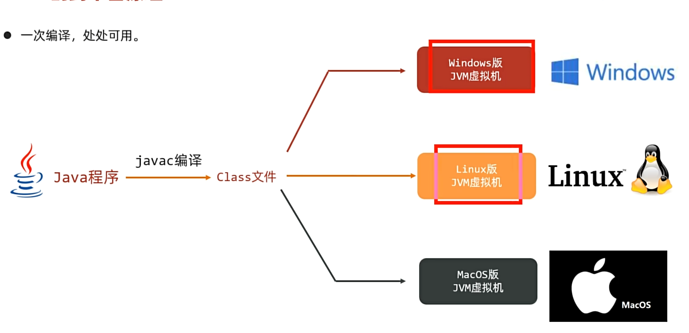
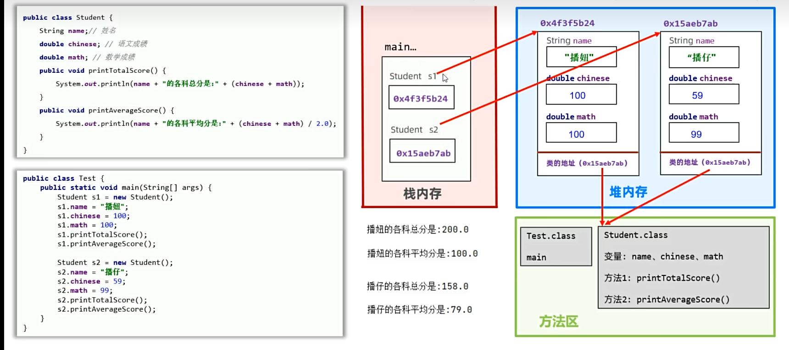
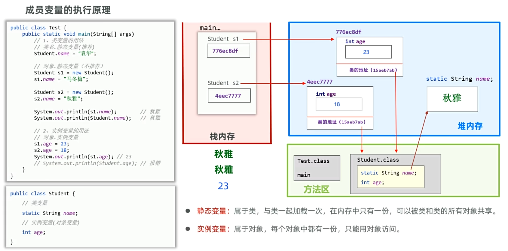
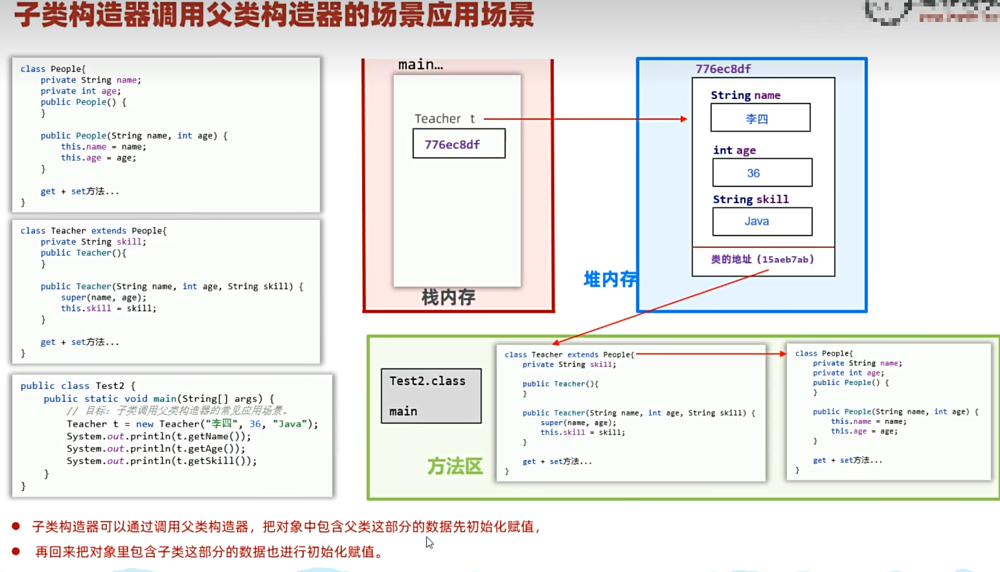
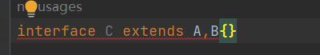
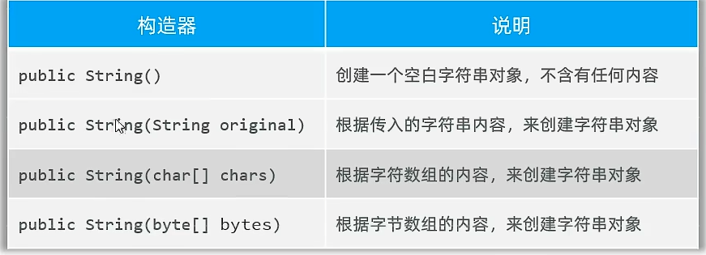
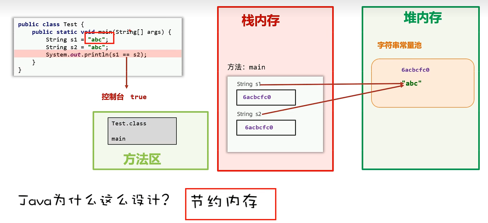
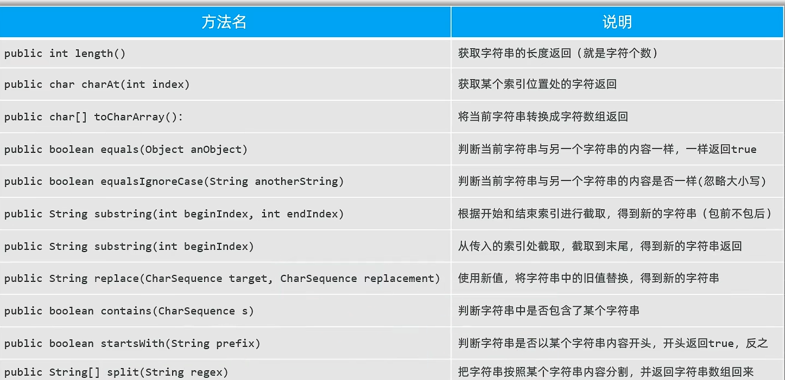
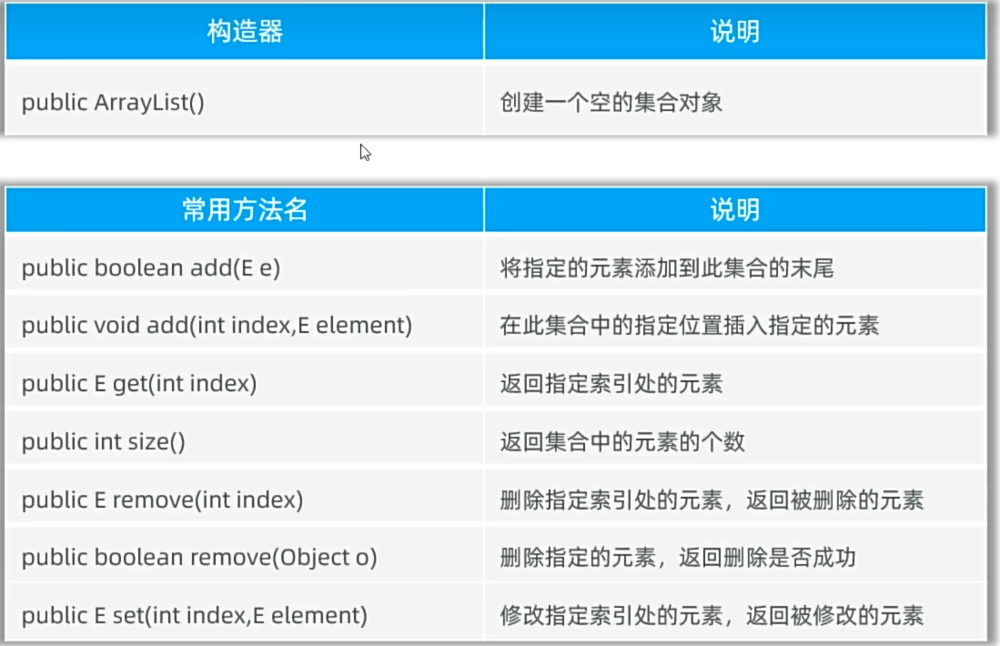

# Java SE 基础学习笔记

Java SE 是 Java 技术体系的基础。本篇记录 Java 的基本语法、流程控制、数组、面向对象、接口、Lambda、字符串和 Swing 等核心知识。

## Java 跨平台原理

Java 源代码先由编译器编译为字节码，再交给不同平台上的 JVM 执行。只要目标平台提供对应的 JVM，同一份字节码就可以运行，这也是“一次编译，到处运行”的基础。



## 注释、字面量与标识符

### 注释

Java 支持三种常见注释：

```java
// 单行注释

/*
 * 多行注释
 */

/**
 * 文档注释
 */
```

注释用于解释代码，编译后不会参与程序执行。

### 字面量

字面量是程序中可以直接书写的数据，例如：

```java
"hello"
1
3.14
'A'
true
false
null
```

常见转义字符包括 `\t`（制表符）和 `\n`（换行符）。

整数还可以使用不同进制表示：

```java
int binary = 0b101010; // 二进制
int hex = 0xfa;        // 十六进制
int octal = 012;       // 八进制
```

### 变量与基本数据类型

变量用于保存程序运行过程中的数据。Java 的八种基本数据类型如下：

| 数据类型 | 字段默认值 | 大小 |
| --- | --- | --- |
| `boolean` | `false` | JVM 规范未固定存储大小 |
| `char` | `'\u0000'` | 2 字节 |
| `byte` | `0` | 1 字节 |
| `short` | `0` | 2 字节 |
| `int` | `0` | 4 字节 |
| `long` | `0L` | 8 字节 |
| `float` | `0.0F` | 4 字节 |
| `double` | `0.0D` | 8 字节 |

> 整数字面量默认是 `int` 类型，浮点数字面量默认是 `double` 类型。局部变量没有默认值，使用前必须完成初始化。

### 关键字与标识符

- **关键字**：Java 语言预先定义、具有特殊含义的单词。
- **标识符**：开发者为类、方法、变量等元素定义的名称。
- 标识符可以包含字母、数字、下划线和 `$`，但不能以数字开头，也不能与关键字相同。
- 变量和方法通常使用小驼峰命名，类名通常使用大驼峰命名，常量通常全部大写并使用下划线分隔。

## 方法

方法是组织功能的基本单元。定义方法时需要明确两个问题：

1. 是否需要接收外部数据，即是否需要参数。
2. 是否需要返回结果；没有返回值时使用 `void`。

```java
修饰符 返回值类型 方法名(参数列表) {
    // 方法体
    return 返回值;
}
```

例如：

```java
public static int getSum(int left, int right) {
    return left + right;
}
```

### 方法重载

同一个类中，多个方法名称相同但参数列表不同，这些方法构成重载。参数列表不同可以体现在参数数量、类型或顺序上，与返回值类型无关。

`System.out.println()` 就提供了多个重载版本，可以输出不同类型的数据。

在 `void` 方法中，可以使用 `return;` 提前结束方法。

## 类型转换

### 自动类型转换

取值范围较小的类型可以自动转换为取值范围较大的类型：

```text
byte -> short -> int -> long -> float -> double
                 ^
char ------------|
```

在表达式中，`byte`、`short` 和 `char` 会先提升为 `int` 再参与运算，因此两个 `byte` 相加的结果也是 `int`。

### 强制类型转换

将大范围类型转换为小范围类型时，需要显式强制转换，并注意数据溢出或精度损失：

```java
int number = 12;
byte value = (byte) number;
print(value);

public static void print(byte value) {
    System.out.println(value);
}
```

## 输入与输出

控制台输出使用 `System.out`，输入可以借助 `Scanner`：

```java
import java.util.Scanner;

Scanner scanner = new Scanner(System.in);

System.out.print("请输入年龄：");
int age = scanner.nextInt();

System.out.print("请输入姓名：");
String name = scanner.next();

System.out.println("年龄：" + age + "，姓名：" + name);
scanner.close();
```

## 运算符

| 类型 | 运算符 | 说明 |
| --- | --- | --- |
| 算术运算 | `+`、`-`、`*`、`/`、`%` | `+` 还可用于字符串拼接 |
| 自增自减 | `++`、`--` | 变量自身加一或减一 |
| 赋值运算 | `=`、`+=`、`-=`、`*=`、`/=`、`%=` | 复合赋值会隐含类型转换 |
| 关系运算 | `>`、`<`、`>=`、`<=`、`==`、`!=` | 结果为 `boolean` |
| 逻辑运算 | `&`、`|`、`!`、`^`、`&&`、`||` | `&&` 和 `||` 支持短路求值 |
| 三元运算 | `条件 ? 值1 : 值2` | 根据条件选择结果 |

复合赋值示例：

```java
byte left = 10;
byte right = 20;
left += right; // 等价于 left = (byte) (left + right)
```

三元运算示例：

```java
String result = number % 2 == 0 ? "偶数" : "奇数";
```

## 程序流程控制

### 分支结构

`if` 适合处理范围和复杂条件，`switch` 适合对离散值进行匹配。

```java
if (condition) {
    // 条件成立
} else if (otherCondition) {
    // 另一个条件成立
} else {
    // 其他情况
}
```

```java
switch (level) {
    case 1:
        System.out.println("普通");
        break;
    case 2:
        System.out.println("高级");
        break;
    default:
        System.out.println("未知");
}
```

传统 `switch` 支持 `byte`、`short`、`int`、`char`、枚举和 `String`。不同 `case` 的值不能重复；如果省略 `break`，会继续执行后续分支，形成穿透。

### 循环结构

| 循环 | 适用场景 |
| --- | --- |
| `for` | 循环次数较明确 |
| `while` | 循环次数不确定，先判断后执行 |
| `do-while` | 先执行后判断，循环体至少执行一次 |

```java
for (int index = 0; index < 10; index++) {
    System.out.println(index);
}

while (condition) {
    // 循环体
}

do {
    // 至少执行一次
} while (condition);
```

- `continue`：跳过本次循环，进入下一次循环。
- `break`：结束当前循环或 `switch`。

## 数组

数组用于保存一组类型相同的数据，创建后长度固定。

### 初始化

```java
// 静态初始化：定义时给出元素
String[] names = {"张三", "李四"};
String[] otherNames = new String[]{"王五", "赵六"};

// 动态初始化：只指定长度
double[] scores = new double[8];
```

动态初始化后的默认值：

| 元素类型 | 默认值 |
| --- | --- |
| `byte`、`short`、`char`、`int`、`long` | `0` |
| `float`、`double` | `0.0` |
| `boolean` | `false` |
| 引用类型 | `null` |

### 访问与遍历

```java
int randomIndex = (int) (Math.random() * names.length);
String randomName = names[randomIndex];

for (int index = 0; index < names.length; index++) {
    System.out.println(names[index]);
}
```

数组遍历常用于求和、搜索和求最值。

### 打乱顺序

```java
for (int index = 0; index < pokers.length; index++) {
    int randomIndex = (int) (Math.random() * pokers.length);

    String temp = pokers[index];
    pokers[index] = pokers[randomIndex];
    pokers[randomIndex] = temp;
}
```

### 二维数组

二维数组的每个元素仍然是一个数组：

```java
int[][] matrix = {
    {1, 2, 3},
    {4, 5, 6}
};

for (int row = 0; row < matrix.length; row++) {
    for (int column = 0; column < matrix[row].length; column++) {
        System.out.print(matrix[row][column] + " ");
    }
    System.out.println();
}
```

## 面向对象编程

对象由成员变量（状态）和方法（行为）组成。开发时先设计类，再通过 `new` 创建具体对象。

从 JVM 内存角度看，局部变量和方法调用主要位于栈内存，对象通常创建在堆内存，类的元数据由方法区对应的运行时区域管理。



### 构造器与 `this`

构造器名称与类名相同，没有返回值声明，创建对象时自动调用，常用于初始化成员变量。

```java
public class Student {
    private String name;

    public Student() {
    }

    public Student(String name) {
        this.name = name;
    }
}
```

类在没有声明任何构造器时，会获得一个默认无参构造器。一旦显式声明了构造器，默认构造器就不再生成。

`this` 表示当前对象，常用于区分成员变量和同名参数，也可以通过 `this(...)` 调用本类的其他构造器。

### 封装与 JavaBean

封装强调“合理隐藏、合理暴露”：

- 使用 `private` 隐藏成员变量。
- 使用公开的 getter 和 setter 控制访问。
- 将数据保存和业务处理拆分到不同职责的类中。

一个常见 JavaBean 通常具备私有成员变量、无参构造器以及对应的 getter 和 setter。

### `static` 与实例成员

| 成员 | 归属 | 数量 | 访问方式 |
| --- | --- | --- | --- |
| 静态变量 | 类 | 全类共享一份 | `类名.变量名` |
| 实例变量 | 对象 | 每个对象各有一份 | `对象.变量名` |
| 静态方法 | 类 | 不依赖具体对象 | `类名.方法名()` |
| 实例方法 | 对象 | 可以访问对象状态 | `对象.方法名()` |



如果一个方法只完成通用功能，不需要访问对象数据，可以设计为静态方法。工具类通常提供静态方法，并将构造器私有化。

静态方法只能直接访问静态成员，不能使用 `this`；实例方法既可以访问实例成员，也可以访问静态成员。

### 继承

继承使用 `extends` 建立父子类关系，可以提高代码复用性：

```java
public class Dog extends Animal {
}
```

Java 类只支持单继承，但支持多层继承；所有类最终都继承自 `Object`。

访问权限从严格到宽松依次为：

| 修饰符 | 本类 | 同包 | 不同包子类 | 任意位置 |
| --- | --- | --- | --- | --- |
| `private` | 是 | 否 | 否 | 否 |
| 默认 | 是 | 是 | 否 | 否 |
| `protected` | 是 | 是 | 是 | 否 |
| `public` | 是 | 是 | 是 | 是 |

当父类和子类存在同名成员时，可以使用 `super.成员` 访问父类成员。

### 方法重写

子类重新实现父类中可继承的方法，称为方法重写。建议使用 `@Override` 让编译器帮助检查。

重写时需要注意：

- 方法名和参数列表保持一致。
- 返回值类型相同，或使用协变返回类型。
- 子类方法的访问权限不能比父类更严格。
- `private` 方法不可见，因此不能被重写。
- 静态方法属于类，不参与运行时多态。

### 子类构造器

子类构造器会先初始化父类部分，再执行自身逻辑。默认情况下，子类构造器第一行隐含 `super()`。

如果父类没有无参构造器，子类必须显式使用 `super(...)` 调用父类的其他构造器。



`super(...)` 和 `this(...)` 都必须位于构造器第一行，因此不能在同一个构造器中同时直接调用。

### 多态

多态是继承或接口实现关系中的运行时现象：

```java
Animal animal = new Dog(); // 向上转型
animal.run();               // 调用实际对象重写后的方法
```

多态的前提是存在继承或实现关系，并发生方法重写。调用方法时“编译看左边，运行看右边”；成员变量不具备同样的运行时多态。

多态可以降低调用方与具体实现之间的耦合，但父类型引用不能直接调用子类独有方法。需要向下转型时，应先使用 `instanceof` 判断：

```java
if (animal instanceof Dog) {
    Dog dog = (Dog) animal;
    dog.swim();
}
```

### `final`

`final` 可以修饰类、方法和变量：

| 用法 | 含义 |
| --- | --- |
| `final class` | 类不能被继承 |
| `final` 方法 | 方法不能被重写 |
| `final` 变量 | 变量只能赋值一次 |
| `static final` | 常用于定义类常量 |

对于基本类型，`final` 限制值不能改变；对于引用类型，限制引用地址不能改变，但对象内部状态仍可能变化。

### 单例模式

单例模式用于确保一个类只创建一个对象。

饿汉式在类加载时创建实例：

```java
public class EagerSingleton {
    private static final EagerSingleton INSTANCE = new EagerSingleton();

    private EagerSingleton() {
    }

    public static EagerSingleton getInstance() {
        return INSTANCE;
    }
}
```

简单懒汉式在第一次使用时创建实例，但下面的写法没有处理多线程并发问题：

```java
public class LazySingleton {
    private static LazySingleton instance;

    private LazySingleton() {
    }

    public static LazySingleton getInstance() {
        if (instance == null) {
            instance = new LazySingleton();
        }
        return instance;
    }
}
```

### 枚举

枚举适合表示数量固定、含义明确的一组值：

```java
public enum Status {
    CREATED,
    RUNNING,
    FINISHED
}
```

枚举类型继承自 `java.lang.Enum`，不能再继承其他类。枚举构造器不能公开，列出的每个枚举常量都是该枚举类型的对象。

### 抽象类与模板方法

`abstract` 可以修饰类和方法。抽象类不能直接创建对象，可以包含成员变量、构造器、普通方法和抽象方法。

子类继承抽象类后，必须实现全部抽象方法，或者继续声明为抽象类。

模板方法模式把稳定流程放在父类中，把变化步骤交给子类实现：

```java
public abstract class Writer {
    public final void write() {
        System.out.println("固定流程 1");
        System.out.println("固定流程 2");
        writeMain();
        System.out.println("固定流程 3");
    }

    protected abstract void writeMain();
}
```

### 接口

接口使用 `interface` 定义，类通过 `implements` 实现接口。一个类只能直接继承一个父类，但可以实现多个接口。

Java 8 之前，接口主要包含常量和抽象方法。之后又增加了默认方法、静态方法；Java 9 增加了私有方法。

```java
public interface Runner {
    void run();

    default void prepare() {
        System.out.println("prepare");
    }

    static void printInfo() {
        System.out.println("runner");
    }
}
```

接口使用时需要注意：

1. 接口可以多继承，但不能继承方法签名相同、返回值不兼容的接口。
2. 父类方法与接口默认方法冲突时，优先使用父类方法。
3. 多个接口提供同名默认方法时，实现类必须重写并明确处理。



```java
interface First {
    default void go() {
        System.out.println("First");
    }
}

interface Second {
    default void go() {
        System.out.println("Second");
    }
}

class Child implements First, Second {
    @Override
    public void go() {
        First.super.go();
        Second.super.go();
    }
}
```

#### 抽象类与接口对比

| 对比项 | 抽象类 | 接口 |
| --- | --- | --- |
| 主要用途 | 抽取共同状态和实现，形成父类模板 | 定义能力和行为契约 |
| 成员 | 可以包含普通类的大部分成员 | 以抽象方法、默认方法、静态方法和常量为主 |
| 关系 | 类只能单继承 | 类可以实现多个接口 |
| 复用方式 | 继承代码和状态 | 解耦调用方与具体实现 |

### 代码块

类中的代码块分为静态代码块和实例代码块：

- 静态代码块在类加载时执行一次，常用于初始化静态数据。
- 实例代码块在每次创建对象时执行，并早于构造器主体。

```java
public class Example {
    static {
        System.out.println("类加载时执行");
    }

    {
        System.out.println("创建对象时执行");
    }
}
```

### 内部类

| 类型 | 定义位置 | 特点 |
| --- | --- | --- |
| 成员内部类 | 外部类的成员位置 | 可以访问外部类实例成员 |
| 静态内部类 | 使用 `static` 修饰 | 只能直接访问外部类静态成员 |
| 局部内部类 | 方法、构造器或代码块内部 | 作用域仅限所在局部区域 |
| 匿名内部类 | 局部位置且没有显式类名 | 定义类的同时立即创建对象 |

创建成员内部类对象：

```java
Outer.Inner inner = new Outer().new Inner();
```

创建静态内部类对象：

```java
Outer.StaticInner inner = new Outer.StaticInner();
```

匿名内部类示例：

```java
Animal animal = new Animal() {
    @Override
    public void cry() {
        System.out.println("匿名内部类实现");
    }
};
```

匿名内部类本质上仍是一个子类，适合只使用一次的简单实现，也经常作为方法参数传递。

## Lambda 与方法引用

Lambda 是 Java 8 引入的函数式语法，可以替代部分函数式接口的匿名内部类：

```java
(参数列表) -> {
    // 方法体
}
```

函数式接口只有一个抽象方法，通常使用 `@FunctionalInterface` 标记。

### 方法引用

当 Lambda 只是调用一个已有方法时，可以使用方法引用简化：

| 类型 | 语法 |
| --- | --- |
| 静态方法引用 | `类名::静态方法` |
| 实例方法引用 | `对象名::实例方法` |
| 特定类型实例方法引用 | `类型名::实例方法` |
| 构造器引用 | `类名::new` |

```java
String[] names = {
    "Tom", "Jerry", "Lucy", "Mary", "Alice", "曹操", "andy", "chris"
};

Arrays.sort(names, String::compareToIgnoreCase);
System.out.println(Arrays.toString(names));
```

构造器引用示例：

```java
CarFactory factory = Car::new;
Car car = factory.create("奔驰");

interface CarFactory {
    Car create(String name);
}

class Car {
    private final String name;

    Car(String name) {
        this.name = name;
    }
}
```

## String

字符串可以使用字面量或构造器创建：

```java
String first = "hello";
String second = new String("hello");
```



字符串字面量保存在字符串常量池中，相同内容通常复用同一个对象；使用 `new` 会显式创建新对象。

```java
String first = "hello";
String second = "hello";
String third = new String("hello");

System.out.println(first == second);    // true
System.out.println(first == third);     // false
System.out.println(first.equals(third)); // true
```



比较字符串内容应使用 `equals()`，`==` 比较的是两个引用是否指向同一个对象。



## ArrayList

集合也是保存数据的容器。与数组相比，集合长度可以动态变化，并提供了更丰富的增、删、改、查 API。

```java
List<String> names = new ArrayList<>();
names.add("张三");
names.add("李四");

names.set(1, "王五");
names.remove("张三");

System.out.println(names.get(0));
```



更完整的集合框架内容见后续 Java SE 笔记。

## Swing GUI

GUI（Graphical User Interface）即图形用户界面。Java 桌面界面主要涉及 AWT 和 Swing：

- **AWT**：依赖操作系统本地窗口系统，提供基础组件。
- **Swing**：构建在 AWT 之上，提供更丰富的轻量级组件。

常用 Swing 组件：

| 组件 | 用途 |
| --- | --- |
| `JFrame` | 顶层窗口 |
| `JPanel` | 组织其他组件的容器 |
| `JButton` | 按钮 |
| `JTextField` | 单行输入框 |
| `JTable` | 表格 |

常用布局管理器：

| 布局 | 特点 |
| --- | --- |
| `FlowLayout` | 按水平方向依次排列 |
| `BorderLayout` | 分为东、南、西、北、中五个区域 |
| `GridLayout` | 按网格排列 |
| `BoxLayout` | 沿单一方向排列 |

常用事件监听器包括按钮点击使用的 `ActionListener` 和键盘事件使用的 `KeyListener`。监听器既可以使用独立实现类，也可以使用匿名内部类或 Lambda 表达式。
