# MySQL 基础学习笔记

这篇笔记整理 MySQL 的基础概念、SQL 语句、函数、约束、索引、事务、备份恢复、数据类型、存储引擎、视图、用户权限、存储程序和 SQL 优化。

| 模块 | 重点内容 |
| --- | --- |
| 数据库与 SQL | DBMS、客户端、DDL、DML、DQL、DCL |
| 函数与约束 | 字符串函数、数学函数、日期函数、流程控制、主键、外键、唯一约束 |
| 索引与事务 | 索引原理、使用场景、隔离级别、锁、MVCC、ACID、Undo Log、Redo Log |
| 运维与对象 | 备份恢复、数据类型、安装、存储引擎、视图、用户权限 |
| 存储程序与优化 | 存储函数、存储过程、触发器、事件、游标、慢查询、索引优化、分库分表 |

## 数据库

### DBMS 数据库管理系统（C/S 架构）

MySQL 是典型的 C/S 架构。客户端连接 MySQL 服务端，服务端默认监听 `3306` 端口。

一个 MySQL 服务可以管理多个数据库，每个数据库可以包含多张表。表中的一行称为一条记录，在 Java 中通常对应一个对象。

| 层级 | 说明 |
| --- | --- |
| MySQL 服务 | 监听客户端连接，默认端口 `3306` |
| 数据库 | 例如 `DB1`、`DB2`，用于组织一组相关表 |
| 表 | 例如 `表1`、`表2`，用于存储结构化数据 |
| 记录 | 表中的一行数据 |

### 客户端

客户端用于操作数据库，可以是命令行工具、图形化工具，也可以是 Web 程序通过 Java JDBC 访问 MySQL。

## SQL

SQL 可以按用途分成几类。先记住它们解决的问题，再看具体语句会清楚很多。

| 类型 | 作用 | 常见语句 |
| --- | --- | --- |
| DDL | 定义数据库对象 | `create`、`alter`、`drop`、`rename` |
| DML | 操作表中数据 | `insert`、`update`、`delete` |
| DQL | 查询数据 | `select` |
| DCL | 管理权限 | `grant`、`revoke` |

### DDL

DDL 用于创建、修改和删除数据库对象，例如数据库、表、索引等。

#### 数据库操作

查看数据库：

```sql
show databases;
show create database db_name;
show create database db01;
```

创建数据库时可以指定字符集和校对规则。默认字符集常见为 `utf8` / `utf8mb4`，`utf8_bin` 区分大小写，`utf8_general_ci` 不区分大小写。

```sql
create database if not exists db03
  character set utf8
  collate utf8mb3_bin;
```

删除数据库：

```sql
drop database if exists db03;
```

#### 表操作

查看表和表结构：

```sql
show tables;
show create table user;
desc table_name;
```

创建表时可以指定字段、字符集、校对规则和存储引擎。表默认使用数据库的字符集，列默认使用表的字符集；后续修改字符集不会自动影响之前已经设置的对象。

```sql
create table table_name (
    field1 datatype,
    field2 datatype
) character set utf8mb4
  collate utf8mb4_general_ci
  engine = InnoDB;
```

自增长字段常和主键一起使用，也可以和唯一索引搭配。插入时如果显式指定了值，以指定值为准；否则按自增长规则生成。

```sql
id int primary key auto_increment
```

修改表结构：

```sql
-- 添加列
alter table table_name add column_name datatype;

-- 修改列类型
alter table table_name modify column_name datatype;

-- 修改列名
alter table employee change column old_name new_name datatype;

-- 删除列
alter table table_name drop column column_name;

-- 修改表名
rename table old_table_name to new_table_name;

-- 修改表字符集
alter table table_name character set utf8mb4;
```

删除表：

```sql
drop table tbl_name;
```

复制表常用于备份。复制结构使用 `like`，复制数据使用 `insert ... select`。

```sql
create table user_bak like user;
insert into user_bak select * from user;
```

对一张表去重时，可以先复制结构，再用 `distinct` 复制数据，最后替换回原表。

```sql
create table emp_bak_2025_2_15_13_07 like emp;
insert into emp_bak_2025_2_15_13_07 select distinct * from emp;

delete from emp;
insert into emp select * from emp_bak_2025_2_15_13_07;

drop table emp_bak_2025_2_15_13_07;
```

### DML

DML 用于新增、修改和删除表中的数据。

#### insert

指定列插入：

```sql
insert into table_name(column1, column2)
values (val1, val2);
```

不指定列时，需要按表中所有字段的顺序提供值：

```sql
insert into table_name
values (val1, val2, val3);
```

一次插入多条记录：

```sql
insert into table_name(col1, col2)
values
  (val1, val2),
  (val3, val4);
```

插入时要注意字段类型、字段长度、字段顺序、字符串和日期需要加单引号。允许为 `null` 的字段可以不赋值；`not null` 字段通常需要给默认值或显式赋值。

#### update

更新数据必须谨慎加上 `where` 条件，否则会修改整张表。

```sql
update tab_name
set column1 = val1,
    column2 = val2
where id = 1;
```

#### delete

删除数据同样要带 `where` 条件，否则会删除整张表的记录。

```sql
delete from tbl_name
where id = 1;
```

### DQL

DQL 主要指 `select` 查询语句。

```sql
select [distinct] column1, column2
from tbl_name
where condition
order by column1 desc
limit 0, 10;
```

`distinct` 只有在查询结果的所有字段都相同时才会去重。

#### where 条件

| 类型 | 写法 | 说明 |
| --- | --- | --- |
| 比较 | `> < >= <= = <> !=` | 基础比较运算 |
| 区间 | `between a and b` | 闭区间 `[a, b]` |
| 枚举 | `in (e1, e2, ...)` | 匹配多个候选值 |
| 模糊 | `like 'A%'` | `%` 匹配任意多个字符，`_` 匹配一个字符 |
| 空值 | `is null` | 判断是否为 `null` |
| 逻辑 | `and` / `or` / `not` | 组合多个条件 |

#### 排序、统计和分组

排序写在查询语句末尾，`asc` 为升序，`desc` 为降序。

```sql
select *
from emp
order by col1 desc, col2 asc;
```

常见聚合函数：

| 函数 | 示例 | 说明 |
| --- | --- | --- |
| `count` | `select count(*) from tbl_name;` | 统计行数，`count(列名)` 会排除该列为 `null` 的行 |
| `sum` | `select sum(sal) from emp;` | 对数值求和 |
| `avg` | `select avg(sal) from emp;` | 对数值求平均值 |
| `max` / `min` | `select max(sal), min(sal) from emp;` | 求最大值和最小值 |

分组后可以用 `having` 对分组结果过滤。`select` 中所有非聚合列都应出现在 `group by` 中，或者被聚合函数包裹。

```sql
select deptno, count(*)
from emp
group by deptno
having count(*) > 3;
```

分页公式是：`limit 每页数量 * (页码 - 1), 每页数量`。

```sql
select *
from emp
limit 20, 10;
```

常见执行顺序可以按这个顺序理解：`where` -> `group by` -> `having` -> `order by` -> `limit`。

#### 多表查询

多表查询的原始结果是笛卡尔积。要得到正确结果，连接条件不能少；通常至少需要 `表数量 - 1` 个连接条件。

自连接是把同一张表当作两张表来查询。

```sql
select e.ename, m.ename as manager_name
from emp e
join emp m on e.mgr = m.empno;
```

子查询是把一个 `select` 嵌入到另一个 SQL 中。

```sql
select *
from emp
where emp_id in (
  select distinct id
  from emp
  where sal > 2000
);
```

子查询也可以作为临时表使用。

```sql
-- 查询每个商品类别中价格最高的商品
select goods.goods_name, goods.shop_price
from ecs_goods goods
join (
  select cat_id, max(shop_price) as max_price
  from ecs_goods
  group by cat_id
) temp on goods.cat_id = temp.cat_id
      and goods.shop_price = temp.max_price;
```

`all` 表示满足子查询所有结果，`any` 表示满足子查询任意一个结果。

```sql
-- 比 30 号部门所有员工工资都高
select *
from emp t2
where t2.sal > all (
  select t.sal
  from emp t
  where t.deptno = 30
);

-- 比 30 号部门任意一个员工工资高
select *
from emp t2
where t2.sal > any (
  select t.sal
  from emp t
  where t.deptno = 30
);
```

多列子查询可以同时比较多个字段。

```sql
-- 查询各科成绩完全和“宋江”一样的学生
select *
from student s
where (s.chinese, s.math, s.english) = (
  select chinese, math, english
  from student
  where name = '宋江'
);
```

每个部门最高工资的人，可以使用多列子查询或者子查询临时表。

```sql
-- 多列子查询
select *
from emp
where (deptno, sal) in (
  select deptno, max(sal)
  from emp
  group by deptno
);

-- 子查询作为临时表
select emp.*
from emp
join (
  select deptno, max(sal) as max_sal
  from emp
  group by deptno
) temp on temp.deptno = emp.deptno
      and temp.max_sal = emp.sal;
```

合并查询时，`union` 会去重，`union all` 保留重复数据。

#### join 写法

| 类型 | 常见写法 | 说明 |
| --- | --- | --- |
| 内连接 | `inner join ... on`、`join ... on`、`cross join ... on` | 两张表都匹配到记录才显示 |
| 左外连接 | `left join ... on`、`left outer join ... on` | 左表有记录时保留左表，右表无匹配则补 `null` |
| 右外连接 | `right join ... on`、`right outer join ... on` | 与左连接方向相反 |

### DCL

DCL 用于管理数据库权限，核心语句是 `grant` 和 `revoke`。用户和权限的具体用法见后文“ MySQL 用户与权限”。

## MySQL 函数

### 字符串相关函数

| 函数 | 说明 |
| --- | --- |
| `charset(str)` | 返回字符串字符集 |
| `concat(string, ...)` | 拼接字符串 |
| `instr(string, substring)` | 返回子串首次出现位置，没找到返回 `0` |
| `ucase(str)` / `lcase(str)` | 转大写 / 转小写 |
| `left(str, len)` | 从左侧截取指定长度 |
| `length(str)` | 返回字节长度 |
| `replace(str, old_str, new_str)` | 替换字符串内容 |
| `strcmp(str1, str2)` | 按字典顺序比较两个字符串 |
| `substring(str, pos, len)` | 从指定位置截取字符串，位置从 `1` 开始 |
| `ltrim` / `rtrim` / `trim` | 去除左侧、右侧或两侧空格 |

### 数学函数

| 函数 | 说明 |
| --- | --- |
| `abs(num)` | 绝对值 |
| `bin(num)` | 十进制转二进制 |
| `ceiling(num)` | 向上取整 |
| `floor(num)` | 向下取整 |
| `conv(n, from_base, to_base)` | 进制转换 |
| `format(number, decimal_places)` | 保留小数位数，四舍五入 |
| `hex(decimal_number)` | 转十六进制 |
| `least(num1, num2, ...)` | 求最小值 |
| `mod(numerator, denominator)` | 求余 |
| `rand([seed])` | 返回 `[0, 1]` 范围内的随机浮点值；指定种子时可得到重复序列 |

### 日期函数

| 函数 | 说明 |
| --- | --- |
| `current_date()` | 当前日期 |
| `current_time()` | 当前时间 |
| `current_timestamp` / `now()` | 当前时间戳 |
| `date(datetime)` | 取日期部分 |
| `date_add(date, interval expr unit)` | 增加日期或时间 |
| `date_sub(date, interval expr unit)` | 减少日期或时间 |
| `datediff(date1, date2)` | 两个日期相差天数 |
| `timediff(time1, time2)` | 两个时间的差值 |
| `year(datetime)` / `month(datetime)` / `date(datetime)` | 提取年月日 |
| `from_unixtime(ts)` | Unix 时间戳转日期 |
| `unix_timestamp()` | 返回从 `1970-01-01` 到当前时间的秒数 |

### 加密和系统函数

| 函数 | 说明 |
| --- | --- |
| `user()` | 当前用户 |
| `database()` | 当前数据库 |
| `md5(str)` | 计算 32 位 MD5 字符串 |
| `password(str)` | 旧版本用于 MySQL 用户密码加密，已不推荐使用 |

### 流程控制函数

| 函数 | 说明 |
| --- | --- |
| `if(expr1, expr2, expr3)` | `expr1` 为真返回 `expr2`，否则返回 `expr3`，类似三元表达式 |
| `ifnull(expr1, expr2)` | `expr1` 非 `null` 返回 `expr1`，否则返回 `expr2` |
| `case when ... then ... else ... end` | 多分支判断 |

```sql
select if(score >= 60, 'pass', 'fail') as result
from student;

select case
         when sal >= 10000 then 'high'
         when sal >= 5000 then 'middle'
         else 'low'
       end as sal_level
from emp;
```

## 约束

约束用于限制表中数据，保证数据完整性。

| 约束 | 作用 | 说明 |
| --- | --- | --- |
| `primary key` | 主键 | 唯一标识一条记录；不能重复，不能为 `null`；一张表只能有一个主键，可以是复合主键 |
| `not null` | 非空 | 插入数据时必须提供值，或者设置默认值 |
| `unique` | 唯一 | 列值不能重复；如果没有指定 `not null`，可以存在多个 `null`；会创建唯一索引 |
| `foreign key` | 外键 | 子表字段引用父表字段；父表被引用字段必须有索引；InnoDB 支持外键 |
| `check` | 检查约束 | MySQL 5.7 只做语法校验但不生效，MySQL 8.0 生效 |

主键常见写法：

```sql
create table student (
    id bigint primary key,
    name varchar(64) not null
);

create table score (
    student_id bigint,
    course_id bigint,
    primary key (student_id, course_id)
);
```

外键示例：

```sql
foreign key (stu_id) references tbl_father(id)
```

外键字段类型要和父表被引用字段一致。建立外键后，父表数据不能随意删除，否则会破坏子表引用。

`check` 示例：

```sql
gender varchar(8) check (gender in ('m', 'f')),
sal double check (sal > 1000 and sal < 2000)
```

## 索引

### 实例

没有索引时，查询会做全表扫描。给查询字段建立索引后，可以显著降低查询时间，但会增加磁盘占用，也会影响写入性能。

```sql
-- 查询太慢
select * from emp where empno = 1234567; -- 2s

-- 使用索引优化
create index empno_index on emp(empno);
select * from emp where empno = 1234567; -- 51ms，提升约 400 倍
```

创建索引会带来空间开销。例如 `emp.ibd` 从 512MB 增加到 640MB。索引只对创建索引的列有效。

```sql
select * from emp where ename = 'HQfdaS'; -- 2s -> 55ms
create index enameno_index on emp(ename);
```

删除索引：

```sql
drop index empno_index on emp;
```

### 索引原理

索引本质是帮助 MySQL 提高查找效率的数据结构。没有索引时是线性扫描；有索引时通常通过 B+Tree 等结构快速定位数据。

| 维度 | 说明 |
| --- | --- |
| 为什么快 | 通过索引结构减少扫描范围 |
| 代价 | 占用磁盘；`insert`、`update`、`delete` 需要维护索引，写入会变慢 |
| 主键索引 | 主键自动建立主键索引 |
| 唯一索引 | `unique`，既保证唯一性，也提供索引能力 |
| 普通索引 | `index`，只提升查询效率 |
| 全文索引 | `fulltext`，常见于 MyISAM；实际开发更常用 Solr、Elasticsearch 等搜索引擎 |

### 使用索引

添加索引：

```sql
create index index_name on table_name(col_name);
create unique index index_name on table_name(col_name);
alter table tbl_name add index index_name (col_name);
alter table tbl_name add primary key (col_name);
```

删除索引：

```sql
drop index index_name on tbl_name;
alter table tbl_name drop index index_name;
alter table tbl_name drop primary key;
```

查询索引：

```sql
show indexes from tbl_name;
show keys from tbl_name;
desc tbl_name;
```

### 什么时候创建索引

适合创建索引的字段：查询频繁、常出现在 `where`、`order by`、`group by` 中，并且区分度较高。

```sql
select * from emp where empno = 1;
```

不适合创建索引的字段：唯一性太差、更新非常频繁、不会出现在查询条件中的字段。

## MySQL 事务

事务用于保证一组 DML 操作的一致性。这组操作要么全部成功，要么全部失败，例如转账场景。

### 事务和锁

事务执行 DML 时，MySQL 会加锁，防止其他事务并发修改同一批数据。

### MySQL 控制事务的重要操作

| 操作 | SQL | 说明 |
| --- | --- | --- |
| 开启事务 | `start transaction` | 之后的 DML 不会立即永久生效 |
| 创建保存点 | `savepoint sp1` | 事务中可以创建多个保存点 |
| 回退到保存点 | `rollback to sp1` | 回退到指定保存点，后面的保存点会被清理 |
| 回滚事务 | `rollback` | 回退整个事务；没有保存点时回到事务开始状态 |
| 提交事务 | `commit` | 提交后不能回退，保存点删除，锁释放，其他会话可见 |

```sql
start transaction;

update account set balance = balance - 100 where id = 1;
savepoint after_debit;

update account set balance = balance + 100 where id = 2;

-- 回退到保存点
rollback to after_debit;

-- 提交事务
commit;
```

事务细节：默认情况下 DML 自动提交，不能回滚。要使用事务机制，表需要使用 InnoDB 存储引擎。开启事务可以使用 `start transaction`，也可以设置 `set autocommit = off`。

### MySQL 事务的隔离级别

隔离性用于保证多个连接并发操作数据库时，各自读到的数据尽可能准确。如果不考虑隔离性，常见问题是脏读、不可重复读和幻读。

| 问题 | 定义 | 解决级别 |
| --- | --- | --- |
| 脏读 | 一个事务读取到另一个未提交事务修改的数据；如果对方回滚，读到的数据就是无效数据 | `read committed` 及以上 |
| 不可重复读 | 同一事务内多次读取同一行数据，结果不一致，原因是其他事务修改并提交了该行 | `repeatable read` 及以上 |
| 幻读 | 同一事务内多次查询同一范围，结果集行数不同，原因是其他事务插入或删除并提交了符合范围的数据 | `serializable`，或 MySQL `repeatable read` 配合间隙锁 |

MySQL 的四种隔离级别：

| 隔离级别 | 可能存在的问题 | 加锁情况 | 说明 |
| --- | --- | --- | --- |
| 读未提交 | 脏读、不可重复读、幻读 | 不加锁 | 隔离性最低 |
| 读已提交 | 不可重复读、幻读 | 不加锁 | 每次读取都能看到其他事务已提交结果 |
| 可重复读 | 幻读 | 不加锁 | MySQL 默认级别，综合性能和安全性较好 |
| 可串行化 | 基本无并发读写异常 | 加锁 | 隔离性最高，性能最低 |

查看事务隔离级别：

```sql
select @@transaction_isolation;
```

设置事务隔离级别：

```sql
set transaction isolation level read uncommitted;
set transaction isolation level read committed;
set transaction isolation level repeatable read;
set transaction isolation level serializable;
```

### MySQL 的锁

锁用于保证事务隔离性。排他锁会阻止其他事务对同一行继续加排他锁或执行修改。

`select ... for update` 是显式加锁机制，用于保护现有行的修改权。它必须配合事务使用；如果查询没有命中索引，InnoDB 可能扩大锁范围，甚至退化为锁全表。

```sql
begin;
select * from orders where user_id = 100 for update;
update orders set status = 'paid' where user_id = 100;
commit;
```

间隙锁是 InnoDB 在 `repeatable read` 下自动加的锁，用于防止幻读。

### MVCC

MVCC（Multi-Version Concurrency Control，多版本并发控制）通过维护数据的多个版本，让读写尽量不互相阻塞。它主要依赖隐藏字段、Undo Log 和 ReadView。

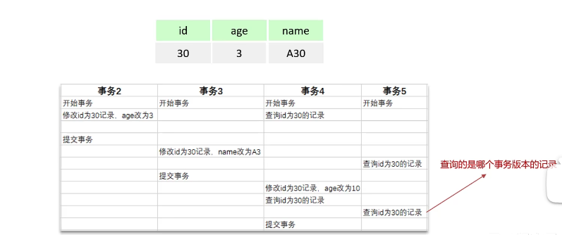

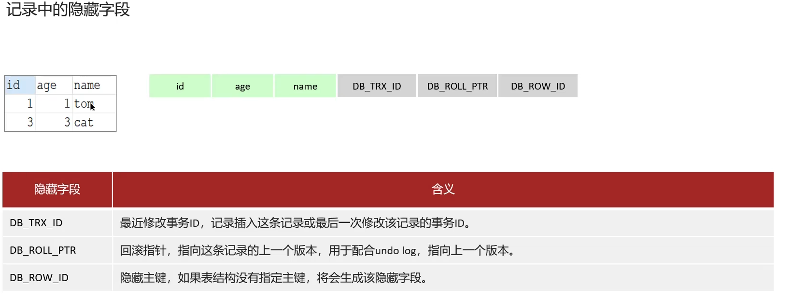

| 概念 | 作用 |
| --- | --- |
| 隐藏字段 | `trx_id` 记录每次操作的事务 id；`roll_pointer` 指向上一个版本 |
| Undo Log | 保存老版本数据，用于回滚和 MVCC |
| 版本链 | 同一行被多个事务修改时，通过 `roll_pointer` 形成旧版本链表 |
| ReadView | 快照读时判断当前事务应该读取哪个版本 |

当前读读取最新版本并加锁，例如：`select ... lock in share mode`、`select ... for update`、`update`、`insert`、`delete`。

快照读是不加锁的普通 `select`。在 `read committed` 下，每次快照读都会生成新的 ReadView；在 `repeatable read` 下，事务内第一次快照读生成 ReadView，后续复用。

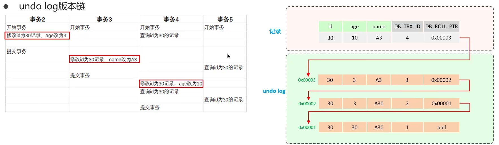

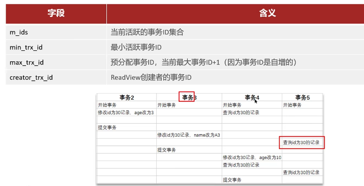

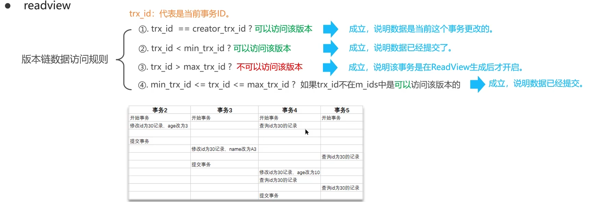


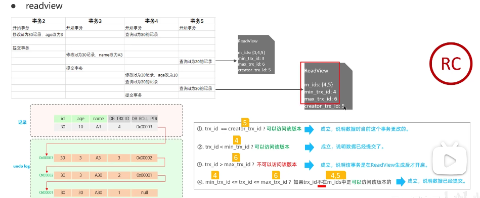

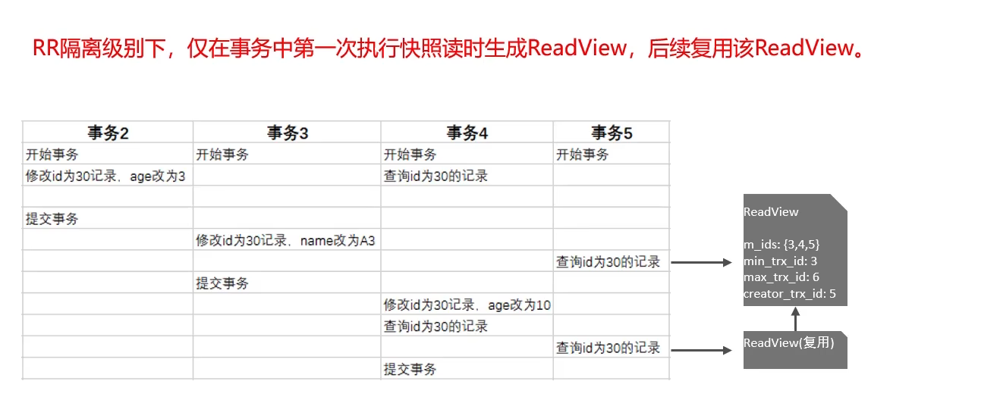

### 事务 ACID

| 特性 | 说明 |
| --- | --- |
| Atomicity 原子性 | DML 操作作为一个整体，要么同时成功，要么同时失败 |
| Consistency 一致性 | 事务让数据从一个一致性状态转移到另一个一致性状态，例如转账前后总金额不变 |
| Isolation 隔离性 | 多个并发事务之间互相隔离，避免读写干扰 |
| Durability 持久性 | 事务一旦提交，对数据的改变就是永久的 |

### Undo Log 和 Redo Log

Buffer Pool 是 InnoDB 在内存中的缓冲区。执行 CRUD 时会先操作缓存中的数据，再以一定频率刷新到磁盘，减少 IO。数据页是 InnoDB 的最小存储单元，默认大小为 16KB。

| 日志 | 记录内容 | 作用 |
| --- | --- | --- |
| Redo Log | 数据页的物理修改 | 保证事务持久性；服务器宕机后可用于恢复已提交的数据 |
| Undo Log | 数据被修改前的逻辑信息 | 支持事务回滚，也支持 MVCC 读取旧版本 |

Redo Log 由 Redo Log Buffer 和 Redo Log File 组成。事务提交后，修改信息会写入 Redo Log，用于在刷新脏页到磁盘时发生错误后的恢复。

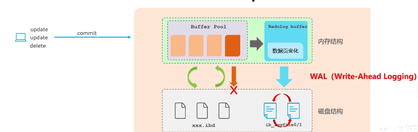

Undo Log 可以理解为反向操作日志。删除一条记录时，Undo Log 中会记录对应的插入信息；更新一条记录时，会记录对应的反向更新信息。执行 `rollback` 时，InnoDB 可以根据 Undo Log 恢复原数据。

## MySQL 备份与恢复数据库

### 备份

```shell
#在终端执行
mysqldump -u username -p  数据库1 数据库2 数据库n > 文件名.sql
```

### 恢复

```sql
在mysql命令行内执行: source 备份的sql文件名.sql
```

## MySQL 数据类型

选择数据类型时，原则是“满足需求的前提下，尽量选择占用空间更小的类型”。

### 数值类型

数值类型默认有符号，也可以指定 `unsigned`。

```sql
create table t4 (
    id tinyint unsigned
);
```

| 类型 | 字节 | 说明 |
| --- | --- | --- |
| `bit(len)` | 1-64 位 | 位类型，默认 1 位，只表示正数 |
| `tinyint` | 1 byte | 小整数 |
| `smallint` | 2 bytes | 小整数 |
| `mediumint` | 3 bytes | 中等整数 |
| `int` | 4 bytes | 常用整数 |
| `bigint` | 8 bytes | 大整数 |
| `float` | 4 bytes | 单精度浮点数 |
| `double` | 8 bytes | 双精度浮点数 |
| `decimal(M, D)` | 由精度决定 | 精确小数；`M` 是总位数，`D` 是小数位数；默认 `decimal(10, 0)` |

### 字符串类型

| 类型 | 范围 | 特点 |
| --- | --- | --- |
| `char` | 0-255 字符 | 定长，长度不足会补空格；适合 MD5、手机号、身份证等定长数据 |
| `varchar` | 0-65536 字节 | 变长，按实际长度存储，需要额外 1-3 字节记录长度 |
| `text` | 0-65535 字节 | 长文本，不能有默认值 |
| `mediumtext` | 0-2^24 字节 | 更大的文本 |
| `longtext` | 0-2^32-1 字节 | 超长文本 |

`utf8mb4` 下，`varchar` 最大字符数大约是 `(65536 - 4) / 4 = 16383`。如果字段长度固定，`char` 查询速度通常优于 `varchar`；如果长度不固定，优先用 `varchar` 节省空间。

### 二进制类型

| 类型 | 说明 |
| --- | --- |
| `blob` | 最大约 65535 字节 |
| `longblob` | 最大约 2^32 字节 |

### 日期类型

| 类型 | 说明 | Java 映射 |
| --- | --- | --- |
| `date` | 年月日 | `java.sql.Date` |
| `time` | 时分秒 | `java.sql.Time` |
| `datetime` | 年月日时分秒，格式 `YYYY-MM-DD HH:MM:SS` | `java.sql.Timestamp` |
| `timestamp` | 时间戳，可在插入和更新时自动维护 | `java.sql.Timestamp` |
| `year` | 年份 | `java.sql.Date` |

```sql
create table t14 (
    birthday date,
    job_time datetime,
    login_time timestamp not null
        default current_timestamp
        on update current_timestamp
);
```

`timestamp` 占用空间更小，但范围只到 2038 年。通常更推荐使用 `datetime`，它也可以配合默认值实现自动更新时间。

### MySQL 与 Java 类型映射

| MySQL 类型 | Java 类型 | JDBC 类型索引 |
| --- | --- | --- |
| `varchar` / `char` / `text` | `java.lang.String` | `12` / `1` / `-1` |
| `blob` | `java.lang.byte[]` | `-4` |
| `int` | `java.lang.Long` | `4` |
| `tinyint` / `smallint` / `mediumint` | `java.lang.Integer` | `-6` / `5` / `4` |
| `bit` | `java.lang.Boolean` | `-7` |
| `bigint` | `java.math.BigInteger` | `-5` |
| `float` / `double` | `java.lang.Float` / `java.lang.Double` | `7` / `8` |
| `decimal` | `java.math.BigDecimal` | `3` |
| `date` / `time` / `datetime` / `timestamp` | `java.sql.Date` / `java.sql.Time` / `java.sql.Timestamp` | `91` / `92` / `93` |

### 常见问题

`int`、`int(10)`、`int(11)` 的存储范围没有区别，都是 4 字节。括号里的数字不是存储长度，而是显示宽度；只有配合 `zerofill` 时才会体现为“不足位数前面补 0”。

## MySQL 安装

安装 MySQL Community Server 后，默认服务端口是 `3306`。命令行连接示例：

```shell
mysql -uroot -pPASSWORD
```

常用图形客户端包括 Navicat、SQLyog、DataGrip。

## 存储引擎

MySQL 表类型由存储引擎决定，常见存储引擎包括 MyISAM、InnoDB、Memory。CSV、ARCHIVE、MRG 等也存在，但日常开发最常用的是 InnoDB。

| 存储引擎 | 特点 | 适用场景 |
| --- | --- | --- |
| MyISAM | 不支持事务和外键，访问速度快 | 对事务完整性要求不高的简单读写 |
| InnoDB | 支持事务、外键、行级锁；写入会维护数据和索引，内存占用更高 | 业务系统默认优先选择 |
| Memory | 数据存放在内存中，访问极快，默认使用 Hash 索引；MySQL 关闭后数据丢失但表结构还在 | 在线状态、临时高速数据；大量频繁修改数据更推荐缓存数据库 |

修改存储引擎：

```sql
alter table tbl_name engine = engine_name;
```

查看支持的存储引擎：

```sql
show engines;
```

选择建议：不需要事务且只做基础 CRUD 时可以考虑 MyISAM；需要事务只能选 InnoDB；Memory 适合少量临时数据，不适合持久化数据。

## 视图

视图是一个虚拟表，内容由查询定义。它和真实表一样包含列，但数据来自真实的基表。基表数据变化会影响视图；在满足条件时，也可以通过视图修改基表数据。

### 视图更新条件

| 情况 | 是否可更新 |
| --- | --- |
| 视图中的每一条记录都能和底层表记录一一对应 | 可以更新 |
| 查询中包含 `count`、`min`、`max`、`avg` 等汇总函数 | 不可更新 |
| 查询中包含 `distinct`、`group by`、`having`、`union`、`union all` | 不可更新 |
| 查询列表中包含子查询 | 不可更新 |

### 视图的使用

创建视图：

```sql
create view view_name as
select ...;
```

查看视图：

```sql
-- 视图在使用上类似一张表
show tables;

-- 查看创建视图时的 SQL
show create view emp_view;
```

删除视图：

```sql
drop view view_name;
```

## MySQL 用户与权限

### 用户

MySQL 的用户信息保存在 `mysql.user` 表中。`host + user` 构成组合主键，用于区分同名用户从不同主机登录的情况。

| 字段 | 说明 |
| --- | --- |
| `host` | 允许登录的位置；`localhost` 表示本机，也可以指定 IP 或网段 |
| `user` | 用户名 |
| `authentication_string` | 密码信息 |

创建用户：

```sql
create user '用户名'@'登录ip' identified by '密码';
```

删除用户：

```sql
drop user '用户名'@'允许登录ip';
```

修改密码：

```sql
-- 修改自己的密码
set password = password('密码');

-- 修改他人的密码
set password for '用户名'@'登录ip' = password('密码');
alter user '用户名'@'登录ip' identified by '新密码';
```

如果创建用户时不指定 `host`，默认是 `%`，表示所有 IP 都有连接权限。也可以限制在指定网段内登录：

```sql
create user 'xxx'@'192.168.1.%' identified by '密码';
```

删除用户时，如果 `host` 不是 `%`，需要明确指定 `用户@host`。

### 权限

常见权限如下：

| 权限 | 说明 |
| --- | --- |
| `all` | 所有权限 |
| `alter` | 修改表、库 |
| `create` | 创建表、库 |
| `insert` / `delete` / `select` / `update` | 常用 DML / DQL 权限 |

授权语法：

```sql
grant 权限列表 on 库.表名 to '用户名'@'登录ip' [identified by '密码'];
```

授权示例：

```sql
grant select on db_name.table_name to 'app'@'%';
grant select, delete, create on db_name.* to 'app'@'%';
grant all privileges on *.* to 'admin'@'%';
```

权限范围：

| 写法 | 说明 |
| --- | --- |
| `*.*` | 系统中所有数据库对象，包括表、视图、存储过程等 |
| `库.*` | 指定库内所有对象 |
| `库.表` | 指定库中的一张表 |

`identified by` 可以省略。用户存在时可用于修改密码；用户不存在时可用于创建用户。

撤销权限：

```sql
revoke 权限列表 on 库.对象 from '用户名'@'登录ip';
```

刷新权限：

```sql
flush privileges;
```

### 允许远程登录

远程登录语法：

```shell
mysql -h 192.168.5.116 -P 3306 -u root -p123456
```

如果要允许 `root` 远程登录，可以在 `mysql.user` 表中把 `root` 的 `host` 修改为 `%`，修改后执行 `flush privileges;`。

## 存储程序（批处理）

存储程序也叫 Stored Routine，常见形式包括存储函数、存储过程、触发器、事件和游标。

### 存储函数 Stored Function

#### 变量

用户自定义变量以 `@` 开头，会在会话关闭后自动销毁或置为 `null`。用户变量可以在函数体内外访问。

```sql
set @a = 10;
set @b = 10.5;
set @b = @a;

select count(*) from emp into @a;
select max(sal), min(sal) from emp into @a, @b;
select @a, @b;
```

函数体内的局部变量使用 `declare` 声明。`declare` 必须放在函数体其他语句之前，未设置值时默认为 `null`。

```sql
declare var1, var2 int default 0;
```

#### 定义和调用函数

定义函数时要声明返回类型，并在函数体中使用 `return` 返回值。为了避免分号提前结束语句，通常会临时修改分隔符。

```sql
delimiter $$

create function avg_math_score()
returns float
begin
    return (select avg(math) from student);
end $$

delimiter ;
```

调用、查看和删除函数：

```sql
select avg_math_score();
show function status like 'avg_math_score';
show create function avg_math_score;
drop function avg_math_score;
```

#### 控制流程

`if` 分支示例：

```sql
create function condition_demo(i int)
returns varchar(20)
begin
    declare result varchar(20);
    if i = 1 then
        set result = 'result is 1';
    elseif i = 2 then
        set result = 'result is 2';
    elseif i = 3 then
        set result = 'result is 3';
    else
        set result = 'invalid!';
    end if;
    return result;
end;
```

`while` 循环示例：

```sql
create function sum_all(n int unsigned)
returns int
begin
    declare sum int default 0;
    declare i int unsigned default 1;
    while i <= n do
        set sum = sum + i;
        set i = i + 1;
    end while;
    return sum;
end;
```

`repeat ... until` 类似 Java 中的 `do while`：

```sql
create function sum_all2(n int unsigned)
returns int
begin
    declare sum int default 0;
    declare i int default 1;
    repeat
        set sum = i + sum;
        set i = i + 1;
    until i > n end repeat;
    return sum;
end;
```

`loop` 可以配合 `return` 或 `leave 标签` 结束循环：

```sql
create function sum_all3(n int unsigned)
returns int
begin
    declare sum int default 0;
    declare i int default 1;
    loop
        if i > n then
            return sum;
        end if;
        set sum = i + sum;
        set i = i + 1;
    end loop;
end;
```

```sql
create function sum_all4(n int unsigned)
returns int
begin
    declare sum int default 0;
    declare i int default 1;
    flag:
    loop
        if i > n then
            leave flag;
        end if;
        set sum = i + sum;
        set i = i + 1;
    end loop;
    return sum;
end;
```

### 存储过程 Stored Procedure

存储过程和存储函数的主要区别是：存储过程没有返回值，调用时使用 `call`。

```sql
create procedure tbl_emp_operation(
    eno mediumint unsigned,
    ena varchar(20)
)
begin
    select * from emp;
    insert into emp(empno, ename, hiredate, sal)
    values (eno, ena, current_date(), 0);
    select * from emp;
end;
```

调用、查看和删除存储过程：

```sql
call tbl_emp_operation(10086, 'motherfather');
show procedure status like 'tbl_emp_operation';
show create procedure tbl_emp_operation;
drop procedure tbl_emp_operation;
```

存储过程参数前缀：

| 前缀 | 说明 |
| --- | --- |
| `in` | 默认前缀，类似 Java 值传递，过程内修改不会影响外部变量 |
| `out` | 调用方可读到过程写出的结果 |
| `inout` | 同时具备输入和输出能力，类似指针效果 |

存储函数和存储过程的区别：

| 对比项 | 存储函数 | 存储过程 |
| --- | --- | --- |
| 返回值 | 必须用 `returns` 声明返回类型，并用 `return` 返回值 | 没有函数式返回值 |
| 参数前缀 | 不支持 `in`、`out`、`inout` | 支持 `in`、`out`、`inout` |
| 结果集 | 执行中产生的结果集不会显示给客户端 | 执行过程中产生的结果集会显示给客户端 |
| 调用方式 | 像函数一样调用 | 使用 `call` 调用 |

### 触发器 Trigger

触发器用于在表插入、删除、修改前后，让 MySQL 自动额外执行一些语句。

```sql
create trigger trigger_name
{before | after}
{insert | delete | update}
on tbl_name
for each row
begin
    -- 触发器内容
end;
```

示例：在插入学生表时校验英语成绩。

```sql
create trigger trigger_for_stu
before insert
on student
for each row
begin
    if new.english < 60 then
        set new.english = 60;
    elseif new.english < 80 then
        set new.english = 80;
    else
        set new.english = 99;
    end if;
end;
```

`NEW` 和 `OLD` 的含义：

| 触发操作 | `NEW` | `OLD` |
| --- | --- | --- |
| `insert` | 插入后的记录 | 无效 |
| `delete` | 无效 | 删除前的记录 |
| `update` | 修改后的记录 | 修改前的记录 |

查看和删除触发器：

```sql
show triggers;
show create trigger trigger_for_stu;
drop trigger trigger_for_stu;
```

注意：触发器内容中不能有输出结果集的语句。`before` 触发器中可以使用 `set new.val = val` 修改记录，`after` 触发器中不能这样修改，因为记录已经写入完成。

### 事件 Event（定时执行任务）

事件用于定时执行任务。

```sql
create event event_name on schedule
{
  at 某个确定时间 |
  every 期望的时间间隔 [starts 开始日期和时间] [ends 结束日期和时间]
}
do
begin
    insert into student(id, name, chinese, english, math)
    values (12, 'caiqingsong', 100, 0, 100);
end;
```

示例：在指定时间插入一条学生记录。

```sql
create event insert_student_event on schedule
at '2025-02-16 15:20:00'
do
begin
    insert into student(id, name, chinese, english, math)
    values (12, 'caiqingsong', 100, 0, 100);
end;
```

查看和删除事件：

```sql
show events;
show create event event_name;
drop event event_name;
```

事件功能需要先开启：

```sql
set global event_scheduler = on;
```

事件过期后会自动删除。

### 游标

游标用于在存储过程中遍历查询结果集。

```sql
create procedure cursor_demo()
begin
    declare temp_empno mediumint unsigned;
    declare temp_ename varchar(30);
    declare record_len int;
    declare i int default 1;

    declare emp_record_cursor cursor for
        select empno, ename from emp;

    open emp_record_cursor;
    set record_len = (select count(*) from emp);

    while i <= record_len do
        fetch emp_record_cursor into temp_empno, temp_ename;
        select temp_ename, temp_empno;
        set i = i + 1;
    end while;

    close emp_record_cursor;
end;
```

游标基本操作：

```sql
declare emp_record_cursor cursor for select empno, ename from emp;
open emp_record_cursor;
fetch emp_record_cursor into temp_empno, temp_ename;
close emp_record_cursor;
```

## SQL 优化

### 定位慢查询

方式一: 使用arthas, trace 查看接口耗时

或者使用运维工具Prometheus, Skywalking查看

方式二:  MySQL自带的慢查询日志(测试环境可以使用, 生成环境使用会消耗性能)

```sql
# /etc/my.cnf
#开启慢查询
slow_query_log=1
#设置慢查日志时间为2s,SQL执行时间超过2s就会记录这个慢查询
long_query_time=2
```

配置完成后需要重启MySQL服务

日志位置: /var/lib/MySQL/localhost-slow.log

### 分析慢的原因

执行计划可以通过 `explain` 或 `desc` 获取，用于观察 MySQL 如何执行 `select` 语句。

```sql
desc select * from emp where empno = 100002;
```

| id | select\_type | table | partitions | type | possible\_keys | key | key\_len | ref | rows | filtered | Extra |
| :--- | :--- | :--- | :--- | :--- | :--- | :--- | :--- | :--- | :--- | :--- | :--- |
| 1 | SIMPLE | emp | null | ref | empno\_index | empno\_index | 3 | const | 1 | 100 | null |

possible\_keys: 当前sql可能用到的索引

key: 当前sql实际用到的索引

Key_len: 索引占用的大小

Extra: 额外的优化建议。例如 `using where; using index` 表示使用了索引，且需要的数据在索引列中都能找到，不用回表；`using index condition` 表示查找使用了索引，但还需要回表查数据。

type 这条sql的连接类型, 性能由好到差为: NULL, system, const, eq_ref, ref, range, index, all

system: 查询MySQL系统中自带的表

const: 根据主键查询

eq_ref: 主键查询或者唯一索引查询(查询结果只有一条数据)

ref: 索引查询,但是数据不止一条

range: 使用了索引, 范围查询

index: 索引树扫描 (效率不高)

all: 全盘扫描(效率不高)

如果执行效率是range一下, 就需要考虑优化了

如何分析:

通过key 和key_len来检查是否命中索引(检查索引是否失效)

通过type字段查看sql是否有进一步的优化空间, 是否存在全索引扫描或全盘扫描

通过extra建议判断,是否出现了回表情况, 如果出现了,可以尝试添加索引或者修改返回字段来修复

### 索引

#### 索引的数据结构

索引是帮助MySQL提高查找效率的数据结构, 如果不使用索引, 那就是线性查找, 效率比较低

MySQL使用的B+树

为啥使用b+树

二叉树的缺点: 最坏的情况成为链表

红黑树: 解决了二叉树的缺点, 但是数据量大的话, 层级就特别深, 就降低了查找效率

B-Tree: 多叉路平衡查找树, 相对与二叉树,B树的节点可以多个分支: 矮胖型, 数据放在节点上

B+Tree(InnoDB默认使用): B-Tree优化, 只在叶子节点上存储数据, 叶子节点使用双向链表连接, 普通节点只存放指针, (MySQL把链表进行收尾相连)

磁盘读写代价比B+树更低: 只在叶子节点查询数据, 减少不必要的数据查询

查询效率B+树更加稳定: 只在叶子节点查询数据

B+Tree便于扫库和区间查询

#### 聚集索引和二级索引

聚集索引: 将数据存储与索引放到了一起, 索引结果的叶子节点保存了行数据, 必须有, 而且只有一个

二级索引: 将数据与索引分开存储, 索引结构的叶子节点关联的是对应的主键, 可以存在多个

聚集索引选权规则

如果有主键, 主键就是聚集索引

如果没有主键, 使用第一个唯一UNIQUE索引作为聚集索引

没有主键和唯一索引, 则InnoDB会自动生成一个rowid作为隐藏的聚集索引

回表操作: 先通过二级索引去找到主键值, 然后通过主键值找到目标结果行(聚簇索引)

我们单独创建的索引就是二级索引

#### 覆盖索引

查询使用了索引, 并且返回的列, 在该索引中已经全部能够找到

```sql
# id是主键, name是普通索引
# 覆盖索引,因为主键是聚集索引
select * from tbl_user where id = 1
# 覆盖索引 (name是二级索引, 数据有name(索引)和主键id)
select id,name from tbl_user where name = 'alice'
#非覆盖索引, 要在聚集索引中再次查找-->回表操作
select id,name gender from tbl_user where name = 'alice'
```

覆盖索引的效率更高

#### MySQL 超大分页优化

```sql
# 耗时2s
select * from emp limit 7000000,10;
# 耗时5ms
select * from emp limit 0,10;
```

通过创建覆盖索引+子查询优化

先通过主键去查出limit对应的id, 再去查询id对应的数据

```sql
select e.*
from emp e,
     (select empno from emp order by empno limit 7000000,10) a
where e.empno = a.empno;
```

#### 创建索引的原则

| 原则 | 说明 |
| --- | --- |
| 数据量大且查询频繁 | 单表超过 10 万数据后，更需要关注索引设计 |
| 关注查询条件 | 常出现在 `where`、`order by`、`group by` 中的字段更适合建立索引 |
| 选择区分度高的列 | 重复数据少的列更适合建索引，能建唯一索引时效率更高 |
| 字符串长字段可用前缀索引 | 针对字段特点建立前缀索引，减少索引体积 |
| 优先考虑联合索引 | 联合索引很多时候可以形成覆盖索引，减少回表并节省空间 |
| 控制索引数量 | 索引越多，增删改时维护成本越高 |
| 尽量避免 `null` | 如果索引列不需要存储 `null`，建表时使用 `not null` 约束 |

#### 索引失效的情况

联合索引:

1.违反最左前缀法则, 指的是查询从最左前列开始, 不能跳过索引中的列, 匹配最左前缀法则.

2.查询范围右边的列不能使用索引的

3.不要在索引列上进行运算, 否则索引将会失效

4.字符串不加单引号,造成索引失效: MySQL优化器会自动进行类型转换,造成索引失效

5.以%开头的模糊查询, 索引失效. 如果仅仅是尾部模糊匹配, 索引不会失效, 如果是头部模糊匹配, 索引会失效

### SQL 优化总结

#### 表设计优化

| 方向 | 建议 |
| --- | --- |
| 数值类型 | 根据数据范围选择合适类型，例如 `tinyint`、`int`、`bigint` |
| 字符串类型 | `char` 是定长类型，效率较高；`varchar` 是变长类型，空间更灵活 |
| 索引设计 | 索引优化见前文索引章节 |

#### SQL 语句优化

| 方向 | 建议 |
| --- | --- |
| 查询字段 | `select` 尽量指明字段名称，便于使用覆盖索引 |
| 索引命中 | 避免造成索引失效的 SQL 写法 |
| 合并查询 | 尽量使用 `union all` 代替 `union`，避免额外去重 |
| 条件表达式 | 避免在 `where` 子句中对字段做表达式操作 |
| Join 优化 | 能用 `inner join` 就尽量不用 `left join` / `right join`；必须使用时，优先用小表作为驱动表 |

内连接会对两个表进行优化, 优先把小表放到外面, 把大表放到里面, left/right join不会重写调整顺序

#### 主从复制、读写分离

如果数据库的使用场景的读操作比较多时候, 使用读写分离架构: 写操作使用主库, 读操作使用slave

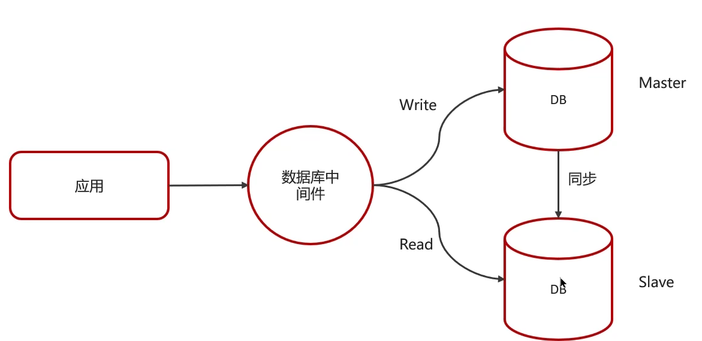

主从复制原理

二进制日志binlog

二进制日志记录了所有ddl和dml,但不包括查询语句

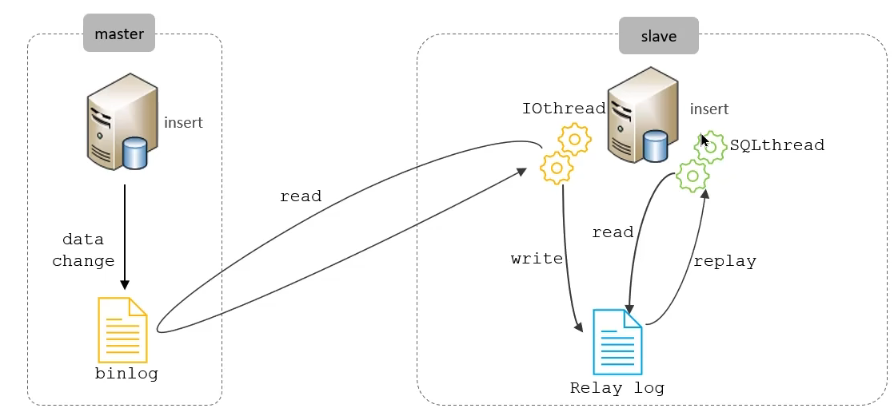

主库在提交事务时, 把数据记录在binlog中,

从库读取主库的二进制日志文件binlog, 写入到从库的中继日志relay log

从库从中继日志中读取数据, 然后写入到自己的数据库中

master会把数据同步到slave上

#### 分库分表

1.如果业务数据逐渐增多, 可以使用分库分表, 单表数据达到1000w或者20G以后

2.此时优化解决不了性能问题

3.IO瓶颈,磁盘IO,网络IO

垂直拆分

垂直分库

以表为依据, 根据业务不同, 将不同的表拆分到不同库中

典型: 商品库, 订单库, 用户库等等(微服务架构就是这样的)

可以提高IO访问效率,从而提高并发

垂直分表

以字段分依据, 根据字段属性将不同的字段拆分到不同的表中,

拆分规则: 把不常用的字段单独放在一张表, 把text, blob等大字段拆分出来放在附表中

特点: 冷热数据分离, 减少IO过渡争抢, 两表互不影响

水平拆分

水平分库

将一个库的数据拆分到多个库中, 所有分库数据互斥,加来来才是所有数据

路由规则: 根据id节点取模, 按id范围录用, 节点1(1-100w),节点2(100w-200w)

水平分表

将一个表的数据拆分到多个表中(可以在同一个库中)

多个表之间数据是互斥的, 比如是按照userId%5进行5个订单表的分表, 总数据是5个表的数据加起来的数据

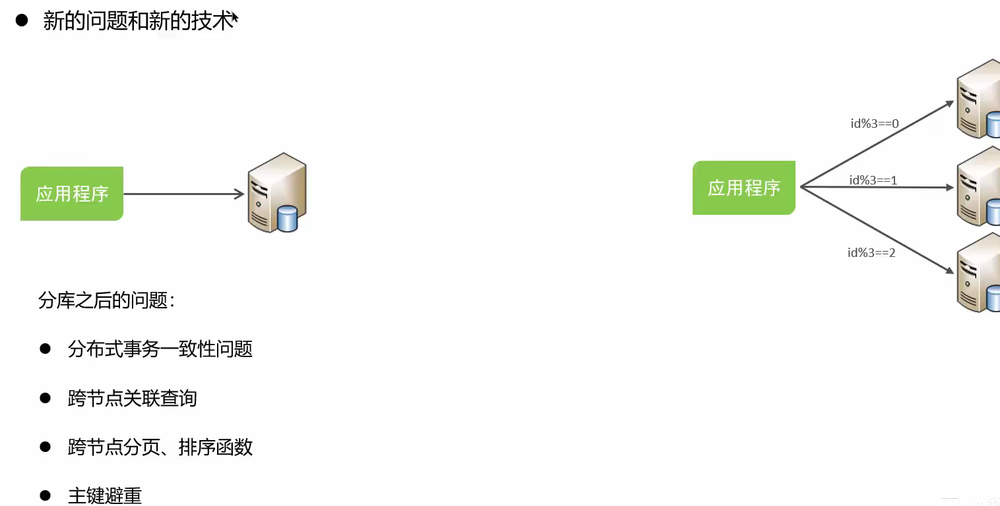

中间件: 使用mycat或者sharding-sphere
