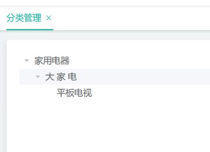
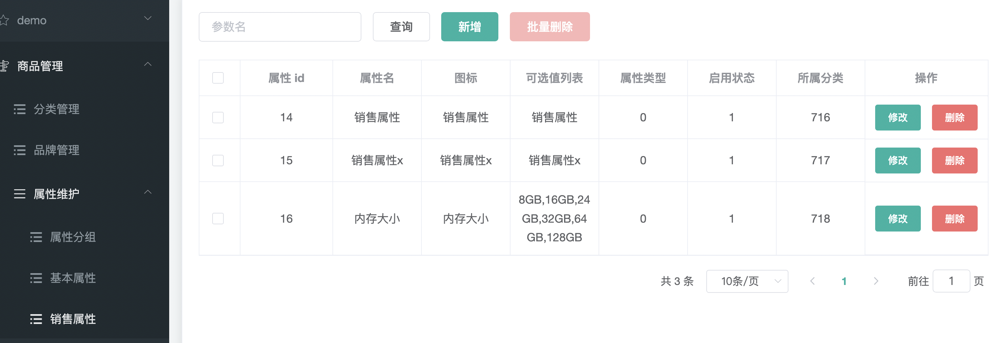
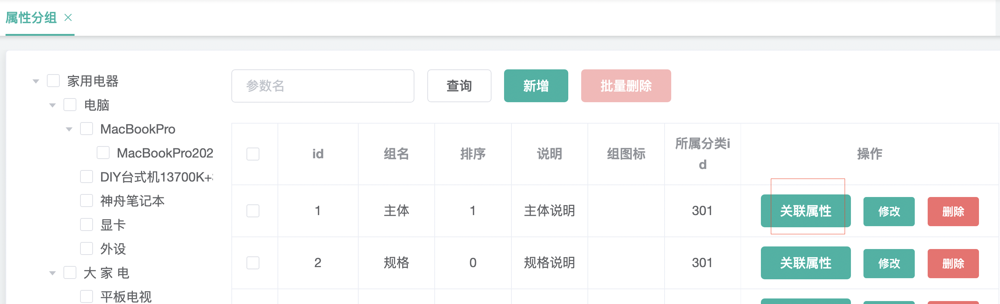
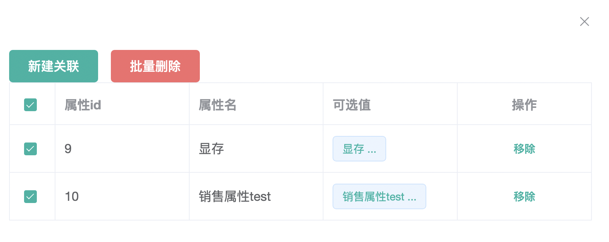
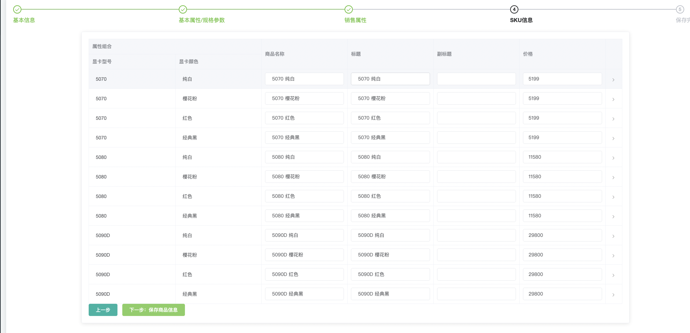

# 微服务项目练习

通用性产品发布解决方案

java springcloud微服务项目练习笔记

这是一个什么项目?

类似商城: 有后台后台界面和前台界面, 可以上架商品, 分类商品, sku,spu等等

## 设计


## 环境

```sh
docker compose -f jiaju_mall_v2_docker_compose.yaml up -d
```

使用docker环境, docker compose-file

```yaml
name: jiaju_mall_v2
services:
  mysql:
    container_name: mysql
    image: mysql
    ports:
      - "3306:3306"
    environment:
      - MYSQL_ROOT_PASSWORD=root
    volumes:
      - /Users/qingsongcai/devtools/docker_mount/jiaju_mall_v2/mysql-data:/var/lib/mysql
      - /Users/qingsongcai/devtools/docker_mount/jiaju_mall_v2/myconf:/etc/mysql/conf.d
    restart: always
    networks: 
      - jiaju_mall_v2_net

networks:
  jiaju_mall_v2_net:

```

前端也使用快速脚手架renren-fast-vue

**使用renren-fast 脚手架*** https://gitee.com/renrenio/renren-fast

把配置文件中数据库改成自己的mysql数据库

启动后台项目和前台项目, 依赖版本, 详见代码

解决跨域问题, 在前端vue配置文件设置代理

代理的域名填后端tomcat的启动地址

解决跨域问题-后端

```java
@Configuration
public class CorsConfig implements WebMvcConfigurer {

   @Override
   public void addCorsMappings(CorsRegistry registry) {
       registry.addMapping("/**")
           .allowedOrigins("*")
           .allowCredentials(true)
           .allowedMethods("GET", "POST", "PUT", "DELETE", "OPTIONS")
           .maxAge(3600);
   }
}
```


代码生成器

## 编码

使用技术, springboot, vue2, mybatisplus

### 商品模块

#### 1.创建家居分类表**,**并完成对家居分类增删改查功能

1. 需求**:** 创建商品分类表**(**支持层级**)** 表字段设计id和parent_id, 一般要使用自连接

   ```sql
   -- 商品模块库
   create database jiaju_commodity;
   use jiaju_commodity;
   -- 分类表
   CREATE TABLE `commodity_category`
   (
       `id`        BIGINT    NOT NULL AUTO_INCREMENT COMMENT 'id',
       `name`      CHAR(50)  NOT NULL COMMENT '名称',
       `parent_id` BIGINT    NOT NULL COMMENT '父分类 id',
       `cat_level` INT       NOT NULL COMMENT '层级',
       `is_show`   TINYINT   NOT NULL COMMENT '0 不显示，1 显示]',
       `sort`      INT       NOT NULL COMMENT '排序',
       `icon`      CHAR(255) NOT NULL COMMENT '图标',
       `pro_unit`  CHAR(50)  NOT NULL COMMENT '统计单位',
       `pro_count` INT       NOT NULL COMMENT '商品数量',
       PRIMARY KEY (`id`)
   ) CHARSET = utf8mb4 COMMENT ='商品分类表';
   -- 添加测试数据
   # 测试数据
   # 第1组 家用电器
   INSERT INTO `commodity_category`(`id`, `name`, `parent_id`, `cat_level`, `is_show`, `sort`, `icon`, `pro_unit`, `pro_count`)
   VALUES (1, '家用电器', 0, 1, 1, 0, '', '', 0);
   INSERT INTO `commodity_category`(`id`, `name`, `parent_id`, `cat_level`, `is_show`, `sort`, `icon`, `pro_unit`, `pro_count`)
   VALUES (21, '大 家 电', 1, 2, 1, 0, '', '', 0);
   INSERT INTO `commodity_category`(`id`, `name`, `parent_id`, `cat_level`, `is_show`, `sort`, `icon`, `pro_unit`, `pro_count`)
   VALUES (22, '厨卫大电', 1, 2, 1, 0, '', '', 0);
   INSERT INTO `commodity_category`(`id`, `name`, `parent_id`, `cat_level`, `is_show`, `sort`, `icon`, `pro_unit`, `pro_count`)
   VALUES (201, '燃气灶', 22, 3, 1, 0, '', '', 0),
          (202, '油烟机', 22, 3, 1, 0, '', '', 0);
   INSERT INTO `commodity_category`(`id`, `name`, `parent_id`, `cat_level`, `is_show`, `sort`, `icon`, `pro_unit`, `pro_count`)
   VALUES (301, '平板电视', 21, 3, 1, 0, '', '', 0);
   # 第2组 家居家装
   INSERT INTO `commodity_category`(`id`, `name`, `parent_id`, `cat_level`, `is_show`, `sort`, `icon`, `pro_unit`, `pro_count`)
   VALUES (2, '家居家装', 0, 1, 1, 0, '', '', 0);
   INSERT INTO `commodity_category`(`id`, `name`, `parent_id`, `cat_level`, `is_show`, `sort`, `icon`, `pro_unit`, `pro_count`)
   VALUES (41, '家纺', 2, 2, 1, 0, '', '', 0);
   INSERT INTO `commodity_category`(`id`, `name`, `parent_id`, `cat_level`, `is_show`, `sort`, `icon`, `pro_unit`, `pro_count`)
   VALUES (601, '桌布/罩件', 41, 3, 1, 0, '', '', 0);
   INSERT INTO `commodity_category`(`id`, `name`, `parent_id`, `cat_level`, `is_show`, `sort`, `icon`, `pro_unit`, `pro_count`)
   VALUES (602, '地毯地垫', 41, 3, 1, 0, '', '', 0);
   INSERT INTO `commodity_category`(`id`, `name`, `parent_id`, `cat_level`, `is_show`, `sort`, `icon`, `pro_unit`, `pro_count`)
   VALUES (42, '灯具', 2, 2, 1, 0, '', '', 0);
   INSERT INTO `commodity_category`(`id`, `name`, `parent_id`, `cat_level`, `is_show`, `sort`, `icon`, `pro_unit`, `pro_count`)
   VALUES (651, '台灯', 42, 3, 1, 0, '', '', 0);
   INSERT INTO `commodity_category`(`id`, `name`, `parent_id`, `cat_level`, `is_show`, `sort`, `icon`, `pro_unit`, `pro_count`)
   VALUES (652, '节能灯', 42, 3, 1, 0, '', '', 0);
   
   select *from commodity_category;
   ```

2. .需求**:** 使用 **renren-generator** 生成商品分类的 **crud** 代码

   使用人人generator代码生成器

   特点: 根据表生成简单的mapper/dao, service controller等等

3.  需求**:** 整合 **hspliving-commodity+MyBatis-Plus ,** 并完成对商品分类 的增删改查接口测试

    1.展示层级分类图, 而不是表格信息, 方便查看
    
    




接口 :http://localhost:9090/commodity/category/list/tree

要在parentchild里显示child节点

数据格式:

```json
{
    "msg": "success",
    "code": 0,
    "categoryTree": [
  		{
        "id": 22,
        "name": "厨卫大电",
        "parentId": 1,
        "catLevel": 2,
        "isShow": 1,
        "sort": 0,
        "icon": "",
        "proUnit": "",
        "proCount": 99
        "childCategories": [
            "category": {
              "id": 202,
              "name": "油烟机",
              "parentId": 22,
              "catLevel": 3,
              "isShow": 1,
              "sort": 0,
              "icon": "",
              "proUnit": "",
              "proCount": 0
            },
      ]
    },
	]
}
```

实现核心代码

```java
    @Override
    public PageUtils queryPage(Map<String, Object> params) {
        IPage<CategoryEntity> page = this.page(
                new Query<CategoryEntity>().getPage(params),
                new QueryWrapper<CategoryEntity>()
        );
        return new PageUtils(page);
    }

    @Override
    public List<CategoryEntity> ListTree() {
        // 先取出所有数据,再组装成map: id -> 分类对象
        LinkedList<CategoryEntity> categoryList = new LinkedList<>(baseMapper.selectList(null));
        Map<Long, CategoryEntity> map = categoryList.stream().collect(Collectors.toMap(CategoryEntity::getId, e -> e));
        ListTree(map, 1);
        List<CategoryEntity> list = map.values().stream()
                .filter(e -> e.getCatLevel().equals(1)).collect(Collectors.toList());
        return list;
    }

    /**
     * 按深度层级遍历, 组装子分类到父分类的childCategories属性中
     *
     * @param map      所有分类信息map: id -- 分类对象
     * @param catLevel 初始分类等级, 值为1时, 组装全部分类层级
     */
    private void ListTree(Map<Long, CategoryEntity> map, Integer catLevel) {
        List<CategoryEntity> levelCategories = map.values().stream()
                .filter(e -> e.getCatLevel().equals(catLevel))
                // 根据排序字段排序
                .sorted(Comparator.comparingInt(CategoryEntity::getSort))
                .collect(Collectors.toList());
        if (!CollectionUtils.isEmpty(levelCategories)) {
            // 分类深度递归遍历, 1->2->3
            for (CategoryEntity levelCategory : levelCategories) {
                // 如果有父分类,则加入到父分类中
                CategoryEntity parent = map.get(levelCategory.getParentId());
                if (parent != null) {
                    if (parent.getChildCategories() == null) {
                        parent.setChildCategories(new ArrayList<>());
                    }
                    parent.getChildCategories().add(levelCategory);
                }
            }
            ListTree(map, catLevel + 1);
        }
    } 
```

注意点: 在实体类增加不存在于数据库的字段, 使用mybatisPlus的注解 

```java
@TableName(value = "commodity_category",excludeProperty = {"childCategories"})
或者
@TableField(exist = false)
private List<CategoryEntity> childCategories;
```

2.删除分类

需求:  **只有没有子分类的才可以** **Delete,**

  逻辑删除,mybatisplus的https://baomidou.com/guides/logic-delete/

```java
/**
* 0 不显示，1 显示
*/
@TableLogic(value = "1", delval = "0")
private Integer isShow;
```

接口: http://localhost:9090/commodity/category/delete

```json
[652,651]
```

```json
{
    "msg": "success",
    "code": 0
}
```

3.新增


**需求:只有** **1,2** **级菜单可以** **新增,**

```json
{
  "id": null,
  "name": "新分类",
  "parentId": 709,
  "catLevel": 3,
  "isShow": 1,
  "sort": 0,
  "icon": "",
  "proUnit": "",
  "proCount": 0
}
```


4.修改分类


需求: 修改分类需要调用回显接口, 然后保存

回显

http://localhost:9090/commodity/category/info/713

保存修改

http://localhost:9090/commodity/category/update

```json
{
  "id": 713,
  "name": "下112新",
  "icon": "下1",
  "proUnit": "下1"
}
```

5.批量删除

前端支持即可

```javascript
batchDel() {
  // this.$refs.tree 引用<el-tree>
  // 半选就是某个分类的子分类, 只选择了部分，没有全选
  let checkedNodes = this.$refs.tree.getCheckedNodes(false,false)
  let delIds =[]
  let delName = []
  for (let i = 0; i < checkedNodes.length; i++) {
    let category = checkedNodes[i]
    delIds.push(category.id)
    delName.push(category.name)
  }
  // 判断空
  if (delIds.length === 0) {
    return;
  }
  this.$confirm(`是否要删除[${delName}]`, '提示', {
    confirmButtonText: '确定',
    cancelButtonText: '取消',
    type: 'warning'
  }).then(() => {
    this.$http.post('http://localhost:9090/commodity/category/delete', delIds).then(({data}) => {
      if (data && data.code === 0) {
        this.$message({
          message: '操作成功',
          type: 'success',
          duration: 1500
        })
        console.log("批量删除成功: ", data)
        // 刷新数据
        this.getTreeData()
      }
    })
  });
  console.log("checkedNodes", checkedNodes)
},
```

#### 2.创建商品品牌表**,**并完成对商品品牌表增删改查功能

表 commodity_brand

```sql
CREATE TABLE `commodity_brand`
(
    id           BIGINT NOT NULL AUTO_INCREMENT COMMENT 'id',
    `name`       CHAR(50) COMMENT '品牌名',
    logo         VARCHAR(1200) COMMENT 'logo',
    description  LONGTEXT COMMENT '说明',
    isShow       TINYINT COMMENT '显示',
    first_letter CHAR(1) COMMENT '检索首字母',
    sort         INT COMMENT '排序',
    primary key (id)
) CHARSET = utf8mb4 COMMENT ='商品品牌表';
```

1.CRUD API 代码生成器生成

```apl
http://localhost:9090/commodity/category/delete
http://localhost:9090/commodity/category/info/{id}
http://localhost:9090/commodity/category/list
http://localhost:9090/commodity/category/delete
```

2.控制是否显示品牌 (isShow字段)

Switch开关控件


```html
<el-table-column
  prop="isShow"
  header-align="center"
  align="center"
  label="显示">
  <template slot-scope="scope">
    <el-switch
      v-model="scope.row.isShow"
      @change="switchIsShow(scope.row)"
      :active-value="1"
      :inactive-value="0"
      active-color="#13ce66"
      inactive-color="#ff4949">
    </el-switch>
  </template>
</el-table-column>
```

#### 3.图片上传-使用aliyun-oss

1.上传方式分析

普通上传方式: 用户数据需先上传到应用服务器，之后再上传到OSS


缺点: 速度慢, 应用服务器压力大,应用服务器成本高

阿里云对象存储**-**服务端签名后直传


**Web**端向服务端请求签名，然后直接上传，不会对服务端产生压力，而且安全可靠。但服务端无法实时了解用户上传了多少文件，上传了什么文件。如果想实时了解用户 上传了什么文件，可以采用服务端签名直传并设置**上传回调**

2.在aliyun创建oss bucket创建ram授权用户,获取OSS_ACCESS_KEY_ID和OSS_ACCESS_KEY_SECRET

使用ossClient访问

aliyun文档 : https://help.aliyun.com/zh/oss/developer-reference/getting-started

集成springCloudalibaba-oss

https://github.com/alibaba/spring-cloud-alibaba/wiki/OSS

需求:上传图片到oss, 使用对象存储**-**服务端签名后直传


注意点:  aliyunOSS上配置跨域访问, 配置公共读取权限, 否则不能显示


#### 4.重构模块-引入服务发现和网关模块

现在模块有, mall.service(aliyun存储服务),mall.commodity(商品子模块),mall.admin(后台管理模块)

以及vue管理台前端模块


现在对这些服务进行统一 管理, 引入nacos服务注册和发现中心


创建mall.gateway模块

配置网关, 让admin vue前端走网关访问后端admin微服务

前端重新配baseUrl

```js
  // api接口请求地址
  // window.SITE_CONFIG['baseUrl'] = 'http://localhost:8080/renren-fast';
  // 改写走网关
  window.SITE_CONFIG['baseUrl'] = 'http://localhost:5050/api';
```

后端网关服务配置

```yaml
server:
  port: 5050

spring:
  application:
    name: mall-gateway
  cloud:
    nacos:
      discovery:
        server-addr: localhost:8848

    gateway:
      routes:
        - id: commodity-router
          # uri: http://localhost:9090
          uri: lb://mall-commodity
          predicates:
            # 这个路径更加精确所以要放上面,不然访问不到
            - Path=/api/commodity/**
          filters:
            # 商品模块没有配置server.context,直接去掉uri中/api/即可
            - RewritePath=/api/(?<segment>.*), /$\{segment}
        - id: admin-router
          uri: lb://mall-admin
          predicates:
            # 把带/api的请求转发到 admin服务
            - Path=/api/**
          filters:
            # 把前面/api/uri  改写为 /mall-admin/uri, 这个就是路径重写
            - RewritePath=/api/(?<segment>.*), /mall-admin/$\{segment}

```

> # Spring Cloud Gateway
>
> filter路径重写
>
> https://docs.spring.io/spring-cloud-gateway/reference/spring-cloud-gateway/gatewayfilter-factories/rewritepath-factory.html

现在启动时可能存在跨域问题

在网关mall-gateway服务统一配置跨域--->固定代码, 注意**导包**

```java
import org.springframework.context.annotation.Bean;
import org.springframework.context.annotation.Configuration;
import org.springframework.web.cors.CorsConfiguration;
import org.springframework.web.cors.reactive.UrlBasedCorsConfigurationSource;
import org.springframework.web.cors.reactive.CorsWebFilter;
@Configuration
public class GatewayCorsConfiguration {
    @Bean
    public CorsWebFilter corsWebFilter() {
        UrlBasedCorsConfigurationSource source = new UrlBasedCorsConfigurationSource();
        // 配置跨域请求头
        CorsConfiguration corsConfiguration = new CorsConfiguration();
        corsConfiguration.addAllowedHeader("*");
        corsConfiguration.addAllowedMethod("*");
        corsConfiguration.addAllowedOrigin("*");
        corsConfiguration.setAllowCredentials(true);
        source.registerCorsConfiguration("/**",corsConfiguration);
        return new CorsWebFilter(source);
    }
}
```

在网关配置了就要注释掉之前在各个模块配置的CrosConfig, 不然会报错: 多个access-control-allow-origin错误

#### 5.nacos配置中心引入

引入配置中心的依赖

```xml
<!--nacos配置中心-->
<dependency>
  <groupId>com.alibaba.cloud</groupId>
  <artifactId>spring-cloud-starter-alibaba-nacos-config</artifactId>
</dependency>
```

配置:

```properties
spring.application.name=mall-service
spring.profiles.active=dev
#nacos
#配置中心地址
spring.cloud.nacos.config.server-addr=localhost:8848
#服务发现/注册中心地址
spring.cloud.nacos.discovery.server-addr=localhost:8848
#指定命名空间id值
spring.cloud.nacos.config.namespace=3dbf3e81-8359-419c-af39-538f34c9721c
spring.cloud.nacos.config.group=dev
spring.cloud.nacos.config.file-extension=properties
```

#### 6.品牌表单校验-前后端都校验

前端校验(element-ui)

```json
firstLetter: [
  // {required: true, message: '检索首字母不能为空', trigger: 'blur'},
  {
    trigger: blur,
    validator: (rule, value, callback) => {
      if (value === '') {
        callback(new Error('检索首字母必须填写'));
      } else {
        if (!/^[a-zA-Z]$/.test(value)) {
          callback(new Error('检索首字母必须a-z或者A-Z并且长度为1'));
        }
        callback();
      }
    }
  }
],
```

后端校验

后端必须校验, 否则利用postman等httpclient工具可以**绕过前端校验**

JSR303

在实体类上增加jsr303注解

```java
@Data
@TableName("commodity_brand")
public class BrandEntity implements Serializable {
    private static final long serialVersionUID = 1L;
    /**
     * id
     */
    @TableId
    private Long id;
    /**
     * 品牌名
     */
    @NotBlank(message = "品牌名称必须填写")
    private String name;
    /**
     * logo
     */
    @NotBlank(message = "logo不能为空")
    @URL(message = "logo不是一个合法的URL")
    private String logo;
    /**
     * 说明
     */
    private String description;
    /**
     * 显示
     */
    @TableField("isShow")
    @NotNull(message = "显示状态不能为空")
    private Integer isShow;
    /**
     * 检索首字母
     */
    @NotBlank(message = "检索首字母不能为空")
    @Pattern(regexp = "^[a-zA-Z]$", message = "检索首字母必须a-z或者A-Z并且长度为1")
    private String firstLetter;
    /**
     * 排序
     */
    @NotNull(message = "排序值不能为空")
    @Range(min = 0, message = "排序值必须是大于等于0的整数")
    private Integer sort;
}
```

保存对象时进行校验, 在方法参数(要校验的对象)用@Validated注解

```java
@RequestMapping("/save")
public R save(@Validated @RequestBody BrandEntity brand, BindingResult result) {
    if (result.hasFieldErrors()) {
        // 创建一个map, 用于收集校验错误, 返回给前端
        Map<String, String> map = new HashMap<>();
        result.getFieldErrors().forEach((item -> {
            String field = item.getField();
            String errorMessage = item.getDefaultMessage();
            map.put(field, errorMessage);
        }));
        return R.error(400, "品牌表单数据校验错误").put("data", map);
    } else {
        brandService.save(brand);
        return R.ok();
    }
}
```

上面那个方法太繁琐了, 每个方法都加, 太难看了, 阅读性不好, 

使用统一异常管理可以优雅解决上面的问题@ControllerAdvice + @ExceptionHandler,

目标方法(可能发生异常的方法, @Validated不要去掉,否则失去jsr303校验的功能)

```java
/**
* 保存
* 交给全局异常处理数据校验
*/
@RequestMapping("/save")
// @RequiresPermissions("commodity:brand:save")
public R save(@Validated @RequestBody BrandEntity brand) {
  brandService.save(brand);
  return R.ok();
}
```

统一异常处理类

```java
@Slf4j
// 表示只处理controller包下抛出的异常
@ControllerAdvice(basePackages = {"org.xxx.jjmallv2.commodity.controller"})
@ResponseBody
public class MallExceptionControllerAdvice {
    // 捕获异常,并获取错误消息
    // 注意只有MethodArgumentNotValidException异常类可以获取 BindResult中的错误信息
    @ExceptionHandler({MethodArgumentNotValidException.class})
    public R handleValidException(MethodArgumentNotValidException e) {
        BindingResult result = e.getBindingResult();
        Map<String, String> errorMap = new HashMap<>();
        result.getFieldErrors().forEach(item -> {
            errorMap.put(item.getField(), item.getDefaultMessage());
        });
        log.error("数据校验出现异常{} 异常类型是{}", e.getMessage(), e.getClass());
        return R.error(400, "方法参数异常").put("data", errorMap);
    }
}
```

兜底异常: 处理未知错误/异常

```java
// 说明: 如欧冠按照业务逻辑, 需要精确匹配异常/错误, 可以再写具体细化的处理方法

// 处理没有精确匹配的异常/错误, 相当于兜底措施
// 返回一个统一信息, 方便前端展示一个友好信息
@ExceptionHandler({Throwable.class})
public R handlerOthersException(Throwable throwable) {
    return R.error(40000, "系统未知错误");
}
```

统一错误状态码

编号规则, 按照具体业务, 比如模块编号+异常编号等

```java
@Getter
public enum MallCodeEnum {
    UNKNOWN_EXCEPTION(40000, "系统未知异常"),
    INVALID_EXCEPTION(40001, "参数校验异常");

    private int code;
    private String msg;

    MallCodeEnum(int code, String msg) {
        this.code = code;
        this.msg = msg;
    }
}
```

使用异常编号

```java
@ExceptionHandler({Throwable.class})
public R handlerOthersException(Throwable throwable) {
    return R.error(MallCodeEnum.UNKNOWN_EXCEPTION.getCode(), MallCodeEnum.UNKNOWN_EXCEPTION.getMsg());
}
```

分组校验

分组校验什么时候会使用到?

添加品牌时,不需要携带主键id,

而修改品牌时, 就必须携带id, 这对这种情况就需要使用到分组校验

实现:

实体类上的jsr303注解添加分组属性groups

```java
@Data
@TableName("commodity_brand")
public class BrandEntity implements Serializable {
    private static final long serialVersionUID = 1L;
    /**
     * id
     */
    @TableId
    @NotNull(message = "修改时要求id不能为空", groups = {UpdateGroup.class})
    @Null(message = "新增时id必须为空", groups = {SaveGroup.class})
    private Long id;
    /**
     * 品牌名
     * 注解@NotBlank在两个组SaveGroup和SaveGroup都生效
     */
    @NotBlank(message = "品牌名称必须填写", groups = {SaveGroup.class, UpdateGroup.class})
    private String name;
    /**
     * logo
     */
    @NotBlank(message = "logo不能为空", groups = {SaveGroup.class})
    @URL(message = "logo不是一个合法的URL", groups = {SaveGroup.class, UpdateGroup.class})
    private String logo;
    /**
     * 说明
     */
    private String description;
    /**
     * 显示
     */
    @TableField("isShow")
    @NotNull(message = "显示状态不能为空", groups = {SaveGroup.class, UpdateGroup.class})
    private Integer isShow;
    /**
     * 检索首字母
     */
    @NotBlank(message = "检索首字母不能为空", groups = {SaveGroup.class})
    @Pattern(regexp = "^[a-zA-Z]$", message = "检索首字母必须a-z或者A-Z并且长度为1", groups = {SaveGroup.class, UpdateGroup.class})
    private String firstLetter;
    /**
     * 排序
     */
    @NotNull(message = "排序值不能为空", groups = {SaveGroup.class})
    @Range(min = 0, message = "排序值必须是大于等于0的整数", groups = {SaveGroup.class, UpdateGroup.class})
    private Integer sort;
}
```

在handler方法参数校验添加分组信息

```java
/**
 * 保存
 * 交给全局异常处理数据校验
 * 注解: @Validated({SaveGroup.class} 表示进行参数校验时使用SaveGroup规则
 */
@RequestMapping("/save")
public R save(@Validated({SaveGroup.class}) @RequestBody BrandEntity brand) {
    brandService.save(brand);
    return R.ok();
}
```

定义分组

实际这个组并无方法, 只是起一个标记作用

```java
public interface SaveGroup {}
public interface UpdateGroup {}
```

注意事项

```java
1. 如果我们的 Controller 指定的分组校验,比如:
public R update(@Validated({UpdateGroup.class}) @RequestBody BrandEntity brand){}
2. 但是我们的 Entity 没有指定的使用哪个分组校验, 则该校验注解就失效了, 比如:
@NotBlank(message = "品牌名不能为空") private String name;
那么@NotBlank 注解 在添加和修改时，都是无效的.
```

自定义校验器

为什么使用自定义校验器?

因为isShow(显示状态)在业务上只能取0或1这样的枚举值, 而正则又无法校验Integer类型

实现

需要添加依赖

```xml
<!-- 引入自定义校验注解 jar -->
<dependency>
    <groupId>javax.validation</groupId>
    <artifactId>validation-api</artifactId>
    <version>2.0.1.Final</version>
</dependency>
```

自定义注解和校验器

```java
/**
 * 自定义注解参考的 @NotNull源码
 *
 * @Constraint(validatedBy = {?}) ?可以指定该注意注解和哪个校验器关联
 * String message() default "{?}"; 指定校验时, 返回的信息,放在resources/ValidationMessages.properties中
 */
@Target({METHOD, FIELD, ANNOTATION_TYPE, CONSTRUCTOR, PARAMETER, TYPE_USE})
@Retention(RUNTIME)
@Documented
@Constraint(validatedBy = {EnumConstraintValidator.class})
public @interface EnumValidate {
    String message() default "{org.xxx.jjmallv2.common.valid.EnumConstraintValidator.message}";

    Class<?>[] groups() default {};

    Class<? extends Payload>[] payload() default {};

    int[] values() default {};
}
```

```java
// EnumConstraintValidator是真正的校验器, 实现校验的逻辑
// 需要实现接口ConstraintValidator
// ConstraintValidator<EnumValidate,Integer> 表示是针对注解EnumValidate传来的Integer值校验
public class EnumConstraintValidator implements ConstraintValidator<EnumValidate, Integer> {
    private Set<Integer> set = new HashSet<>();

    @Override
    public boolean isValid(Integer integer, ConstraintValidatorContext constraintValidatorContext) {
        return set.contains(integer);
    }

    @Override
    public void initialize(EnumValidate anno) {
        // @EnumValidate(values = {0, 1},...)
        int[] values = anno.values();
        for (int value : values) {
            set.add(value);
        }
        System.out.println("自定义注解EnumValidate的values值: " + Arrays.toString(values));
    }
}
```

使用

```java
/**
 * 显示状态
 */
@TableField("isShow")
@NotNull(message = "显示状态不能为空", groups = {SaveGroup.class, UpdateGroup.class})
// @Pattern(regexp = "^(0|1)$", message = "显示状态只能是1或0") 正则对整数不起作用
@EnumValidate(values = {0, 1}, message = "显示状态只能是1或0", groups = {SaveGroup.class, UpdateGroup.class})
private Integer isShow;
```

> 一个自定义校验注解，可以由多个校验器来组合校验
>
>  **validatedBy = {**EnumConstraintValidator**.**class**}** 是可以带校验器类型数组的

Switch开关修改isShow状态问题

接口是: http://localhost:5050/api/commodity/brand/update/

入参:

```json
{
  "id": 7,
  "isShow": 0
}
```

但是注意/commodity/brand/update/这个接口也用来修改商标, 算是复用, 但是这里要注意, 我们在

这个接口上增加了 jsr303校验, 导致 我们修改isShow状态时也会校验其他的字段, 比如name不能为空

```java
@Validated({UpdateGroup.class}) @RequestBody BrandEntity brand
```

导致修改状态只传id和isShow被校验住了

解决方案: 增加一个UpdateIsShowGroup.class分组, 只校验id不为空和isShow的值, 还要增加一个updateIsShow的接口, 让前端调用时不要update接口, 走/update/isShow接口

```java
/**
* 修改
* 注解: 修改状态, 只校验id和isShow的值
*/
@RequestMapping("/update/isShow")
public R updateIsShow(@Validated({UpdateIsShowGroup.class}) @RequestBody BrandEntity brand) {
    brandService.updateById(brand);
    return R.ok();
}
```

#### 7.创建商品属性组表

**说明 **家居商品属性分组，是针对第三级商品分类的, **第一级和第二级没有商品属性分组 信息**


建表

```mysql
## 商品属性分组表
use jiaju_commodity;
CREATE TABLE `commodity_attrgroup`
(
    id          bigint not null auto_increment comment 'id',
    `name`      char(20) comment '组名',
    sort        int comment '排序',
    description varchar(255) comment '说明',
    icon        varchar(255) comment '组图标',
    category_id bigint comment '所属分类id',
    primary key (id)
) charset utf8mb4
  collate utf8mb4_general_ci comment '商品属性分组表';
#插入测试数据
INSERT INTO `commodity_attrgroup` (id,`name`, sort,description,icon,category_id) VALUES(1, '主体',0,'主体说明','',301);
INSERT INTO `commodity_attrgroup` (id,`name`, sort,description,icon,category_id) VALUES(2, '规格',0,'规格说明','',301);
INSERT INTO `commodity_attrgroup` (id,`name`, sort,description,icon,category_id) VALUES(3, '功能',0,'功能说明','',301);
```

需求1: 树形控件 + 分组属性展示

点击商品分类树形菜单叶子节点(三级分类)时, 展示对应分类id的分组属性, 即查询时携带categoryId


条件查询: **查询条件是针对** **id** **或者** **name, id** **就是相等条件**, name **就是 模糊查询**

接口: http://localhost:5050/api/commodity/attrgroup/list/301?t=1743228563569&page=1&limit=10&key=2

```java
/**
 * 根据categoryId 查询
 */
@RequestMapping("/list/{categoryId}")
// @RequiresPermissions("commodity:attrgroup:list")
public R listByCategoryId(@RequestParam Map<String, Object> params,
                          @PathVariable(name = "categoryId", required = false) Long categoryId) {
    PageUtils page = attrgroupService.queryPage(params, categoryId);
    return R.ok().put("page", page);
}
```

service

```java
public PageUtils queryPage(Map<String, Object> params, Long categoryId) {
    // 封装查询条件
    QueryWrapper<AttrgroupEntity> queryWrapper = new QueryWrapper<>();
    // 获取前端传入的前端检索关键字 "key", 
    // 查(id=key or name like %key%) and category_id = categoryId
    String key = (String) params.get("key");
    if (StringUtils.hasText(key)) {
        queryWrapper.and(qw -> qw.eq("id", key).or().like("name", key));
    }
    // 处理categoryId查询条件
    // 设置业务规则: categoryId ==0, 表示查询条件不携带categoryId
    if (categoryId != 0) {
        queryWrapper.eq("category_id", categoryId);
    }
    IPage<AttrgroupEntity> page = this.page(
            new Query<AttrgroupEntity>().getPage(params),
            queryWrapper);
    return new PageUtils(page);
}
```

分页功能, 引入mybatisplus插件

```java
@Configuration
public class MybatisPlusConfig {
    /**
     * 添加分页插件
     */
    @Bean
    public MybatisPlusInterceptor mybatisPlusInterceptor() {
        MybatisPlusInterceptor interceptor = new MybatisPlusInterceptor();
        // 分页拦截器
        PaginationInnerInterceptor pi = new PaginationInnerInterceptor(DbType.MYSQL);
        // 处理页数溢出,默认设置为第一页
        pi.setOverflow(true);
        pi.setMaxLimit(100L);

        interceptor.addInnerInterceptor(pi); // 如果配置多个插件, 切记分页最后添加
        // 如果有多数据源可以不配具体类型, 否则都建议配上具体的 DbType
        return interceptor;
    }
}
```

 需求2: 新增属性组时, 选择分类时关联分类优化, 不要手动输入, 给出一个级联选择器


实现: elementUI的级联选择器控件, 复用之前的树形控件的接口, 分类id通过级联选择器给表单

需求3: 修改时回显所属分类id对应的联选择器


设计: AttrgroupEntity增加字段categoryIds给前端回显

```java
 /**
     * 还要初始化级联选择器的值, 需要一个分类层级id的数组
     */
    @TableField(exist = false)
    private Long[] categoryIds;
```

实现: 递归使用子分类id, 查询所有父id

```java
/**
     * 根据子id 查询所有父id
     * 例如: 传入三级id 202, 返回 [1,22,202]
     *
     * @return 分类id数组
     */
@Override
public Long[] getIdsByChildId(Long childId) {
  List<CategoryEntity> list = baseMapper.selectList(null);
  CategoryEntity childCategory = list.stream()
    .filter(category -> category.getId().equals(childId))
    .findFirst().orElse(null);
  List<Long> idList = new ArrayList<>();
  getIdsByChildId(list, childCategory, idList);
  return idList.toArray(new Long[0]);
}
// 递归方法
private void getIdsByChildId(List<CategoryEntity> list, CategoryEntity child, List<Long> idList) {
  if (child == null) {
    return;
  }
  idList.add(0, child.getId());
  // 父分类: 层级+1 且chid.parentId= parent.Id
  CategoryEntity parent = list.stream().filter(category ->
                                               category.getCatLevel().equals(child.getCatLevel() - 1)
                                               && category.getId().equals(child.getParentId())
                                              ).findFirst().orElse(null);
  // 递归
  getIdsByChildId(list, parent, idList);
}
```

注意事项: 前端关闭表单时, 要置空categoryIds数组, 否则新增时会显示"脏数据"

#### 8.商品分类和商品品牌关联表

商品品牌和商品分类是多对多的关系, 所以需要一个中间表来处理这种关系

一个品牌可以有多个分类, 一个分类也可以有多个品牌

**对于大表，会根据需要设计一些冗余字段来提高效率，比如这里的** **brand_name** **和** **category_name**

```mysql
#商品分类和品牌关联表
create table commodity_category_brand_relation
(
    id            bigint not null auto_increment comment 'id',
    brand_id      bigint comment '品牌id',
    category_id   bigint comment '分类id',
    brand_name    varchar(255) comment '品牌名称',
    category_name varchar(255) comment '分类名称',
    primary key (id)
) charset utf8mb4
  collate utf8mb4_general_ci comment '商品分类和品牌关联表';
```

需求1: 在品牌管理添加关联分类按钮功能


需求2: 新增关联


需求3:解除关联


这个主要是前端复杂, 后端很简单, 单表CRUD

#### 9.商品属性表(基本属性)

基本属性和销售属性的分类, 由产品方或者销售方来确定, 本质上没有区别, 但是设计上有区别

 销售属性可以选择: 比如内存大小, 颜色, 款式型号等 (套餐)

基本属性: 质保年限, 上市时间,制造商,等不可以选择的商品属性(商品参数)

商品属性表设计

业务规定: **对于 基本属性 一般是归属于**/**关联一个商品属性**

**组** **,(而且只能被关联** **1** **次**)

```mysql
use jiaju_commodity;
# 商品属性表
CREATE TABLE commodity_attr
(
    id           BIGINT NOT NULL AUTO_INCREMENT COMMENT '属性 id',
    attr_name    CHAR(30) COMMENT '属性名',
    search_type  TINYINT COMMENT '是否需要检索[0-不需要，1-需要]',
    icon         VARCHAR(255) COMMENT '图标',
    value_select CHAR(255) COMMENT '可选值列表[用逗号分隔]',
    attr_type    TINYINT COMMENT '属性类型[0-销售属性，1-基本属性]',
    `enable`     BIGINT COMMENT '启用状态[0 - 禁用，1 - 启用]',
    category_id  BIGINT COMMENT '所属分类',
    show_desc    TINYINT COMMENT '快速展示【是否展示在介绍上;0-否 1-是】',
    primary key (id)
) charset utf8mb4
  collate utf8mb4_general_ci comment '商品属性表';
```


需求: 保存属性表+含属性表和属性组关联表(attrGroupId)

接口: http://localhost:5050/api/commodity/attr/save

```json
{
  "attrName": "test",
  "searchType": "1",
  "icon": "test",
  "valueSelect": "test",
  "attrType": "1",
  "enable": "1",
  "categoryId": 716,
  "showDesc": "1",
  "attrGroupId": 5
}
```

创建商品属性表和属性组关联表

```mysql
use jiaju_commodity;
#商品属性表和属性组关联表
create table commodity_attr_attrgroup_relation
(
    id            bigint not null auto_increment comment 'id',
    attr_id       bigint comment '属性id',
    attr_group_id bigint comment '属性组id',
    attr_sort     bigint comment '属性组内排序',
    primary key (id)
) charset utf8mb4
  collate utf8mb4_general_ci comment '商品属性表';

select * from commodity_attr_attrgroup_relation;
```

需求: 新增属性, 新增属性时保存属性和属性组关联


```java
@Override
@Transactional
public boolean saveAttrAndRelation(AttrEntity attr) {
    Assert.notNull(attr, "属性对象不能为空");
    Assert.notNull(attr.getAttrGroupId(), "分组id不能为空");
    Assert.notNull(attr.getAttrType(), "属性类型不能为空");
    // 校验attrGroup是否存在
    AttrgroupEntity attrgroupEntity = attrgroupService.queryById(attr.getAttrGroupId());
    // Assert.notNull(attrgroupEntity, "属性组不存在 attrGroupId=" + attr.getAttrGroupId());
    // 保存基本属性 attrType=1
    if (attr.getAttrType().equals(1) && attrgroupEntity != null) {
        // 保存属性
        this.save(attr);
        // 保存属性和属性组关联
        AttrAttrgroupRelationEntity attrAttrgroupRelationEntity = new AttrAttrgroupRelationEntity();
        attrAttrgroupRelationEntity.setAttrGroupId(attrgroupEntity.getId());
        attrAttrgroupRelationEntity.setAttrId(attr.getId());
        // 设置默认排序为0
        attrAttrgroupRelationEntity.setAttrSort(0L);
        attrAttrgroupRelationService.save(attrAttrgroupRelationEntity);
    }
    return true;
}
```


需求:修改属性及关联表


```java
@Override
@Transactional(rollbackFor = Exception.class)
public boolean updateAttrAndRelationById(AttrEntity attr) {
    Assert.notNull(attr, "属性对象不能为空");
    Assert.notNull(attr.getId(), "属性id不能为空");
    Long attrGroupId = attr.getAttrGroupId();
    if (attrGroupId != null) {
        // 校验attrGroup是否存在
        AttrgroupEntity attrgroupEntity = attrgroupService.queryById(attr.getAttrGroupId());
        Assert.notNull(attrgroupEntity, "属性组不存在 attrGroupId=" + attr.getAttrGroupId());
        // 先删除旧的关联
        attrAttrgroupRelationService.
                remove(new LambdaQueryWrapper<AttrAttrgroupRelationEntity>()
                        .eq(AttrAttrgroupRelationEntity::getAttrId, attr.getId()));
        // 保存属性和属性组关联
        AttrAttrgroupRelationEntity attrAttrgroupRelationEntity = new AttrAttrgroupRelationEntity();
        attrAttrgroupRelationEntity.setAttrGroupId(attrgroupEntity.getId());
        attrAttrgroupRelationEntity.setAttrId(attr.getId());
        // 设置默认排序为0
        attrAttrgroupRelationEntity.setAttrSort(0L);
        attrAttrgroupRelationService.save(attrAttrgroupRelationEntity);
    }
    // 保存属性
    this.updateById(attr);
    return true;
}
```


需求: 带条件分页查询


接口: http://localhost:5050/api/commodity/attr/listByCategoryId/{categoryId}?page=1&limit=10&key=test

```java
/**
 * 设置业务规则: categoryId ==0, 表示查询条件不携带categoryId
 * 基本属性的分页检索
 * http://localhost:5050/api/commodity/attr/listByCategoryId/301?page=1&limit=10&key=test&categoryId=301
 * @param params     params
 * @param categoryId categoryId
 * @return page
 */
@Override
public PageUtils queryPageByCategoryId(Map<String, Object> params, Long categoryId) {
    LambdaQueryWrapper<AttrEntity> lw = new LambdaQueryWrapper<>();
    // key是搜索关键字, 可以为id或者name
    String key = (String) params.get("key");
    // categoryId ==0, 表示查询条件不携带categoryId
    // select * from commodity_attr where (category_id = ? AND (id = ? OR attr_name LIKE ?)) LIMIT ?
    lw.eq(categoryId != null && !categoryId.equals(0L), AttrEntity::getCategoryId, categoryId)
            .and(StringUtils.hasText(key),
                    item -> item.eq(AttrEntity::getId, key).or().like(AttrEntity::getAttrName, key));
    IPage<AttrEntity> page = this.page(
            new Query<AttrEntity>().getPage(params),
            lw);
    return new PageUtils(page);
}
```

需求删除属性, 删除时要删除属性组联表中的记录

#### 10.销售属性

销售属性复用基本属性, 但是有不同: 销售属性不归属某个属性组 (即单表操作)

销售属性没有: search_type,show_desc字段

需求: 条件分页查询(attr_type=0), 新增, 修改, 删除

#### 11.通过管理系统页面，完成商品属性分组和商品属性**(**基本属性**)**关 联维护

梳理:
基本属性有分类, 属性组也有分类, 关联的时候要保持分类一致

涉及到四张表, 分类表, 商品属性表, 商品属性组表, 商品属性和属性组关联表

需求:增加属性组关联属性的按钮




需求: 批量删除 属性组关联的基本属性(和移除公用接口)



需求: 新建关联,包括两步: 查询和保存 

查询(有难度):只查询没有关联当前属性组的属性, 意思是排除掉已经关联的attr_id--->attr_group_id

保存:保存时校验一下,有没有关联过属性组


#### 12.商品发布页面

SKU,SPU的概念

SPU: Standard Product Unit 标准化产品单元, 一类商品, 或者商品型号: 比如Nvida5080型号的显卡

SKU: Stock keeping Unit: 库存保有单位, 即具体的商品, 可以配置库存, 价格等等

SKU是SPU的子类, 是在SPU抽象基础上, 更具体实现, 比如: AORUS GeForce RTX™ 5080 MASTER ICE 16G显卡

需求: 构建前端页面


需求: 选择分类时, 品牌需要联动

前端vue使用watch(监听属性变化)

需求: 保存商品sku



前端json数据

```json
{
    "spuName": "zangxin家的好显卡们15",
    "spuDescription": "zangxin家的好显卡们15",
    "catalogId": 717,
    "brandId": 7,
    "weight": 2,
    "publishStatus": 0,
    "decript": [
        "https://jiaju-mall-v2.oss-cn-shanghai.aliyuncs.com/2025-04-03/7c584de5-36ad-49ff-806e-750d7b7c0608_22e1760f3333518a13633a1c2debe9c32231a9d1.jpg@1192w.webp"
    ],
    "images": [
        "https://jiaju-mall-v2.oss-cn-shanghai.aliyuncs.com/2025-04-03/3cdfe688-2bac-4533-8be8-eaed6b931da3_21eeb06d127de23165f4a24d422ec4b72975041c.jpg@1192w.webp",
        "https://jiaju-mall-v2.oss-cn-shanghai.aliyuncs.com/2025-04-03/86202963-2170-423d-87cb-03044af80f7f_033e4b39a8e72dc5319a8d2bfe58cdc287a207a3.jpg@1192w.webp",
        "https://jiaju-mall-v2.oss-cn-shanghai.aliyuncs.com/2025-04-03/8733197c-8449-462b-8078-fd255539305c_91b26401be11e0c0466005bcd4db754cf1976585.jpg@1192w.webp",
        "https://jiaju-mall-v2.oss-cn-shanghai.aliyuncs.com/2025-04-03/b0b29277-a20e-4219-896d-14da321f0c67_10017.webp"
    ],
    "bounds": {
        "buyBounds": 3,
        "growBounds": 3
    },
    "baseAttrs": [
        {
            "attrId": 9,
            "attrValues": "8GB",
            "showDesc": 1
        },
        {
            "attrId": 21,
            "attrValues": "500W",
            "showDesc": 1
        },
        {
            "attrId": 20,
            "attrValues": "3年",
            "showDesc": 1
        },
        {
            "attrId": 23,
            "attrValues": "供电",
            "showDesc": 1
        }
    ],
    "skus": [
        {
            "attr": [
                {
                    "attrId": 15,
                    "attrName": "显卡型号",
                    "attrValue": "5070"
                },
                {
                    "attrId": 22,
                    "attrName": "显卡颜色",
                    "attrValue": "樱花粉"
                }
            ],
            "skuName": "zangxin家的好显卡们15 5070 樱花粉",
            "price": "5200",
            "skuTitle": "zangxin家的好显卡们15 5070 樱花粉",
            "skuSubtitle": "zangxin家的好显卡们15 5070 樱花粉",
            "images": [
                {
                    "imgUrl": "https://jiaju-mall-v2.oss-cn-shanghai.aliyuncs.com/2025-04-03/3cdfe688-2bac-4533-8be8-eaed6b931da3_21eeb06d127de23165f4a24d422ec4b72975041c.jpg@1192w.webp",
                    "defaultImg": 1
                },
                {
                    "imgUrl": "https://jiaju-mall-v2.oss-cn-shanghai.aliyuncs.com/2025-04-03/86202963-2170-423d-87cb-03044af80f7f_033e4b39a8e72dc5319a8d2bfe58cdc287a207a3.jpg@1192w.webp",
                    "defaultImg": 0
                },
                {
                    "imgUrl": "https://jiaju-mall-v2.oss-cn-shanghai.aliyuncs.com/2025-04-03/8733197c-8449-462b-8078-fd255539305c_91b26401be11e0c0466005bcd4db754cf1976585.jpg@1192w.webp",
                    "defaultImg": 0
                },
                {
                    "imgUrl": "https://jiaju-mall-v2.oss-cn-shanghai.aliyuncs.com/2025-04-03/b0b29277-a20e-4219-896d-14da321f0c67_10017.webp",
                    "defaultImg": 0
                }
            ],
            "descar": [
                "5070",
                "樱花粉"
            ],
            "fullCount": 0,
            "discount": 0,
            "countStatus": 0,
            "fullPrice": 0,
            "reducePrice": 0,
            "priceStatus": 0,
            "memberPrice": []
        },
        {
            "attr": [
                {
                    "attrId": 15,
                    "attrName": "显卡型号",
                    "attrValue": "5070"
                },
                {
                    "attrId": 22,
                    "attrName": "显卡颜色",
                    "attrValue": "经典黑"
                }
            ],
            "skuName": "zangxin家的好显卡们15 5070 经典黑",
            "price": "5000",
            "skuTitle": "zangxin家的好显卡们15 5070 经典黑",
            "skuSubtitle": "zangxin家的好显卡们15 5070 经典黑",
            "images": [
                {
                    "imgUrl": "https://jiaju-mall-v2.oss-cn-shanghai.aliyuncs.com/2025-04-03/3cdfe688-2bac-4533-8be8-eaed6b931da3_21eeb06d127de23165f4a24d422ec4b72975041c.jpg@1192w.webp",
                    "defaultImg": 0
                },
                {
                    "imgUrl": "https://jiaju-mall-v2.oss-cn-shanghai.aliyuncs.com/2025-04-03/86202963-2170-423d-87cb-03044af80f7f_033e4b39a8e72dc5319a8d2bfe58cdc287a207a3.jpg@1192w.webp",
                    "defaultImg": 1
                },
                {
                    "imgUrl": "https://jiaju-mall-v2.oss-cn-shanghai.aliyuncs.com/2025-04-03/8733197c-8449-462b-8078-fd255539305c_91b26401be11e0c0466005bcd4db754cf1976585.jpg@1192w.webp",
                    "defaultImg": 0
                },
                {
                    "imgUrl": "https://jiaju-mall-v2.oss-cn-shanghai.aliyuncs.com/2025-04-03/b0b29277-a20e-4219-896d-14da321f0c67_10017.webp",
                    "defaultImg": 0
                }
            ],
            "descar": [
                "5070",
                "经典黑"
            ],
            "fullCount": 0,
            "discount": 0,
            "countStatus": 0,
            "fullPrice": 0,
            "reducePrice": 0,
            "priceStatus": 0,
            "memberPrice": []
        },
        {
            "attr": [
                {
                    "attrId": 15,
                    "attrName": "显卡型号",
                    "attrValue": "5080"
                },
                {
                    "attrId": 22,
                    "attrName": "显卡颜色",
                    "attrValue": "樱花粉"
                }
            ],
            "skuName": "zangxin家的好显卡们15 5080 樱花粉",
            "price": "13000",
            "skuTitle": "zangxin家的好显卡们15 5080 樱花粉",
            "skuSubtitle": "zangxin家的好显卡们15 5080 樱花粉",
            "images": [
                {
                    "imgUrl": "https://jiaju-mall-v2.oss-cn-shanghai.aliyuncs.com/2025-04-03/3cdfe688-2bac-4533-8be8-eaed6b931da3_21eeb06d127de23165f4a24d422ec4b72975041c.jpg@1192w.webp",
                    "defaultImg": 0
                },
                {
                    "imgUrl": "https://jiaju-mall-v2.oss-cn-shanghai.aliyuncs.com/2025-04-03/86202963-2170-423d-87cb-03044af80f7f_033e4b39a8e72dc5319a8d2bfe58cdc287a207a3.jpg@1192w.webp",
                    "defaultImg": 0
                },
                {
                    "imgUrl": "https://jiaju-mall-v2.oss-cn-shanghai.aliyuncs.com/2025-04-03/8733197c-8449-462b-8078-fd255539305c_91b26401be11e0c0466005bcd4db754cf1976585.jpg@1192w.webp",
                    "defaultImg": 1
                },
                {
                    "imgUrl": "https://jiaju-mall-v2.oss-cn-shanghai.aliyuncs.com/2025-04-03/b0b29277-a20e-4219-896d-14da321f0c67_10017.webp",
                    "defaultImg": 0
                }
            ],
            "descar": [
                "5080",
                "樱花粉"
            ],
            "fullCount": 0,
            "discount": 0,
            "countStatus": 0,
            "fullPrice": 0,
            "reducePrice": 0,
            "priceStatus": 0,
            "memberPrice": []
        },
        {
            "attr": [
                {
                    "attrId": 15,
                    "attrName": "显卡型号",
                    "attrValue": "5080"
                },
                {
                    "attrId": 22,
                    "attrName": "显卡颜色",
                    "attrValue": "经典黑"
                }
            ],
            "skuName": "zangxin家的好显卡们15 5080 经典黑",
            "price": "12000",
            "skuTitle": "zangxin家的好显卡们15 5080 经典黑",
            "skuSubtitle": "zangxin家的好显卡们15 5080 经典黑",
            "images": [
                {
                    "imgUrl": "https://jiaju-mall-v2.oss-cn-shanghai.aliyuncs.com/2025-04-03/3cdfe688-2bac-4533-8be8-eaed6b931da3_21eeb06d127de23165f4a24d422ec4b72975041c.jpg@1192w.webp",
                    "defaultImg": 0
                },
                {
                    "imgUrl": "https://jiaju-mall-v2.oss-cn-shanghai.aliyuncs.com/2025-04-03/86202963-2170-423d-87cb-03044af80f7f_033e4b39a8e72dc5319a8d2bfe58cdc287a207a3.jpg@1192w.webp",
                    "defaultImg": 0
                },
                {
                    "imgUrl": "https://jiaju-mall-v2.oss-cn-shanghai.aliyuncs.com/2025-04-03/8733197c-8449-462b-8078-fd255539305c_91b26401be11e0c0466005bcd4db754cf1976585.jpg@1192w.webp",
                    "defaultImg": 0
                },
                {
                    "imgUrl": "https://jiaju-mall-v2.oss-cn-shanghai.aliyuncs.com/2025-04-03/b0b29277-a20e-4219-896d-14da321f0c67_10017.webp",
                    "defaultImg": 1
                }
            ],
            "descar": [
                "5080",
                "经典黑"
            ],
            "fullCount": 0,
            "discount": 0,
            "countStatus": 0,
            "fullPrice": 0,
            "reducePrice": 0,
            "priceStatus": 0,
            "memberPrice": []
        }
    ]
}
```

在https://www.bejson.com/jsonviewernew/去看json结构

根据json构建vo对象

创建对应的表来保存

```sql
#spu表
#  1. 保存商品 spu 信息
# 1 个 spu 信息可能对于多个 sku
#   1 个 spu+1 个 sku 就是一个商品的组合关系()
USE jiaju_commodity;
CREATE TABLE commodity_spu_info
(
    id              bigint not null auto_increment comment '商品id',
    spu_name        varchar(200) comment '商品名称',
    spu_description VARCHAR(1000) COMMENT '商品描述',
    catalog_id      BIGINT COMMENT '所属分类 id',
    brand_id        BIGINT COMMENT '品牌 id',
    weight          DECIMAL(18, 4),
    publish_status  TINYINT COMMENT '上架状态[0 - 下架，1 - 上架]',
    create_time     DATETIME,
    update_time     DATETIME,
    primary key (id)
) CHARSET = utf8mb4
  collate utf8mb4_general_ci COMMENT ='商品 spu 信息';

#商品spu的介绍图片,可能有多张图片路径用,隔开
CREATE TABLE commodity_spu_info_desc
(
    spu_id  bigint not null comment '商品id',
    decript longtext comment '商品介绍图片',
    primary key (spu_id)
) charset utf8mb4
  collate utf8mb4_general_ci comment '商品 spu 信息介绍-图片';


#商品图片集表,就是商品最前面的按一组图片来展示图片的集合 , 点击可以切换图片
CREATE TABLE commodity_spu_images
(
    id          BIGINT NOT NULL AUTO_INCREMENT COMMENT 'id',
    spu_id      bigint comment 'spu_id',
    img_name    varchar(200) comment '图片名字',
    img_url     varchar(255) comment '图片地址',
    img_sort    int comment '排序',
    default_img tinyint comment '是否默认图',
    PRIMARY KEY (id)
) charset utf8mb4
  collate utf8mb4_general_ci comment '商品spu图片集表';

# 保存商品 spu 基本属性值表
CREATE TABLE commodity_product_attr_value
(
    id         BIGINT NOT NULL AUTO_INCREMENT COMMENT 'id',
    spu_id     BIGINT COMMENT '商品 id',
    attr_id    BIGINT COMMENT '属性 id',
    attr_name VARCHAR(200) COMMENT '属性名',
    attr_value VARCHAR(200) COMMENT '属性值',
    attr_sort  INT COMMENT '顺序',
    quick_show TINYINT COMMENT '快速展示【是否展示在介绍上;0-否 1-是】',
    PRIMARY KEY (id)
) CHARSET = utf8mb4 COMMENT ='spu 基本属性值';

# sku表
CREATE TABLE commodity_sku_info
(
    sku_id          BIGINT NOT NULL AUTO_INCREMENT COMMENT 'skuId',
    spu_id          BIGINT COMMENT 'spuId',
    sku_name        VARCHAR(255) COMMENT 'sku 名称',
    sku_desc        VARCHAR(2000) COMMENT 'sku 介绍描述',
    catalog_id      BIGINT COMMENT '所属分类 id',
    brand_id        BIGINT COMMENT '品牌 id',
    sku_default_img VARCHAR(255) COMMENT '默认图片',
    sku_title       VARCHAR(255) COMMENT '标题',
    sku_subtitle    VARCHAR(2000) COMMENT '副标题',
    price           DECIMAL(18, 4) COMMENT '价格',
    sale_count      BIGINT COMMENT '销量',
    PRIMARY KEY (sku_id)
) CHARSET = utf8mb4 COMMENT ='sku 信息';

# sku图片表-某一个 sku 对应的图片[1 个 sku 可能有多个图片
# sku图片是从spu图片集中筛选的
CREATE TABLE commodity_sku_images
(
    id          BIGINT NOT NULL AUTO_INCREMENT COMMENT 'id',
    sku_id      BIGINT COMMENT 'sku_id',
    img_url     VARCHAR(255) COMMENT '图片地址',
    img_sort    INT COMMENT '排序',
    default_img INT COMMENT '默认图[0 - 不是默认图，1 - 是默认图]',
    PRIMARY KEY (id)
) CHARSET = utf8mb4 COMMENT ='sku 图片';

# sku销售属性表
# 1.保存 sku 的销售属性/值, 一个 sku 可以有多个销售属性/值
CREATE TABLE commodity_sku_sale_attr_value
(
    id         BIGINT NOT NULL AUTO_INCREMENT COMMENT 'id',
    sku_id     BIGINT COMMENT 'sku_id',
    attr_id    BIGINT COMMENT 'attr_id',
    attr_name  VARCHAR(200) COMMENT '销售属性名',
    attr_value VARCHAR(200) COMMENT '销售属性值',
    attr_sort  INT COMMENT '顺序',
    primary key (id)
) CHARSET = utf8mb4 COMMENT ='sku 的销售属性/值表';
```

#### 13.SPU管理页面


