秒杀项目

### 秒杀方案

1. 秒杀/高并发主要解决两个问题, 并发读, 并发写
2. 并发读核心优化理念就是尽量减少读DB, 或者读更少的数据, 并发写也是一样的
3. 针对秒杀系统需要做一些防护, 针对意料做设计兜底, 防止意外发生
4. 系统架构要满足高可用: 流量复合预期,要稳定, 保证秒杀活动顺利完成, 秒杀商品顺利的卖出去,这个是前提
5. 系统保证数据的一致性, 就是秒杀10个商品, 那就只能成交10个商品, 多一个少一个都不行, 一旦库存不对, 就要承担损失.
6. 系统要满足高性能, 也就是系统的性能要足够高,需要支撑大流量, 不光是服务端要做到极致的性能优化, 而且在整个请求链路上都要做协同优化
7. 秒杀涉及大量的并发读和并发写, 因此支持高并发访问非常关键, 对应方案: 页面缓存(静态化), redis预减库存/内存标记与隔离, 请求削峰(rabbitmq异步请求), 分布式session共享

### 设计


### 编码

数据库

```mysql
create database seckill charset utf8mb4 collate utf8mb4_general_ci;
```

#### 1.用户登录+参数校验+全局异常处理

用户表

```mysql
drop table if exists `seckill_user`;
create table seckill_user
(
    id                bigint       not null comment '用户ID, 主键, 手机号',
    nickname          varchar(255) not null default '',
    `password`        varchar(32)  not null default '' comment 'md5(md5(pass明文+固定salt)+salt)',
    `salt`            varchar(10)  not null default '',
    `head`            varchar(128) not null default '' comment '头像',
    `register_date`   datetime              default null comment '注册时间',
    `last_login_date` datetime              default null comment '最后一次登录时间',
    `login_count`     int(11)               default '0' comment '登录次数',
    primary key (id)
) engine = InnoDB charset = utf8mb4;
```

```mysql
-- 测试数据
-- 13312345678/13312345678 salt=12345678
insert into seckill_user(id, nickname, password, salt, head, register_date, last_login_date, login_count)
VALUES ('13312345678', 'zangxin', '77ac31522b6361cb71c69f9ad0c45f76', '12345678', '', current_timestamp(), current_timestamp(), 1);
```


密码加密问题:

方式1 前端明文-->后端md5(明文)-->数据库

方式二 前端md5(明文)-->后端(md5(md5(明文))--->DB

方式三 前端md5(明文+salt1)-->后端(md5(md5(明文+salt1)+salt2)

 每个用户的salt都不一样

需求:用户登录

```java
@Override
    public ResponseBean login(LoginVo loginVo) {
        String mobile = loginVo.getMobile();
        String password = loginVo.getPassword();
        // 判空
        if (!StringUtils.hasText(mobile) || !StringUtils.hasText(password)) {
            return ResponseBean.error(ResponseBeanEnum.LOGIN_ERROR);
        }
        // 手机号码格式
        if (!ValidatorUtil.isMobile(mobile)) {
            return ResponseBean.error(ResponseBeanEnum.MOBILE_ERROR);
        }
        // 查询数据库
        User user = userMapper.selectById(mobile);
        if (null == user) {// user not exist
            return ResponseBean.error(ResponseBeanEnum.MOBILE_NOT_EXIST);
        }
        // 校验密码, LoginVo这里拿到的密码是mid密码, 客户端已经第一次加盐了
        String salt2 = user.getSalt();
        String dbPass = MD5Util.midPassToDBPass(password, salt2);
        if (!dbPass.equals(user.getPassword())) {
            return ResponseBean.error(ResponseBeanEnum.LOGIN_ERROR);
        }
        return ResponseBean.success();
    }
```

```java
@Data
public class LoginVo {
    private String mobile;
    private String password;
}
```


自定义注解来校验参数(手机号/密码)

```java
@Target({METHOD, FIELD, ANNOTATION_TYPE, CONSTRUCTOR, PARAMETER, TYPE_USE})
@Retention(RUNTIME)
@Documented
@Constraint(validatedBy = {IsMobileValidator.class})
public @interface IsMobile {
    String message() default "手机号码格式错误";

    Class<?>[] groups() default {};

    Class<? extends Payload>[] payload() default {};

    boolean required() default true;
}
```

```javascript
public class IsMobileValidator implements ConstraintValidator<IsMobile, String> {
    private boolean required = false;

    @Override
    public void initialize(IsMobile anno) {
        required = anno.required();
    }

    @Override
    public boolean isValid(String value, ConstraintValidatorContext constraintValidatorContext) {
        // 必填手机号
        if (required) {
            return ValidatorUtil.isMobile(value);
        } else {
            if (!StringUtils.hasText(value)) { // 为空时不校验
                return true;
            } else {
                return ValidatorUtil.isMobile(value);
            }
        }
    }
}
```


```java
// 使用注解
@Data
public class LoginVo {
    @IsMobile(message = "你很伟大~")
    @NotNull
    private String mobile;

    @NotNull
    @Length(min = 32)
    private String password;
}
```

```java
@RequestMapping("/doLogin")
@ResponseBody
// 必须加@Validated
public ResponseBean doLogin(@Validated LoginVo loginVo) {
  log.info("登录入参: loginVo={}", loginVo);
  return userService.login(loginVo);
}
```

```java
// 改进后的service
@Override
public ResponseBean login(LoginVo loginVo) {
  String mobile = loginVo.getMobile();
  String password = loginVo.getPassword();
  // 查询数据库
  User user = userMapper.selectById(mobile);
  if (null == user) {// user not exist
    throw new GlobalException(ResponseBeanEnum.MOBILE_NOT_EXIST);
  }
  // 校验密码, LoginVo这里拿到的密码是mid密码, 客户端已经第一次加盐了
  String salt2 = user.getSalt();
  String dbPass = MD5Util.midPassToDBPass(password, salt2);
  if (!dbPass.equals(user.getPassword())) {
    throw new GlobalException(ResponseBeanEnum.LOGIN_ERROR);
  }
  return ResponseBean.success();
}
```

全局异常处理

```java
// 全局异常类
@Data
@AllArgsConstructor
public class GlobalException extends RuntimeException{
    private ResponseBeanEnum responseBeanEnum;

}
```

```java
// 全局异常处理类
@RestControllerAdvice
public class GlobalExceptionHandler {
    // 处理所有的异常
    @ExceptionHandler(Exception.class)
    public ResponseBean ExceptionHandler(Exception e) {
        // 如果是全局异常，正常处理
        if (e instanceof GlobalException) {
            GlobalException ex = (GlobalException) e;
            return ResponseBean.error(ex.getResponseBeanEnum());
        } else if (e instanceof BindException) {
            // 如果是绑定异常 :由于我们自定义的注解只会在控制台打印错误信息，想让该信息传给前端。
            // 需要获取改异常 BindException中注解定义消息，返回给前端
            BindException ex = (BindException) e;
            ResponseBean respBean = ResponseBean.error(ResponseBeanEnum.BING_ERROR);
            // respBean.setMessage("参数校验异异常");
            String defaultMessage = ex.getBindingResult().getAllErrors().get(0).getDefaultMessage();
            respBean.setMessage(defaultMessage);
            return respBean;
        }
        // 兜底异常
        return ResponseBean.error(ResponseBeanEnum.ERROR);
    }
}
```


#### 2.session

用户登录成功后需要保存 session, 保持登录状态, 然后进入到商品页面

给登录成功的用设置一个cookie: userTicket

```java
// 用户登录成功
// 给每一个用户生成一个ticket-唯一的标识一个用户
String ticket = UUIDUtil.uuid();
// 将用户登录信息保存到session中
request.getSession().setAttribute(ticket, user);
// 设置cookie
CookieUtil.setCookie(request, response, "userTicket", ticket);
```


```java
// 商品页面会对登录进行校验
@RequestMapping("/toList")
public String toList(HttpSession session, Model model,
                     @CookieValue(value = "userTicket", required = false) String userTicket) {
  User user = (org.xxx.seckill.pojo.User) session.getAttribute(userTicket);
  if (!StringUtils.hasText(userTicket)) {
    return "login";
  }
  if (null == user) { // 用户没有成功登录,或者userTicket不正确
    return "login";
  }
  // 将用户信息放入到model中, 给模板使用
  model.addAttribute("user", user);
  return "goodsList";
}
```

分布式session问题

**1**、当**Nginx** **对请求进行负载均衡后**,**可能对应到不同的** **Tomcat**

**2**、比如第**1** **次请求**,**均衡到** **TomcatA,** **这时** **Session** **就记录在** **TomcatA,** **第** **2** **次请求， 均衡到** **TomcatB,** **这时就出现问题了，因为** **TomcatB** **会认为该用户是第** **1** **次来，就会 允许购买请求**

**3**、这样就会造成重复购买

解决方案

**session**绑定**/**粘滞


**概述**: **服务器会把某个用户的请求**交给**tomcat** **集群中的一个节点，以后此节点就负责该保存该用户的** session

**1) Session** **绑定可以利用负载均衡的源地址** **Hash(ip_hash)**算法实现

**2)** **负载均衡服务器总是将来源手同一个** **IP** **的请求分发到同一台服务器上，也可以根**

**据** **Cookie** **信息将同一个用户的请求总是分发到同一台服务器上**

**3)**这样整个会话期间，该用户所有的请求都在同一台服务器上处理，即**Session** **绑定 在某台特定服务器上，保证** **Session** **总能在这台服务器上获取。这种方法又被称为** **session** **黏滞**/**粘滞**

优点: 不占用服务端内存

缺点: 1) 增加新机器，会重新 Hash，导致重新登录 2) 应用重启, 需要重新登录 3) 某台服务器宕机，该机器上 的 Session 也就不存在了，用户请求切换到其他机器后因为没有 Session 而无法完成业务处理， 这种方案不符合 系统高可用需求, 使用较少

Session复制


**Session** **复制是小型架构使用较多的一种服务器集群** **Session** **管理机制**

**-** **应用服务器开启** **Web** **容器的** **Session** **复制功能，在集群中的几台服务器之间同步** **Session** **对象，使每台服务器上都保存了所有用户的** **Session** **信息**

**-** **这样任何一台机器宕机都不会导致** **Session** **数据的丢失，而服务器使用** **Session** **时， 也只需要在本机获取即可**

优点: 无需修改代码，修改 Tomcat 配置即可

缺点: session同步战术内网带宽, 多台tomcat同步性能下降,session占用内存

前端存储

优点: 不占用服务端内存

缺点: 1) 存在安全风险 2) 数据大小受 cookie 限制 3) 占用外网带宽

**后端集中存储**

优点:安全，容易水平扩展(session放redis, 读session从redis中读取)

缺点:增加复杂度，需要修改代码

分布式 **Session** 解决方案 **1-SpringSession** 实现分布式 **Session**(**后端集中存储**)

一句话:将用户 **Session** 不再存放到各自登录的 **Tomcat** 服务器**,**而是统一存放到 **Redis**，从而解决 **Session** 分布式问题

需求: 把用户登录成功的session信息保存在指定的redis中

配置redis: 192.168.2.85:6379, 可视化工具: another redis desktop manager

引入spring-session依赖

```xml
<!--redis依赖-->
<!--spring data redis 依赖, 即 spring 整合 redis-->
<dependency>
  <groupId>org.springframework.boot</groupId>
  <artifactId>spring-boot-starter-data-redis</artifactId>
</dependency> <!--pool2 对象池依赖-->
<dependency>
  <groupId>org.apache.commons</groupId>
  <artifactId>commons-pool2</artifactId>
</dependency>
<!--实现分布式 session, 即将 Session 保存到指定的 Redis-->
<dependency>
  <groupId>org.springframework.session</groupId>
  <artifactId>spring-session-data-redis</artifactId>
</dependency>
```

配置文件-是的只用配置redis

```properties
# redis
spring.redis.host=192.168.2.85
spring.redis.port=6379
spring.redis.database=0
spring.redis.timeout=10000ms
#最大连接数:默认是 8
spring.redis.lettuce.pool.max-active=20
#最大连接阻塞等待时间，默认是-1
spring.redis.lettuce.pool.max-wait=10000ms
#最大空闲连接，默认是 8
spring.redis.lettuce.pool.max-idle=200
#最小空闲连接，默认是 0
spring.redis.lettuce.pool.min-idle=5
```

登录一下, redis中就有session数据了结果


**-** **前面将** **Session** **统一存放指定** **Redis,** **是以原生的形式存放**, **在操作时**, **还需要反序列化， 不方便**

**-** **我们进行改进**: **直接将登录用户信息统一存放到** **Redis,** **利于操作**

具体步骤:

注释掉spring-session-data-redis依赖

自定义redisTemplate实现序列化

```java
@Configuration
public class RedisConfig {
    @Bean
    public RedisTemplate<String, Object> redisTemplate(RedisConnectionFactory redisConnectionFactory) {
        RedisTemplate<String, Object> redisTemplate = new RedisTemplate<>();
        // 设置相应 key 的序列化
        redisTemplate.setKeySerializer(new StringRedisSerializer());
        // value 序列化
        // redis 默认是 jdk 的序列化是二进制,这里使用的是通用的 json 数据,不用传具体的序列化的对象
        redisTemplate.setValueSerializer(new GenericJackson2JsonRedisSerializer());
        // 设置相应的 hash 序列化
        redisTemplate.setHashKeySerializer(new StringRedisSerializer());
        redisTemplate.setHashValueSerializer(new GenericJackson2JsonRedisSerializer()); // 注入连接工厂
        redisTemplate.setConnectionFactory(redisConnectionFactory);
        return redisTemplate;
    }
```


修改登录成功的service代码-存放用户信息到redis中

```java
// 用户登录成功
// 给每一个用户生成一个ticket-唯一的标识一个用户
String ticket = UUIDUtil.uuid();
// 将用户登录信息保存到session中
// request.getSession().setAttribute(ticket, user);
redisTemplate.opsForValue().set("user:" + ticket, user);
CookieUtil.setCookie(request, response, "userTicket", ticket);
return ResponseBean.success();
```

service增加方法,根据cookie获取user

```java
/**
 * 根据cookie从redis中获取用户
 * @param userTicket 登录后给用户分配标志
 * @return user
 */
@Override
public User getUserByCookie(String userTicket,HttpServletRequest request, HttpServletResponse response) {
  if (!StringUtils.hasText(userTicket)) {
    return null;
  }
  User user = (User) redisTemplate.opsForValue().get("user:" + userTicket);
  if (user != null) {
    // 如果user不为null, 刷新cookie的存活时间
    CookieUtil.setCookie(request, response, "userTicket", userTicket);
  }
  return user;
}
```


controller代码修改-登录校验

```java
 User user = userService.getUserByCookie(userTicket, request, response);
```

再次登录(http://127.0.0.1/goods/toList)查看redis


实现 WebMvcConfigurer ,优化登录

**1**、获取浏览器传递的 **cookie** 值，进行参数解析，直接转成 **User** 对象，继续传递**.**

节省controller的参数列表: 

```java
@RequestMapping("/toList")
public String toList(HttpSession session, Model model, HttpServletRequest request, HttpServletResponse response,
                     @CookieValue(value = "userTicket", required = false) String userTicket) {}
```

变成

```java
@RequestMapping("/toList")
public String toList(Model model, User user) 
```

实现步骤

定义参数解析器

```java
@Component
public class UserArgumentResolver implements HandlerMethodArgumentResolver {
    @Autowired
    private UserService userService;

    //如果这个方法返回 true 才会执行下面的 resolveArgument 方法
    // 返回 false 不执行下面的方法
    @Override
    public boolean supportsParameter(MethodParameter parameter) {
        Class<?> parameterType = parameter.getParameterType();
        return User.class == parameterType;
    }

    // * 这个方法，类似拦截器，将传入的参数，取出 cookie 值，然后获取对应的 User 对象
    // * 并把这个 User 对象作为参数继续传递.
    @Override
    public Object resolveArgument(MethodParameter parameter, ModelAndViewContainer mavContainer, NativeWebRequest webRequest, WebDataBinderFactory binderFactory) throws Exception {
        HttpServletRequest request = webRequest.getNativeRequest(HttpServletRequest.class);
        HttpServletResponse response = webRequest.getNativeResponse(HttpServletResponse.class);
        String userTicket = CookieUtil.getCookieValue(request, "userTicket");
        if (!StringUtils.hasText(userTicket)) {
            return null;
        }
        //根据 cookie-ticket 到 Redis 获取 User
        User user = userService.getUserByCookie(userTicket, request, response);
        return user;
    }
}
```

注册解析器

```java
@Configuration
@EnableWebMvc
public class WebConfig implements WebMvcConfigurer {
    @Autowired
    private UserArgumentResolver userArgumentResolver;
    // 自定义参数解析
    @Override
    public void addArgumentResolvers(List<HandlerMethodArgumentResolver> resolvers) {
        resolvers.add(userArgumentResolver);
    }
}
```

修改controller 方法入参

```java
@RequestMapping("/toList")
public String toList(Model model, User user) {
    if (null == user) { // 用户没有成功登录,或者userTicket不正确
        return "login";
    }
    // 将用户信息放入到model中, 给模板使用
    model.addAttribute("user", user);
    return "goodsList";
}
```

#### 3.基本秒杀功能

秒杀商品列表

登录成功后, 进入商品列表页面: http://127.0.0.1/goods/toList, goodsList.html

商品表

```mysql
-- 商品表
DROP TABLE IF EXISTS `t_goods`;
CREATE TABLE `t_goods`
(
    `id`           BIGINT(20)  NOT NULL AUTO_INCREMENT COMMENT '商品 id',
    `goods_name`   VARCHAR(16) not null DEFAULT '',
    `goods_title`  VARCHAR(64) not null DEFAULT '' COMMENT '商品标题',
    `goods_img`    VARCHAR(64) not null DEFAULT '' COMMENT '商品图片',
    `goods_detail` LONGTEXT    not null COMMENT '商品详情',
    `goods_price`  DECIMAL(10, 2)       DEFAULT '0.00' COMMENT '商品价格',
    `goods_stock`  INT(11)              DEFAULT '0' COMMENT '商品库存',
    PRIMARY KEY (`id`)
) ENGINE = INNODB
  AUTO_INCREMENT = 3
  DEFAULT CHARSET = utf8mb4;
-- 测试数据
INSERT INTO `t_goods` VALUES ('1', '整体厨房设计-套件', '整体厨房设计-套件', '/imgs/kitchen.jpg', '整体厨房设计-套件', '15266.00', '100');
INSERT INTO `t_goods` VALUES ('2', '学习书桌-套件', '学习书桌-套件', '/imgs/desk.jpg', '学习书桌-套件', '5690.00', '100');

```


秒杀商品表

```mysql
--  秒杀商品表
DROP TABLE IF EXISTS `t_seckill_goods`;
CREATE TABLE `t_seckill_goods`
(
    `id`            BIGINT(20) NOT NULL AUTO_INCREMENT,
    `goods_id`      BIGINT(20)     DEFAULT 0,
    `seckill_price` DECIMAL(10, 2) DEFAULT '0.00',
    `stock_count`   INT(10)        DEFAULT 0,
    `start_date`    DATETIME       DEFAULT NULL,
    `end_date`      DATETIME       DEFAULT NULL,
    PRIMARY KEY (`id`)

) ENGINE = INNODB
  AUTO_INCREMENT = 3
  DEFAULT CHARSET = utf8mb4;
INSERT INTO `t_seckill_goods` VALUES ('1', '1', '5266.00', '0', '2022-11-18 19:36:00', '2022-11-19 09:00:00');
INSERT INTO `t_seckill_goods` VALUES ('2', '2', '690.00', '10', '2022-11-18 08:00:00', '2022-11-19 09:00:00');

```

生成对应的mapper, pojo,mapper.xml文件

显示商品列表的实体类GoodsVo

```java
@Data
@AllArgsConstructor
@NoArgsConstructor
public class GoodsVo extends Goods {
    private BigDecimal seckillPrice;
    private Integer stockCount;
    private Date startDate;
    private Date endDate;
}
```

商品详情页面: 根据goods查询商品详情

```java
// 商品详情页
@RequestMapping("/toDetail/{goodsId}")
public String toGoodsDetail(@PathVariable("goodsId") Long goodsId,
                            Model model, User user) {
    if (null == user) {
        return "login";
    }
    GoodsVo goodsVo = goodsService.findGoodsVoByGoodsId(goodsId);
    model.addAttribute("goods", goodsVo);
    model.addAttribute("user", user);
    return "goodsDetail";
}
```


秒杀状态: 秒杀倒计时, 秒杀进行中, 秒杀结束

秒杀剩余时间

实现: 根据秒杀开始时间-秒杀结束时间的区间来判断状态和剩余时间

```java
// 商品详情页
@RequestMapping("/toDetail/{goodsId}")
public String toGoodsDetail(@PathVariable("goodsId") Long goodsId,
                            Model model, User user) {
    if (null == user) {
        return "login";
    }
    GoodsVo goodsVo = goodsService.findGoodsVoByGoodsId(goodsId);
    
    Date startTime = goodsVo.getStartDate();
    Date endTime = goodsVo.getEndDate();
    Date now = new Date();
    // 秒杀状态 0: 未开始, 1:进行中 2:结束
    Integer status = 0;
    // 还剩多久秒杀开始
    Long remainSeconds = 0L;
    if (now.before(startTime)) {
        status = 0;
        remainSeconds = (startTime.getTime() - now.getTime()) / 1000;
    } else if (now.after(startTime) && now.before(endTime)) {
        remainSeconds = 0L;
        status = 1;
    } else if (now.after(endTime)) {
        status = 2;
        remainSeconds = -1L;
    }
    model.addAttribute("secKillStatus", status);
    model.addAttribute("remainSeconds", remainSeconds);
    model.addAttribute("goods", goodsVo);
    model.addAttribute("user", user);
    return "goodsDetail";
}
```


秒杀按钮

1.秒杀按钮的状态会变化

2.如果秒杀没有开始-不可用状态

3.秒杀开始-可用

4.秒杀结束-不可用状态

buy按钮

```html
<button class="btn btn-primary btn-block" type="submit" onclick="getSecKillPath()" id="buyButton">
```


```javascript
$(function () {
    countDown(); //会执行countDown()
});

function countDown() {
    //获取剩余时间
    var remainSeconds = $("#remainSeconds").val();
    var timeout; //定时器/计时器
    //秒杀还未开始
    if (remainSeconds > 0) {
        $("#buyButton").attr("disabled", true);//抢购的按钮设置成不可用
        timeout = setTimeout(function () {
            $("#countDown").text(remainSeconds - 1);
            $("#remainSeconds").val(remainSeconds - 1);
            countDown();
        }, 1000);
    } else if (remainSeconds == 0) {//秒杀进行中
        $("#buyButton").attr("disabled", false);
        if (timeout) {//清空计时器
            clearTimeout(timeout);
        }
        $("#seckillTip").html("秒杀进行中");

    } else {
        $("#buyButton").attr("disabled", true);//抢购的按钮设置成不可用
        $("#seckillTip").html("秒杀已结束");
    }
}
```

秒杀接口开发

秒杀成功--进入订单确认页

秒杀失败--秒杀失败页面(库存限购,每人只能买一个商品)

订单表

```mysql
-- 普通订单表,记录订单完整信息
DROP TABLE IF EXISTS `t_order`;
CREATE TABLE `t_order`
(
    `id`               BIGINT(20)     NOT NULL AUTO_INCREMENT,
    `user_id`          BIGINT(20)     NOT NULL DEFAULT 0,
    `goods_id`         BIGINT(20)     NOT NULL DEFAULT 0,
    `delivery_addr_id` BIGINT(20)     NOT NULL DEFAULT 0,
    `goods_name`       VARCHAR(16)    NOT NULL DEFAULT '',
    `goods_count`      INT(11)        NOT NULL DEFAULT '0',
    `goods_price`      DECIMAL(10, 2) NOT NULL DEFAULT '0.00',
    `order_channel`    TINYINT(4)     NOT NULL DEFAULT '0' COMMENT '订单渠道 1pc，2Android， 3ios',
    `status`           TINYINT(4)     NOT NULL DEFAULT '0' COMMENT '订单状态:0 新建未支付 1 已支付 2已发货 3已收货 4已退款 5已完成',
    `create_date`      DATETIME                DEFAULT NULL,
    `pay_date`         DATETIME                DEFAULT NULL,
    PRIMARY KEY (`id`)
) ENGINE = INNODB
  AUTO_INCREMENT = 600
  DEFAULT CHARSET = utf8mb4;
```

秒杀订单表--记录用户id-商品id-订单id

```mysql
--  秒杀订单表,记录某用户 id,秒杀的商品 id,及其订单 id
DROP TABLE IF EXISTS `t_seckill_order`;
CREATE TABLE `t_seckill_order`
(
    `id`       BIGINT(20) NOT NULL AUTO_INCREMENT,
    `user_id`  BIGINT(20) NOT NULL DEFAULT 0,
    `order_id` BIGINT(20) NOT NULL DEFAULT 0,
    `goods_id` BIGINT(20) NOT NULL DEFAULT 0,
    PRIMARY KEY (`id`),
    UNIQUE KEY `seckill_uid_gid` (`user_id`, `goods_id`) USING BTREE COMMENT ' 用户 id，商品 id 的唯一索引，解决同一个用户多次抢购'
) ENGINE = INNODB
  AUTO_INCREMENT = 300
  DEFAULT CHARSET = utf8mb4;
```

第一版秒杀代码

service

```java
// 需要考虑事务, 高并发
@Override
public Order seckill(User user, GoodsVo goodsVo) {
    Assert.notNull(user, "用户没有登录");
    Long userId = user.getId();
    Assert.notNull(goodsVo, "秒杀商品goods不能为空");
    // 查询秒杀商品的库存-扣减库存
    SeckillGoods seckillGoods = new LambdaQueryChainWrapper<>(seckillGoodsMapper)
            .eq(SeckillGoods::getGoodsId, goodsVo.getId()).one();
    seckillGoods.setStockCount(seckillGoods.getStockCount() - 1);
    int update = seckillGoodsMapper.updateById(seckillGoods);
    // 生成普通订单
    Order order = new Order();
    order.setUserId(userId);
    order.setGoodsId(goodsVo.getId());
    order.setDeliveryAddrId(0L); // 设置一个默认值
    order.setGoodsName(goodsVo.getGoodsName());
    order.setGoodsCount(1);
    order.setGoodsPrice(seckillGoods.getSeckillPrice());
    order.setOrderChannel((byte) 1);
    order.setStatus((byte) 0);
    order.setCreateDate(new Date());
    this.save(order);
    // 生成秒杀商品订单
    SeckillOrder seckillOrder = new SeckillOrder();
    seckillOrder.setOrderId(order.getId());
    seckillOrder.setUserId(userId);
    seckillOrder.setGoodsId(goodsVo.getId());
    seckillOrderMapper.insert(seckillOrder);
    // 返回order用来回显订单信息
    return order;
}
```

controller

```java
// 处理用户抢购请求
@RequestMapping("/doSeckill")
public String doSeckill(User user, Model model, Long goodsId) {
    if (null == user) {
        return "login";
    }
    GoodsVo goodsVo = goodsService.findGoodsVoByGoodsId(goodsId);
    // 判断是否有库存
    if (goodsVo.getStockCount() < 1) {// 无库存
        model.addAttribute("errmsg", ResponseBeanEnum.INSUFFICIENT_INVENTORY.getMessage());
        return "secKillFail";
    }
    // 判断用户是否重复购买
    SeckillOrder seckillOrder = seckillOrderService.getOne(
            new LambdaQueryWrapper<SeckillOrder>()
                    .eq(SeckillOrder::getGoodsId, goodsId)
                    .eq(SeckillOrder::getUserId, user.getId())
    );
    if (null != seckillOrder) {
        model.addAttribute("errmsg", ResponseBeanEnum.LIMIT_BUY_ONE);
        return "secKillFail";
    }
    // 生成订单
    Order order = orderService.seckill(user, goodsVo);
    if (null == order) {
        model.addAttribute("errmsg", "秒杀失败, 其他原因");
        return "secKillFail";
    }
    // 秒杀成功进入订单页面
    model.addAttribute("order", order);
    return "orderDetail";
}
```

```html
<form id="secKillForm" method="post" action="/seckill/doSeckill">
  <input type="hidden" id="goodsId" name="goodsId" th:value="${goods.id}">
  <button class="btn btn-primary btn-block" type="submit" id="buyButton">抢购</button>
</form>
```

测试


抢购成功


秒杀基本功能完成--下单-扣减库存--判断是否重复购买

高并发版本还需改进

#### 4.秒杀压测

压测工具jmeter的使用

压测秒杀接口/seckill/doSeckill

准备工作

1.批量生成用户的脚本

```java
/**
 * @author zangxin
 * @version 1.0
 * @date 2025/4/11
 * 生成用户工具类
 * 创建用户，并且去登录得到 userticket，
 * 得到的 userTicket 写入到 config.txt 文件内
 */
public class UserUtil {
    public static void create(int count) throws Exception {
        List<User> users = new ArrayList<>(count);
        for (int i = 0; i < count; i++) {
            // 用户数据表的 slat,由程序员设置
            //?是用户原始密码,比如 12345 , hello 等
            User user = new User();
            user.setId(13300000100L + i);
            user.setNickname("user" + i);
            user.setSalt("P5XT7DiE");
            user.setPassword(MD5Util.inputPassToDBPass("12345", user.getSalt()));
            users.add(user);
        }
        System.out.println("create user");
        // 插入数据库
        Connection connection = getConn();
        String sql = "insert into seckill_user(nickname,salt,password,id) values(?,?,?,?)";
        PreparedStatement preparedStatement = connection.prepareStatement(sql);
        for (int i = 0; i < users.size(); i++) {
            User user = users.get(i);
            preparedStatement.setString(1, user.getNickname());
            preparedStatement.setString(2, user.getSalt());
            preparedStatement.setString(3, user.getPassword());
            preparedStatement.setLong(4, user.getId());
            preparedStatement.addBatch();
        }
        preparedStatement.executeBatch();
        // 关闭 connection.close();
        preparedStatement.clearParameters();
        System.out.println("insert to do");
        // 登录拿到 userTicket
        String urlStr = "http://localhost:80/login/doLogin";
        File file = new File("/Users/qingsongcai/devtools/apache-jmeter-5.6.3/jmeter_data_zangxin/config.txt");
        if (file.exists()) {
            file.delete();
        }
        RandomAccessFile raf = new RandomAccessFile(file, "rw");
        raf.seek(0);
        for (int i = 0; i < users.size(); i++) {
            User user = users.get(i);
            // 请求
            URL url = new URL(urlStr);
            HttpURLConnection co = (HttpURLConnection) url.openConnection();
            co.setRequestMethod("POST");
            // 设置输入网页密码(相当于输出到页面)
            co.setDoOutput(true);
            OutputStream outputStream = co.getOutputStream();
            String params = "mobile=" + user.getId() + "&password=" +
                    MD5Util.inputPassToMidPass("12345");
            outputStream.write(params.getBytes());
            outputStream.flush();
            // 获取网页输出 ，( 得 到 输 入 流 ， 把 结 果 得 到 ， 再 输 出 到 ByteArrayOutputStream 内)
            InputStream inputStream = co.getInputStream();
            ByteArrayOutputStream bout = new ByteArrayOutputStream();
            byte[] bytes = new byte[1024];
            int len = 0;
            while ((len = inputStream.read(bytes)) >= 0) {
                bout.write(bytes, 0, len);
            }
            inputStream.close();
            bout.close();
            // 把 ByteArrayOutputStream 内的东西转换为 respBean 对象
            String response = new String(bout.toByteArray());
            ObjectMapper mapper = new ObjectMapper();
            ResponseBean respBean = mapper.readValue(response, ResponseBean.class);
            // 得到 userTicket, 需要在/login/doLogin返回数据中设置userTicket
            String userTicket = (String) respBean.getObj();
            System.out.println("create userTicket" + userTicket);
            String row = user.getId() + "," + userTicket;
            // 写入指定文件
            raf.seek(raf.length());
            raf.write(row.getBytes());
            raf.write("\r\n".getBytes());
            System.out.println("write to file:" + user.getId());
        }
        raf.close();
        System.out.println("over");
    }

    private static Connection getConn() throws Exception {
        String url = "jdbc:mysql://localhost:3306/seckill?useUnicode=true&characterEncoding=UTF-8&serverTimezone=Asia/Shanghai";
        String username = "root";
        String password = "root";
        String driver = "com.mysql.cj.jdbc.Driver";
        Class.forName(driver);
        return DriverManager.getConnection(url, username, password);
    }

    public static void main(String[] args) throws Exception {
        create(2000);
    }
}
```

生成2000条用户数据


登录数据存储到redis中(2000个key)


config.txt 2000条

```java
13300000100,2067c2b47ce940a79c7d2b813d41d2e1
13300000101,b2c11ecb06ad4687adcde69eb7adc08e
13300000102,145b5a2c18fb4de3b0bd95c2de7ae08f
13300000103,1b1886f43c24436294b39f6c1befc59c
13300000104,71b31979ca084df2bf29de245d273461
13300000105,58ee08f2cccf43cb8965226cd8e358ce
13300000106,418b46741c7b47ab8b43545c342020c9
...
```

配置jmeter

秒杀接口: /seckill/doSeckill

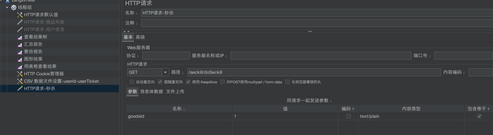

csv数据

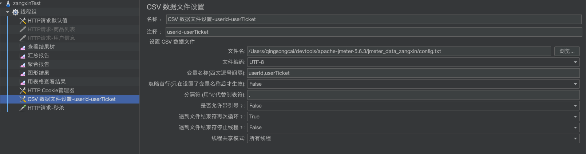

cookie数据

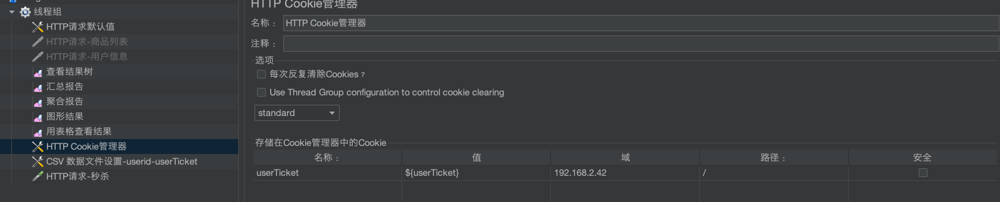

配置结果树和汇总报告等监听器

配置库存为10个, 商品id-goodsId=1

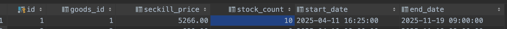

线程组: 线程数:1000, 循环次数10, ramp-up时间:0

**吞吐量1464**

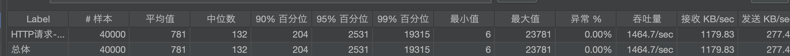

存在超卖问题

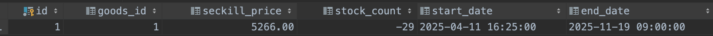

而且订单生成也有问题

明明只有10个库存商品, 却生成了200个订单---在库存判断时,没有考虑多超卖问题


压测数据库sql语句

```mysql
-- 压测,清理数据,避免用户限购一次的问题
delete from t_order where 1=1;
delete from t_seckill_order where 1=1;
update t_seckill_goods set stock_count = 10;
-- 查看结果
select count(*) as '普通订单数量' from t_order;
select count(*) as '秒杀订单数量' from t_seckill_order;
select stock_count from t_seckill_goods where goods_id =1;
```


#### 5.页面优化

**1)** **多用户在查看商品列表和商品详情的时候**每一个用户都需要到 **DB** **查询**

**2)** **对** **DB** **查询的压力很大，比如** **10000** 人, **在** **1** **分钟都查看商品列表** **就会有** **10000** **次对** **DB** **操作**

**3)** **但是我们商品信息并不会频繁的变化**, **所以你查询回来的结果都是一样的**

 **4)** **我们可以通过**Redis*缓存页面来进行优化*,**这样可以将**1分钟内多次查询DB, **优化成**1次查询**, **减少 **DB** **压力**

分析:


第一次请求时, redis中没有, 去DB中获取, 返回给客户端, 顺带着把数据放到redis中, 以后访问就从redis中读取了

商品列表缓存(/goods/toList)

具体code

```java
// 手动渲染模板要使用
@Autowired
private ThymeleafViewResolver thymeleafViewResolver;

// 使用了 redis 缓存页面优化
@RequestMapping(value = "/toList", produces = "text/html;charset=utf-8")
@ResponseBody
public String toList_v2(Model model, User user, HttpServletRequest request, HttpServletResponse response) {
  // 先从redis中拿,没有再从db中拿
  String html = (String) redisTemplate.opsForValue().get("goodsList");
  if (StringUtils.hasText(html)) {
    return html;
  }

  if (null == user) { // 用户没有成功登录,或者userTicket不正确
    return "login";
  }
  // 将用户信息放入到model中, 给模板使用
  model.addAttribute("user", user);
  // 从DB中拿数据
  List<GoodsVo> goodsVoList = goodsService.findGoodsVo();
  model.addAttribute("goodsList", goodsVoList);
  // 手动渲染Template模板
  WebContext webContext = new WebContext(request, response, request.getServletContext(), request.getLocale(), model.asMap());
  html = thymeleafViewResolver.getTemplateEngine().process("goodsList", webContext);
  if (StringUtils.hasText(html)) {
    // 每 60s 更新一次redis页面缓存, 即60s后, 该页面缓存失效, Redis 会清除该缓存
    redisTemplate.opsForValue().set("goodsList", html, 60, TimeUnit.SECONDS);
  }
  return html;
}
```

商品详情页缓存(/goods//toDetail/{goodsId}) 60秒失效时间,失效重写查询数据库,再缓存

```java
// 商品详情页-redis缓存优化
@RequestMapping(value = "/toDetail/{goodsId}", produces = "text/html;charset=utf-8")
@ResponseBody
public String toGoodsDetail_v2(@PathVariable("goodsId") Long goodsId,
       HttpServletRequest request, HttpServletResponse response,
       Model model, User user) {
    // 先从redis中拿,没有再从db中拿
    String html = (String) redisTemplate.opsForValue().get("goodsDetail:" + goodsId);
    if (StringUtils.hasText(html)) {
        return html;
    }
    if (null == user) {
        return "login";
    }
    GoodsVo goodsVo = goodsService.findGoodsVoByGoodsId(goodsId);

    Date startTime = goodsVo.getStartDate();
    Date endTime = goodsVo.getEndDate();
    Date now = new Date();
    // 秒杀状态 0: 未开始, 1:进行中 2:结束
    Integer status = 0;
    // 还剩多久秒杀开始
    Long remainSeconds = 0L;
    if (now.before(startTime)) {
        status = 0;
        remainSeconds = (startTime.getTime() - now.getTime()) / 1000;
    } else if (now.after(startTime) && now.before(endTime)) {
        remainSeconds = 0L;
        status = 1;
    } else if (now.after(endTime)) {
        status = 2;
        remainSeconds = -1L;
    }
    model.addAttribute("secKillStatus", status);
    model.addAttribute("remainSeconds", remainSeconds);
    model.addAttribute("goods", goodsVo);
    model.addAttribute("user", user);

    // 手动渲染Template模板
    WebContext webContext = new WebContext(request, response, request.getServletContext(), request.getLocale(), model.asMap());
    html = thymeleafViewResolver.getTemplateEngine().process("goodsDetail", webContext);
    if (StringUtils.hasText(html)) {
        // 每 60s 更新一次redis页面缓存, 即60s后, 该页面缓存失效, Redis 会清除该缓存
        redisTemplate.opsForValue().set("goodsDetail:" + goodsId, html, 60, TimeUnit.SECONDS);
    }
    return html;
}
```

压测结果

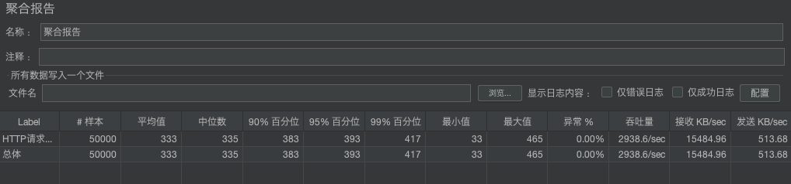

如果我们商品信息修改了**,** 会存在短时间内**(**比如 **1** 分钟**), Redis** 页面缓存和商品信息不一致的问题**,** 怎么办

思路 **1 :** 可以将 **Redis** 页面缓存更新时间减小**,** 比如设置成 **10s,** 甚至更短**.**

思路 **2 :** 可以在更新商品信息时**,** 同时更新 **Redis** 页面缓存**,** 台管理程序**,** 更新 **Redis** 页面缓存的原理和机制是一样的

对象缓存问题

**1)** **当用户登录成功后**就会将用户对象缓存到 **Redis**

**2)** **好处是解决了分布式架构下的** **Session** **共享问题**

**3)** **但是也带来新的问题**如果用户信息改变 **存在 用户信息和** **Redis** **缓存用户对象数据**不一致问题也就是对象缓存问题

**解决思路**

**1)** **编写方法 **当用户信息变化时 **就更新用户在** **DB** **的信息 **同时删除该用户在 **Redis** **的**缓存对象

**2)** **这样用户就需要使用新密码重新登录 **从而更新用户在**Redis** **对应的缓存对象. **

**3)** **我们以修改用户密码为例来演示用户其它信息修改类似** 

**4)** **用户信息修改接口，通常是在后台系统调用的**

修改密码后删除缓存,让用重新登录,从而刷新缓存

```java
    // 更新密码
    @Override
    @Transactional(rollbackFor = Exception.class)
    public ResponseBean updatePassword(User user, String password, HttpServletRequest request,
                                       HttpServletResponse response) {
        User userDb = userMapper.selectById(user.getId());
        // 修改密码
        String dbPass = MD5Util.inputPassToDBPass(password, userDb.getSalt());
        userDb.setPassword(dbPass);
        int update = userMapper.updateById(userDb);
        if (update > 0) {
            // 先拿到redis中userTicket作为redis的key,再删除redis中的缓存, 让用户下次重新登录
            String userTicket = CookieUtil.getCookieValue(request, "userTicket");
            redisTemplate.delete("user:" + userTicket);
            return ResponseBean.success();
        }
        return ResponseBean.error(ResponseBeanEnum.UPDATE_PASSWORD_ERROR);
    }
```

```java
/**
 *
 * @param user
 * @param newPassword 为了简单,直接调用的api接口, 密码不是前端加密过一次的, 而是明文
 * @param request
 * @param response
 * @return
 */
// http://127.0.0.1/user/updatePassword?newPassword=1234
@RequestMapping("/updatePassword")
@ResponseBody
public ResponseBean updatePassword(User user, String newPassword, HttpServletRequest request, HttpServletResponse response) {
    return userService.updatePassword(user, newPassword, request, response);
}
```

浏览器先登录一个用户 ,然后调用更改密码的api接口

http://127.0.0.1/user/updatePassword?newPassword=1234

当前登录用户的密码就被改为1234了, 刷新之前的页面, 就会跳转到登录页面


#### 6.解决重复购买和超卖问题

秒杀基本功能中方法有些不足之处:

1.扣减库存时没有原子性, 有两条sql语句(查询, 修改,超卖问题主要原因)

```java
// 查询秒杀商品的库存-扣减库存
SeckillGoods seckillGoods = seckillGoodsMapper.selectById(goodsVo.getId());
seckillGoods.setStockCount(seckillGoods.getStockCount() - 1);
int update = seckillGoodsMapper.updateById(seckillGoods);
```

现在优化为

```java
// 优化版本的扣减库存
// mysql在默认的事务隔离级别(可重复读),update语句会在事务中锁定要更新的行 (row lock)
// 带where条件是行锁, 不带where条件是表锁(性能大幅度降低)
// 防止奇台会话在同一行执行update或者delete操作
//sql: update t_seckill_goods set stock_count = stock_count - 1 where goods_id = ? and stock_count > 0
int update = seckillGoodsMapper.update(null, new UpdateWrapper<SeckillGoods>()
        .setSql("stock_count = stock_count - 1")
        .eq("goods_id", goodsVo.getId())
        .gt("stock_count", 0));
if (!(update > 0)) { // 库存不足
    throw new GlobalException(ResponseBeanEnum.INSUFFICIENT_INVENTORY);
}
```

2.缓存秒杀订单到redis中

```java
// 将生成秒杀的订单放入的redis中, 提高复购判断时的查询效率 key=order:userId:googsId
redisTemplate.opsForValue().set("order:" + userId + ":" + goodsVo.getId(), order);
```

判断复购

```java
SeckillOrder seckillOrder = (SeckillOrder) redisTemplate.opsForValue()
  .get("order:" + user.getId() + ":" + goodsVo.getId());
if (null != seckillOrder) {
  model.addAttribute("errmsg", ResponseBeanEnum.LIMIT_BUY_ONE.getMessage());
  return "secKillFail";
}
```

2.0版本的完整秒杀代码如下:

service

```java
// 需要考虑事务, 高并发
@Override
@Transactional(rollbackFor = Exception.class)
public Order seckill(User user, GoodsVo goodsVo) {
    Assert.notNull(user, "用户没有登录");
    Long userId = user.getId();
    Assert.notNull(goodsVo, "秒杀商品goods不能为空");
    // 查询秒杀商品的库存-扣减库存
    // 优化版本的扣减库存-v2.0
    // mysql在默认的事务隔离级别(可重复读),update语句会在事务中锁定要更新的行 (row lock)
    // 防止奇台会话在同一行执行update或者delete操作
    // update t_seckill_goods set stock_count = stock_count - 1 where goods_id = ? and stock_count > 0
    int update = seckillGoodsMapper.update(null, new UpdateWrapper<SeckillGoods>()
            .setSql("stock_count = stock_count - 1")
            .eq("goods_id", goodsVo.getId())
            .gt("stock_count", 0));
    if (!(update > 0)) { // 库存不足
        throw new GlobalException(ResponseBeanEnum.INSUFFICIENT_INVENTORY);
    }
    // 生成普通订单
    Order order = new Order();
    order.setUserId(userId);
    order.setGoodsId(goodsVo.getId());
    order.setDeliveryAddrId(0L); // 设置一个默认值
    order.setGoodsName(goodsVo.getGoodsName());
    order.setGoodsCount(1);
    order.setGoodsPrice(goodsVo.getSeckillPrice());
    order.setOrderChannel((byte) 1);
    order.setStatus((byte) 0);
    order.setCreateDate(new Date());
    this.save(order);
    // 生成秒杀商品订单
    SeckillOrder seckillOrder = new SeckillOrder();
    seckillOrder.setOrderId(order.getId());
    seckillOrder.setUserId(userId);
    seckillOrder.setGoodsId(goodsVo.getId());
    seckillOrderMapper.insert(seckillOrder);
    // 将生成秒杀的订单放入的redis中, 提高复购判断时的查询效率 key=order:userId:googsId
    redisTemplate.opsForValue().set("order:" + userId + ":" + goodsVo.getId(), seckillOrder);
    // 返回order用来回显订单信息
    return order;
}
```

controller

```java
// 处理用户抢购请求
@RequestMapping("/doSeckill")
public String doSeckill(User user, Model model, Long goodsId) {
  if (null == user) {
    return "login";
  }
  GoodsVo goodsVo = goodsService.findGoodsVoByGoodsId(goodsId);
  // 判断是否有库存
  if (goodsVo.getStockCount() < 1) {// 无库存
    model.addAttribute("errmsg", ResponseBeanEnum.INSUFFICIENT_INVENTORY.getMessage());
    return "secKillFail";
  }
  // 判断用户是否重复购买 redis中获取-v2.0
  SeckillOrder seckillOrder = (SeckillOrder) redisTemplate.opsForValue()
    .get("order:" + user.getId() + ":" + goodsVo.getId());
  if (null != seckillOrder) {
    model.addAttribute("errmsg", ResponseBeanEnum.LIMIT_BUY_ONE.getMessage());
    return "secKillFail";
  }
  // 生成订单
  Order order = orderService.seckill(user, goodsVo);
  if (null == order) {
    model.addAttribute("errmsg", "秒杀失败, 其他原因");
    return "secKillFail";
  }
  // 秒杀成功进入订单页面
  model.addAttribute("order", order);
  model.addAttribute("user", user);
  model.addAttribute("goods", goodsVo);
  return "orderDetail";
}
```

压测

准备: 

清空redis  flushdb

清空普通订单表, 秒杀订单表,用户表中自动生成的用户

设置库存为10个

```mysql
-- 压测,清理数据,避免用户限购一次的问题
delete from t_order where 1=1;
delete from t_seckill_order where 1=1;
update t_seckill_goods set stock_count = 10;
delete from seckill_user where id >= 13300000100;
```

重写生成用户, 并登录

执行UserUtil.main()

查看结果

```mysql
-- 查看结果
create view  v1 as select count(*) as '普通订单数量' from t_order;
create view  v2 as select count(*) as '秒杀订单数量' from t_seckill_order;
create view  v3 as select stock_count as '库存数量' from t_seckill_goods where goods_id =1;
select * from v1,v2,v3;
```

没有超卖问题,


 压测的吞吐量为8220/sec, 线程数2000, 循环20次,峰值时间0 ()

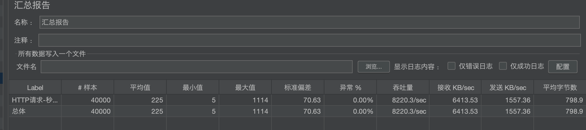


#### **7.** 秒杀优化**-RabbitMQ+Redis**

##### redis预减库存优化(v3)

我们之前防止超卖时通过到数据库查询和数据库抢购完成的

1判断库存是否充足

```java
GoodsVo goodsVo = goodsService.findGoodsVoByGoodsId(goodsId);
// 判断是否有库存
if (goodsVo.getStockCount() < 1) {// 无库存
  model.addAttribute("errmsg", ResponseBeanEnum.INSUFFICIENT_INVENTORY.getMessage());
  return "secKillFail";
}
```

2.通过行锁扣减库存

```java
// mysql在默认的事务隔离级别(可重复读),update语句会在事务中锁定要更新的行 (row lock)
// 防止奇台会话在同一行执行update或者delete操作
// update t_seckill_goods set stock_count = stock_count - 1 where goods_id = ? and stock_count > 0
int update = seckillGoodsMapper.update(null, new UpdateWrapper<SeckillGoods>()
                                       .setSql("stock_count = stock_count - 1")
                                       .eq("goods_id", goodsVo.getId())
                                       .gt("stock_count", 0));
if (!(update > 0)) { // 库存不足
  throw new GlobalException(ResponseBeanEnum.INSUFFICIENT_INVENTORY);
}
```

这样的方式有缺点

如果在短时间,大量抢购进入DB,造成峰值, 容易压垮数据库

**解决方案 使用redis预减库存(库存放到redis中), 如果没有库存了, 直接返回, 减小对DB的压力**(v3)

示意图


实现

1.秒杀开始前初始化库存到redis中

```java
// init()方法,在属性初始化完成后调用, 在这里初始化库存(测试方便,不要到生产中使用,因为生成环境可能有多个buy服务集群)
@Override
public void afterPropertiesSet() throws Exception {
  // 查询所有秒杀商品
  List<GoodsVo> list = goodsService.findGoodsVo();
  // 变量商品,将上线活动的商品库存放入到redis
  if (CollectionUtils.isEmpty(list)) {
    return;
  }
  list.forEach(goodsVo -> {
    Long goodsId = goodsVo.getId();
    Integer stockCount = goodsVo.getStockCount();
    // 商品库存key=seckillGoods:goodsId, value=库存量
    redisTemplate.opsForValue().set("seckillGoods:" + goodsId, stockCount);
    // todo 需要搞个定时任务同步redis库存到数据库
  });
}
```

redis预减库存

```java
// 处理用户抢购请求 v3
@RequestMapping("/doSeckill")
public String doSeckill_v3(User user, Model model, Long goodsId) {
  if (null == user) {
    return "login";
  }
  GoodsVo goodsVo = goodsService.findGoodsVoByGoodsId(goodsId);
  // 判断是否有库存
  // 既然取出了 goodsVo, 就判断一下 DB 是否还有库存, 但该方法 在大并发下, 不能确保不超卖(方法不具原子性)
  if (goodsVo.getStockCount() < 1) {
    model.addAttribute("errmsg", ResponseBeanEnum.INSUFFICIENT_INVENTORY.getMessage());
    return "secKillFail";
  }

  // 是否重复购买
  // 这个判断要在预减库存 前面, 否则如果一个用户购买成功 再次秒杀，就会预减 Redis 库存,
  // 就会造成了 Redis 库存少了，但是实际 DB 库存还有剩余, 出现秒杀商品剩余的问题
  SeckillOrder seckillOrder = (SeckillOrder) redisTemplate.opsForValue()
    .get("order:" + user.getId() + ":" + goodsVo.getId());
  if (null != seckillOrder) {
    model.addAttribute("errmsg", ResponseBeanEnum.LIMIT_BUY_ONE.getMessage());
    return "secKillFail";
  }

  // 库存预减,如果在redis没有库存了,直接返回,不往下走了,减少执行查询数据库[优化]
  Long decrement = redisTemplate.opsForValue().decrement("seckillGoods:" + goodsId);
  if (decrement < 0) { // 说明商品已经没有库存了
    // 恢复库存为0
    redisTemplate.opsForValue().set("seckillGoods:" + goodsId, 0);
    model.addAttribute("errmsg", ResponseBeanEnum.INSUFFICIENT_INVENTORY.getMessage());
    return "secKillFail";
  }

  // 生成订单
  Order order = orderService.seckill(user, goodsVo);
  if (null == order) {
    model.addAttribute("errmsg", "秒杀失败, 其他原因");
    return "secKillFail";
  }
  // 秒杀成功进入订单页面
  model.addAttribute("order", order);
  model.addAttribute("user", user);
  model.addAttribute("goods", goodsVo);
  return "orderDetail";
}
```

压测结果 8237,结果不明显, 因为我的数据库在本机,redis在虚拟机上,(调大redis的最大连接数)

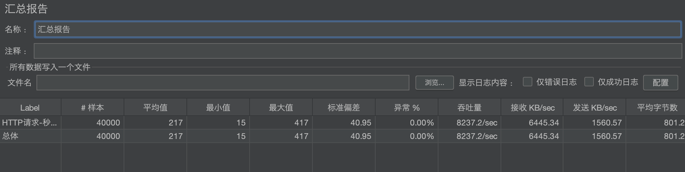


##### 内存标记优化(v4)

加入内存标记，避免总到 Reids 查询库存

```java
// 库存预减,如果在redis没有库存了,直接返回,不往下走了,减少执行查询数据库[优化]
Long decrement = redisTemplate.opsForValue().decrement("seckillGoods:" + goodsId);
if (decrement < 0) { // 说明商品已经没有库存了
  // 恢复库存为0
  redisTemplate.opsForValue().set("seckillGoods:" + goodsId, 0);
  model.addAttribute("errmsg", ResponseBeanEnum.INSUFFICIENT_INVENTORY.getMessage());
  return "secKillFail";
}
```

上面这段代码可以优化, 如果redis中商品库存为空时, 把商品放入到map中, 再有请求过来先查本地, 如果本地有库存,再去redis扣减库存 (本地比redis更快, redis要通过网络连接,比较耗时)

```java
// 存放商品库存状态, key=goodsId, value: true有库存, false无库存
private ConcurrentHashMap<Long, Boolean> goodsStausMap = new ConcurrentHashMap<>();

@Override
public void afterPropertiesSet() throws Exception {
  // 查询所有秒杀商品
  List<GoodsVo> list = goodsService.findGoodsVo();
  // 变量商品,将上线活动的商品库存放入到redis
  if (CollectionUtils.isEmpty(list)) {
    return;
  }
  list.forEach(goodsVo -> {
    Long goodsId = goodsVo.getId();
    Integer stockCount = goodsVo.getStockCount();
    // 商品库存key=seckillGoods:goodsId, value=库存量
    redisTemplate.opsForValue().set("seckillGoods:" + goodsId, stockCount);
    // 初始化库存状态
    goodsStausMap.put(goodsId, stockCount > 0);
    // todo 需要搞个定时任务同步redis库存到数据库
  });
```

抢购方法

```java
// 处理用户抢购请求 v4 内存标记优化(v4)
@RequestMapping("/doSeckill")
public String doSeckill_v4(User user, Model model, Long goodsId) {
  if (null == user) {
    return "login";
  }
  GoodsVo goodsVo = goodsService.findGoodsVoByGoodsId(goodsId);

  // 判断是否有库存
  if (goodsVo.getStockCount() < 1) {
    model.addAttribute("errmsg", ResponseBeanEnum.INSUFFICIENT_INVENTORY.getMessage());
    return "secKillFail";
  }

  // 是否重复购买 这个判断要在预减库存 前面,
  SeckillOrder seckillOrder = (SeckillOrder) redisTemplate.opsForValue()
    .get("order:" + user.getId() + ":" + goodsVo.getId());
  if (null != seckillOrder) {
    model.addAttribute("errmsg", ResponseBeanEnum.LIMIT_BUY_ONE.getMessage());
    return "secKillFail";
  }

  // 先在本地判断, 如果没有库存直接返回,不用走后面流程了
  if (goodsStausMap.get(goodsId) != null && !goodsStausMap.get(goodsId)) {
    model.addAttribute("errmsg", ResponseBeanEnum.INSUFFICIENT_INVENTORY.getMessage());
    return "secKillFail";
  }

  // 库存预减,如果在redis没有库存了,直接返回,不往下走了,减少执行查询数据库[优化]
  Long decrement = redisTemplate.opsForValue().decrement("seckillGoods:" + goodsId);
  if (decrement < 0) { // 说明商品已经没有库存了
    // 更新本地库存状态
    goodsStausMap.put(goodsId, false);
    // 恢复库存为0
    redisTemplate.opsForValue().set("seckillGoods:" + goodsId, 0);
    model.addAttribute("errmsg", ResponseBeanEnum.INSUFFICIENT_INVENTORY.getMessage());
    return "secKillFail";
  }

  // 生成订单
  Order order = orderService.seckill(user, goodsVo);
  if (null == order) {
    model.addAttribute("errmsg", "秒杀失败, 其他原因");
    return "secKillFail";
  }
  // 秒杀成功进入订单页面
  model.addAttribute("order", order);
  model.addAttribute("user", user);
  model.addAttribute("goods", goodsVo);

  return "orderDetail";
}
```


压测结果8330

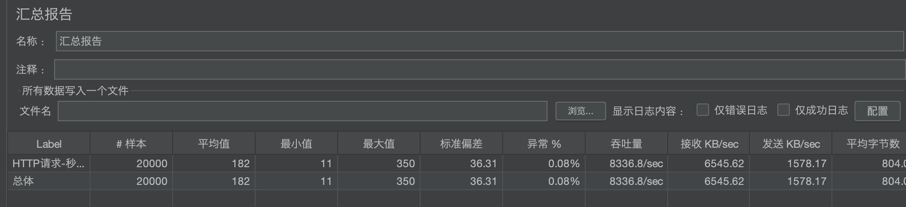

一键清理数据方法, 清理完毕后,直接jmeter

```java
public class TestAuto {
    public static void main(String[] args) throws Exception {

        Connection connection = getConn();
        String sql1 = "delete from t_order where 1=1";
        String sql2 = "delete from t_seckill_order where 1=1";
        String sql3 = "update t_seckill_goods set stock_count = 10";
        PreparedStatement ps1 = connection.prepareStatement(sql1);
        ps1.executeUpdate();
        PreparedStatement ps2 = connection.prepareStatement(sql2);
        ps2.executeUpdate();
        PreparedStatement ps3 = connection.prepareStatement(sql3);
        ps3.executeUpdate();
        System.out.println("清理数据库完成");


        Jedis jedis = connectRedis();
        jedis.set("seckillGoods:1", "10");
        Set<String> keys = jedis.keys("order:*");
        if (!CollectionUtils.isEmpty(keys)) {
            jedis.del(keys.toArray(new String[0]));
        }

        System.out.println("清理redis完成");

        // 重置库存状态map
        // seckill/resetStockStatus
        HttpClientBuilder httpClientBuilder = HttpClientBuilder.create();
        HttpGet httpGet = new HttpGet("http://localhost/seckill/resetStockStatus");
        // 设置请求头：内容类型
        httpGet.setHeader("Content-Type", "application/json;charset=UTF-8");
        CloseableHttpResponse httpResponse = httpClientBuilder.build().execute(httpGet);
        System.out.println("重置库存状态map完成");
        // release
        ps1.close();
        ps2.close();
        ps3.close();
        jedis.close();
        httpResponse.close();
        System.out.println("现在可以在jmeter上压测了");
    }


    private static Jedis connectRedis() throws Exception {
        // 连接redis
        Jedis jedis = new Jedis("192.168.2.85", 6379);
        return jedis;
    }

    private static Connection getConn() throws Exception {
        String url = "jdbc:mysql://localhost:3306/seckill?useUnicode=true&characterEncoding=UTF-8&serverTimezone=Asia/Shanghai";
        String username = "root";
        String password = "root";
        String driver = "com.mysql.cj.jdbc.Driver";
        Class.forName(driver);
        return DriverManager.getConnection(url, username, password);
    }
}
```


##### 消息队列实现异步操作(v5)

**前面秒杀,** **没有实现异步机制** **是完成下订单后再返回的 **当有大并发请求下订单操作**时**数据库来不及响应容易造成线程堆积
优化方案

**-** **加入消息队列，实现秒杀的异步请求**

**-** **接收到客户端秒杀请求后，服务器立即返回 正在秒杀中**..,**有利于流量削峰**

**-** **客户端进行轮询秒杀结果**, **接收到秒杀结果后，在客户端页面显示即可**

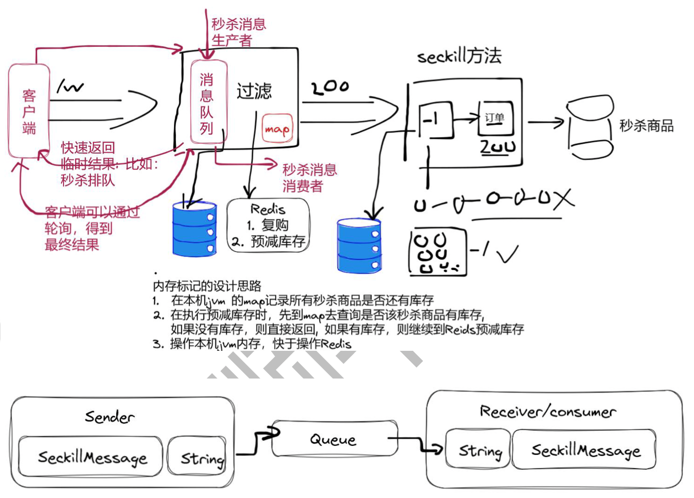

实现代码

使用topic交换机mq

消息体

```java
@Data
@AllArgsConstructor
@NoArgsConstructor
public class SeckillMessage implements Serializable {
    private User user;
    private Long goodsId;
}
```

mq配置

```java
// 秒杀rabbitmq
private static final String SECKILL_QUEUE = "seckillQueue";
private static final String SECKILL_EXCHANGE = "seckillExchange";
private static final String SECKILL_ROUTING_KEY = "seckill.#";

@Bean
public Queue queue_seckill() {
  return new Queue(SECKILL_QUEUE);
}

@Bean
public TopicExchange seckill_exchange() {
  return new TopicExchange(SECKILL_EXCHANGE);
}

@Bean
public Binding binding_seckill() {
  return BindingBuilder.bind(queue_seckill()).to(seckill_exchange()).with(SECKILL_ROUTING_KEY);
}
```

发送消息

```java
@SneakyThrows
public void sendSeckillOrder(SeckillMessage msg) {
  log.info("发送秒杀消息:{}", msg);
  String msgStr = new ObjectMapper().writeValueAsString(msg);
  rabbitTemplate.convertAndSend("seckillExchange", "seckill.order", msgStr);
}
```

接收消息

```java
// 接收秒杀消息
@RabbitListener(queues = {"seckillQueue"})
public void recevieSeckillOrderMessage(String msg) throws JsonProcessingException {
  log.info("[秒杀订单]接收到消息: {}", msg);
  ObjectMapper objectMapper = new ObjectMapper();
  SeckillMessage seckillMessage = objectMapper.readValue(msg, SeckillMessage.class);
  // 消费消息--保存订单
  User user = seckillMessage.getUser();
  Long goodsId = seckillMessage.getGoodsId();
  GoodsVo goodsVo = goodsService.findGoodsVoByGoodsId(goodsId);
  orderService.seckill(user, goodsVo);
}
```

在controller中接收到请求后, 发送秒杀消息

```java
// 生成订单-发送mq消息
SeckillMessage seckillMessage = new SeckillMessage(user,goodsId);
mqSender.sendSeckillOrder(seckillMessage);
```

完整代码

```java
// 处理用户抢购请求 v5 消息队列
@RequestMapping("/doSeckill")
public String doSeckill_v5(User user, Model model, Long goodsId) {
  if (null == user) {
    return "login";
  }
  GoodsVo goodsVo = goodsService.findGoodsVoByGoodsId(goodsId);

  // 判断是否有库存
  if (goodsVo.getStockCount() < 1) {
    model.addAttribute("errmsg", ResponseBeanEnum.INSUFFICIENT_INVENTORY.getMessage());
    return "secKillFail";
  }

  // 是否重复购买 这个判断要在预减库存 前面,
  SeckillOrder seckillOrder = (SeckillOrder) redisTemplate.opsForValue()
    .get("order:" + user.getId() + ":" + goodsVo.getId());
  if (null != seckillOrder) {
    model.addAttribute("errmsg", ResponseBeanEnum.LIMIT_BUY_ONE.getMessage());
    return "secKillFail";
  }

  // 先在本地判断, 如果没有库存直接返回,不用走后面流程了
  if (goodsStausMap.get(goodsId) != null && !goodsStausMap.get(goodsId)) {
    model.addAttribute("errmsg", ResponseBeanEnum.INSUFFICIENT_INVENTORY.getMessage());
    return "secKillFail";
  }

  // 库存预减,如果在redis没有库存了,直接返回,不往下走了,减少执行查询数据库[优化]
  Long decrement = redisTemplate.opsForValue().decrement("seckillGoods:" + goodsId);
  if (decrement < 0) { // 说明商品已经没有库存了
    // 更新本地库存状态
    goodsStausMap.put(goodsId, false);
    // 恢复库存为0
    redisTemplate.opsForValue().set("seckillGoods:" + goodsId, 0);
    model.addAttribute("errmsg", ResponseBeanEnum.INSUFFICIENT_INVENTORY.getMessage());
    return "secKillFail";
  }
  // 生成订单-发送mq消息
  SeckillMessage seckillMessage = new SeckillMessage(user,goodsId);
  mqSender.sendSeckillOrder(seckillMessage);

  model.addAttribute("errmsg", "排队中...");
  return "secKillFail";
}
```

压测结果8000

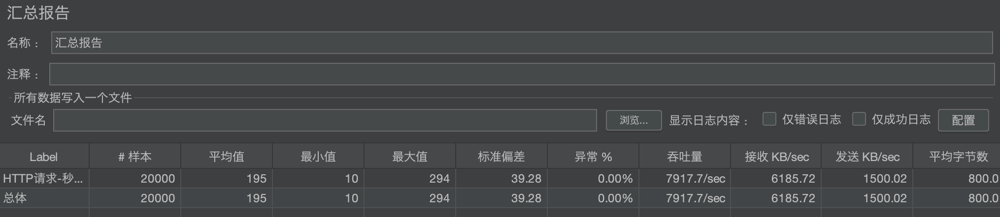

注意到因为消息队列是异步,所以无法给前端返回是否抢到的结果, 所以返回"排队中..."


这时需要客户端去轮询--抢购是否成功下单了--轮询秒杀最终结果

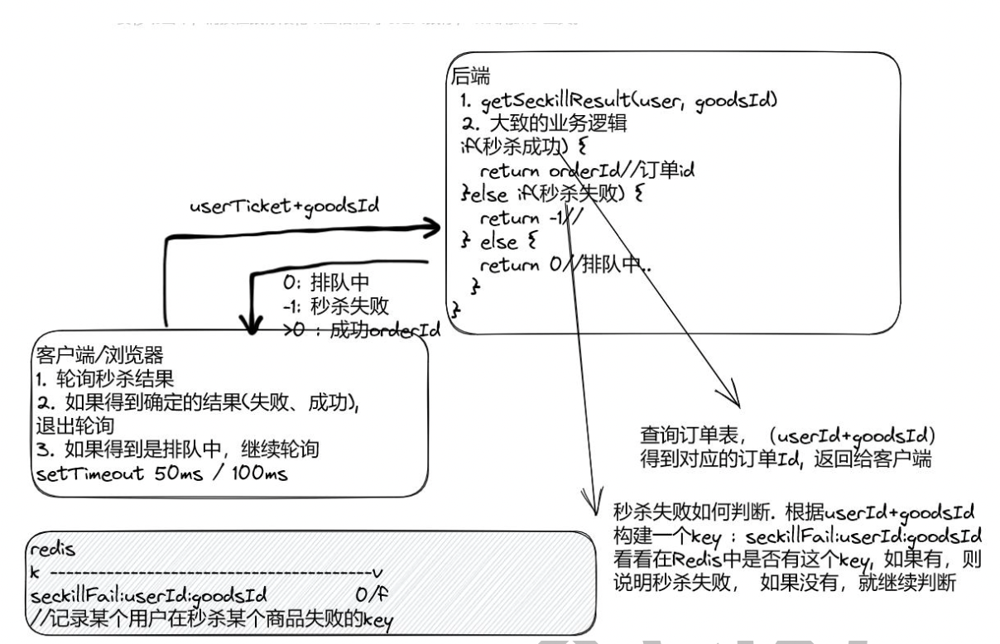

或者

怎么判断秒杀失败呢? 订单表中没有userId-goodsId的记录

#### 8.秒杀安全

##### 秒杀接口地址隐藏

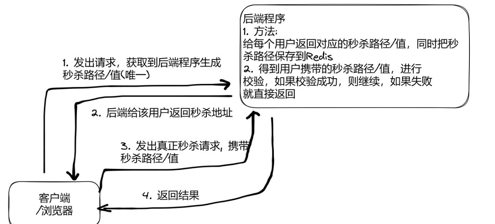

```java
// 生成唯一秒杀路径,每个用户都不一样
@Override
public String createPath(User user, Long goodsId) {
  // 生成一个秒杀路径
  String path = MD5Util.md5(UUIDUtil.uuid());
  // key=seckillPath:userId:goodsId, value=path 过期时间60s
  redisTemplate.opsForValue().set("seckillPath:" + user.getId() + ":" + goodsId, path, 60, TimeUnit.SECONDS);
  return path;
}

 // 校验秒杀路径
@Override
public boolean checkPath(User user, Long goodsId, String path) {
  if (user == null || goodsId < 0 || !StringUtils.hasText(path)) {
    return false;
  }
  // 校验路径
  String redisPath = (String) redisTemplate.opsForValue().get("seckillPath:" + user.getId() + ":" + goodsId);
  return path.equals(redisPath);
}
```

改造后的controller

```java
// 处理用户抢购请求 v6  增加秒杀安全机制, 返回json数据, 不跳转页面了
@RequestMapping("/{path}/doSeckill")
@ResponseBody
public ResponseBean doSeckill_v6(@PathVariable("path") String path, User user, Long goodsId) {
  if (null == user) {
    return ResponseBean.error(ResponseBeanEnum.SESSION_ERROR);
  }
  // 校验路径是否合法
  boolean isPathOk = orderService.checkPath(user, goodsId, path);
  if (!isPathOk) {
    return ResponseBean.error(ResponseBeanEnum.REQUEST_ILLEGAL);
  }

  GoodsVo goodsVo = goodsService.findGoodsVoByGoodsId(goodsId);
  // 判断是否有库存
  if (goodsVo.getStockCount() < 1) {
    return ResponseBean.error(ResponseBeanEnum.INSUFFICIENT_INVENTORY);
  }

  // 是否重复购买 这个判断要在预减库存 前面,
  SeckillOrder seckillOrder = (SeckillOrder) redisTemplate.opsForValue()
    .get("order:" + user.getId() + ":" + goodsVo.getId());
  if (null != seckillOrder) {
    return ResponseBean.error(ResponseBeanEnum.LIMIT_BUY_ONE);
  }

  // 先在本地判断, 如果没有库存直接返回,不用走后面流程了
  if (goodsStausMap.get(goodsId) != null && !goodsStausMap.get(goodsId)) {
    return ResponseBean.error(ResponseBeanEnum.INSUFFICIENT_INVENTORY);
  }

  // 库存预减,如果在redis没有库存了,直接返回,不往下走了,减少执行查询数据库[优化]
  Long decrement = redisTemplate.opsForValue().decrement("seckillGoods:" + goodsId);
  if (decrement < 0) { // 说明商品已经没有库存了
    // 更新本地库存状态
    goodsStausMap.put(goodsId, false);
    // 恢复库存为0
    redisTemplate.opsForValue().set("seckillGoods:" + goodsId, 0);
    return ResponseBean.error(ResponseBeanEnum.INSUFFICIENT_INVENTORY);
  }

  // 生成订单-发送mq消息
  SeckillMessage seckillMessage = new SeckillMessage(user, goodsId);
  mqSender.sendSeckillOrder(seckillMessage);

  return ResponseBean.success(ResponseBeanEnum.SECKILL_QUEUE);
}
```

前端页面

```html
<!--对应秒杀v6.0后台 隐藏秒杀接口-->
<input type="hidden" id="goodsId" name="goodsId" th:value="${goods.id}">
<button class="btn btn-primary btn-block" type="submit" onclick="getSecKillPath()" id="buyButton">
  立即秒杀
</button>
```

```javascript
//通过隐藏秒杀接口的方式,秒杀商品
function getSecKillPath() {
  var goodsId = $("#goodsId").val();
  //获取用户输入的验证码
  // var captcha = $("#captcha").val();
  $.ajax({
    url: "/seckill/path",
    type: "GET",
    data: {
      goodsId: goodsId,
      // captcha: captcha,
    },
    success: function (data) {
      if (data.code == 200) {
        //取出服务器返回的随机生成的路径
        var path = data.obj;
        //真正的秒杀方法
        doSecKill(path);
      } else {
        layer.msg(data.message);
      }
    },
    error: function () {
      layer.msg("客户端请求错误");
    }
  })
}

//携带秒杀生成的路径, 秒杀商品
function doSecKill(path) {
  $.ajax({
    //一定要注意路径的大小写问题,否则报404
    url: '/seckill/' + path + '/doSeckill',
    type: 'POST',
    data: {
      goodsId: $("#goodsId").val()
    },
    success: function (data) {
      if (data.code == 200) {
        layer.msg("秒杀结果" + data.message);
      } else {
        layer.msg(data.message);
      }
    },
    error: function () {
      layer.msg("客户端请求错误！", {time: 2000});
    }
  });
}
```

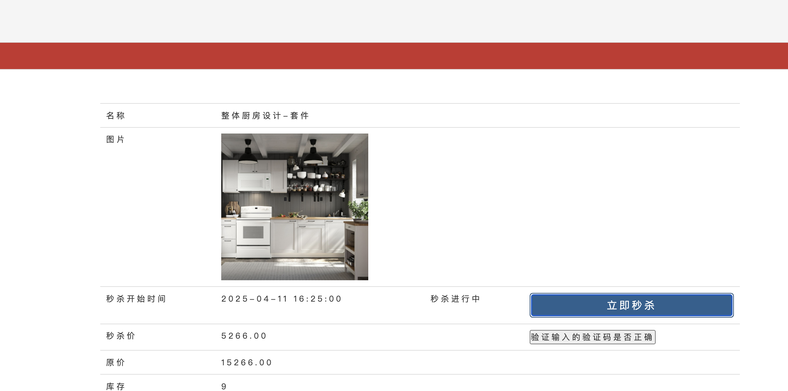


##### 验证码防止脚本攻击

在一些抢购活动中 可以通过验证码的方式 **防止脚本攻击 **比如 **12306**

**使用验证码工具: happyCaptcha** https://gitee.com/ramostear/Happy-Captcha

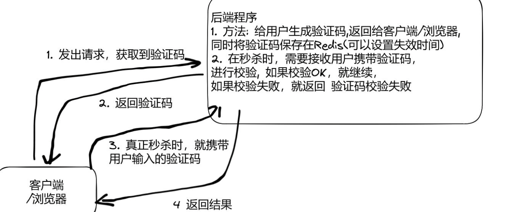


生成验证码

```java
// 生成验证码,并放到redis中
@RequestMapping("/captcha")
public void happyCaptcha(HttpServletRequest request, HttpServletResponse response, User user, Long goodsId) {
  // 生成验证码并返回, 验证码默认就保存在session中, sessionKey: happy-captcha
  HappyCaptcha.require(request, response)
    .style(CaptchaStyle.ANIM)            // 设置展现样式为动画
    .type(CaptchaType.NUMBER)            // 设置验证码内容为数字
    .length(6)                            // 设置字符长度为6
    .width(220)                            // 设置动画宽度为220
    .height(80)                            // 设置动画高度为80
    .font(Fonts.getInstance().zhFont())    // 设置汉字的字体
    .build().finish();                // 生成并输出验证码
  // 验证码保存在redis中, 时间为5min, key: captcha:userId:goodsId
  redisTemplate.opsForValue().set("captcha:" + user.getId() + ":" + goodsId,
                                  request.getSession().getAttribute("happy-captcha"), 300, TimeUnit.SECONDS);
}
```

校验验证码方法

```java
@Override
public boolean checkCode(User user, Long goodsId, String code) {
  if (user == null || goodsId < 0 || !StringUtils.hasText(code)) {
    return false;
  }
  String redisCode = (String) redisTemplate.opsForValue().get("captcha:" + user.getId() + ":" + goodsId);
  return code.equals(redisCode);
}
```

在获取隐藏的秒杀路径时校验验证码

```java
// 秒杀安全-获取秒杀路径
@RequestMapping("/path")
@ResponseBody
public ResponseBean getPath(User user, Long goodsId, String captcha) {
  if (user == null || goodsId == null || goodsId < 0) {
    return ResponseBean.error(ResponseBeanEnum.SESSION_ERROR);
  }
  // 校验验证码
  boolean isCodeOK = orderService.checkCode(user, goodsId, captcha);
  if (!isCodeOK) {
    return ResponseBean.error(ResponseBeanEnum.CODE_ERROR);
  }
  String path = orderService.createPath(user, goodsId);
  return ResponseBean.success(path);
}
```

```html
<td>
  <!--显示验证码-->
  
</td>
<td>
  <!--输入框,可以输入验证码-->
  <input id="captcha" class="captchaImg"/>
  <input type="button" id="captchabtn" onclick="verifyCaptcha()" value="验证输入的验证码是否正确">
</td>
```

```javascript
// 在秒杀进行中的状态下, 请求验证码,并显示(默认情况下该验证码图片是不显示的)
$("#captchaImg").attr("src", "/seckill/captcha?goodsId=" + $("#goodsId").val());
$("#captchaImg").show();
// 显示输入框
$("#captcha").show();
```

获取隐藏路径时传递验证码

```javascript
//通过隐藏秒杀接口的方式,秒杀商品
function getSecKillPath() {
  var goodsId = $("#goodsId").val();
  //获取用户输入的验证码
  var captcha = $("#captcha").val();
  $.ajax({
    url: "/seckill/path",
    type: "GET",
    data: {
      goodsId: goodsId,
      captcha: captcha,
    },
    success: function (data) {
      if (data.code == 200) {
        //取出服务器返回的随机生成的路径
        var path = data.obj;
        //真正的秒杀方法
        doSecKill(path);
      } else {
        layer.msg(data.message);
      }
    },
    error: function () {
      layer.msg("客户端请求错误");
    }
  })
}
```


##### 秒杀接口限流防刷

接口限流**-**防止某个用户频繁的请求秒杀接口

点击过于频繁后给用户显示: "访问过于频繁, 请稍后再试"

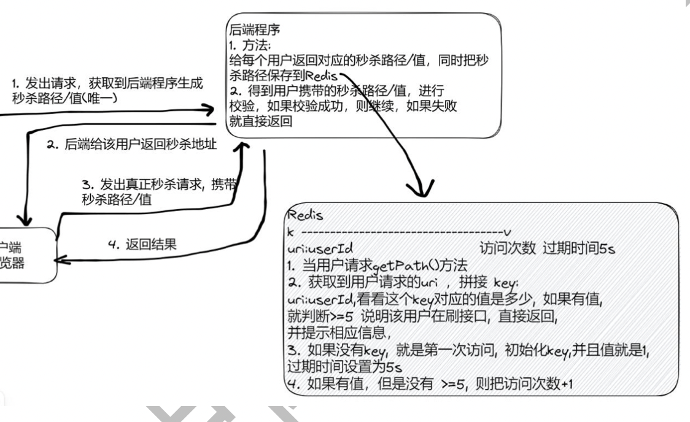

redis计数器, 完成接口限流

**-** 除了计数器算法，也有其它的算法来进行接口限流**,** 比如漏桶算法和令牌桶算法

令牌桶算法**,** 相对比较主流

```java
// 秒杀安全-获取秒杀路径-v7
@RequestMapping("/path")
@ResponseBody
public ResponseBean getPath(User user, Long goodsId, String captcha, HttpServletRequest request) {
  if (user == null || goodsId == null || goodsId < 0) {
    return ResponseBean.error(ResponseBeanEnum.SESSION_ERROR);
  }

  // v8秒杀计数器,防止用户刷接口, 5s内超过5次就认为是刷接口
  String uri = request.getRequestURI();
  Integer count = (Integer) redisTemplate.opsForValue().get(uri + ":" + user.getId());
  if (count == null) { // 说明是第一次访问
    redisTemplate.opsForValue().set(uri + ":" + user.getId(), 1, 5, TimeUnit.SECONDS);
  } else if (count != null && count < 5) {
    redisTemplate.opsForValue().increment(uri + ":" + user.getId());
  } else if (count != null && count >= 5) {
    return ResponseBean.error(ResponseBeanEnum.LIMIT_ACCESS);
  }

  // 校验验证码 -v7
  boolean isCodeOK = orderService.checkCode(user, goodsId, captcha);
  if (!isCodeOK) {
    return ResponseBean.error(ResponseBeanEnum.CODE_ERROR);
  }
  String path = orderService.createPath(user, goodsId);
  return ResponseBean.success(path);
}
```


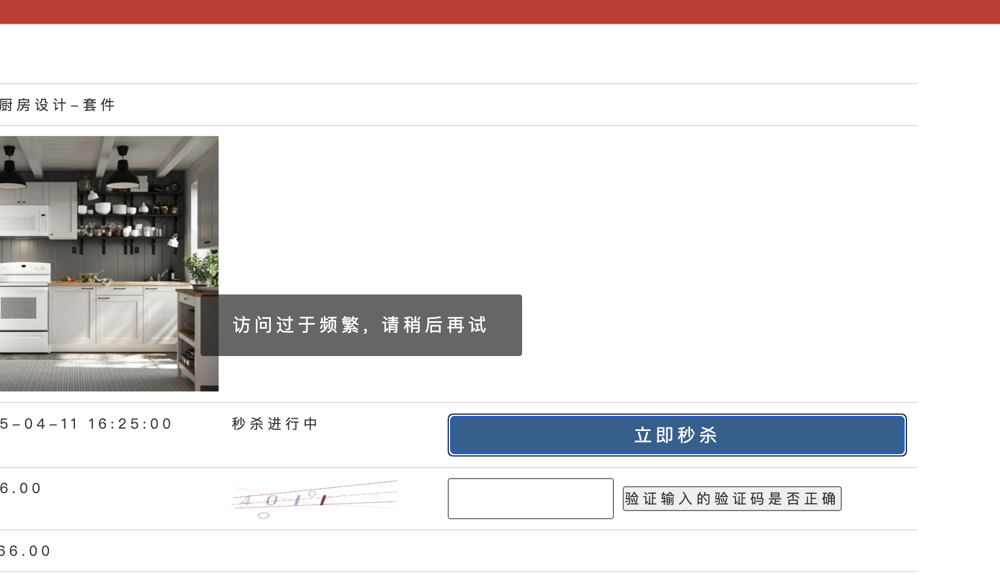

上面代码缺点: 侵入性太强, 过期时间/数量(即访问速率)写死了

限流代码改进, 使用注解实现

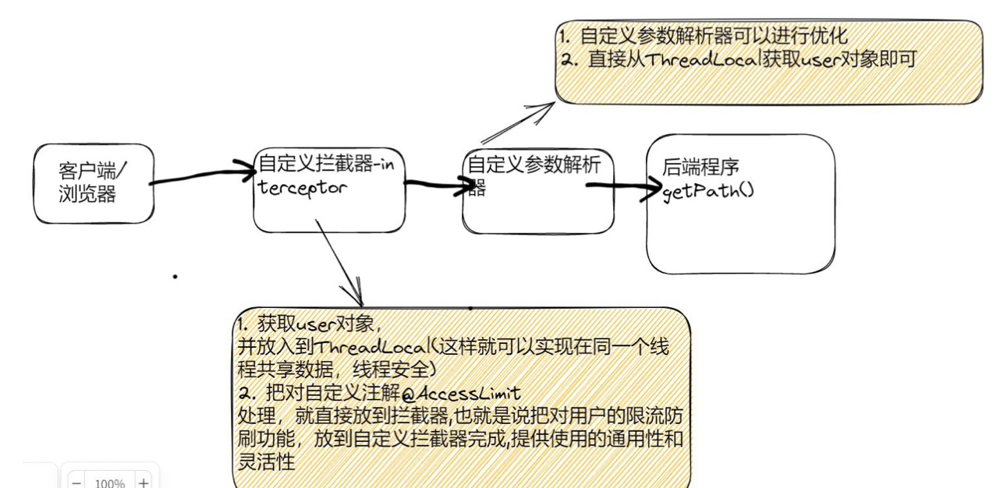


实现

```java
// 在统计时间长度内,达到最大访问次数,就会限制访问
@Target(ElementType.METHOD)
@Retention(RetentionPolicy.RUNTIME)
public @interface AccessRateLimiter {
    // 统计时间长度
    int second();
    // 最大访问次数
    int maxCount();
    // 是否需要登录,默认需要登录
    boolean needLogin() default true;
}
```

```java
public class UserContext {
    // 每个线程都有自己的ThreadLocal, 把共享数据放在ThreadLocal,保证线程安全
    private static ThreadLocal<User> userHolder = new ThreadLocal<>();

    public static void setUser(User user) {
        userHolder.set(user);
    }

    public static User getUser(User user) {
        return userHolder.get();
    }
}
```

拦截器

```java
@Component
@SuppressWarnings("all")
public class AccessLimitInterceptor implements HandlerInterceptor {
    @Autowired
    private UserService userService;

    @Autowired
    private RedisTemplate redisTemplate;

    // 实现两个功能: 得到user对象,放入到ThreadLocal, 解析注解@AccessRateLimiter
    @Override
    public boolean preHandle(HttpServletRequest request, HttpServletResponse response, Object handler) throws Exception {
        if (handler instanceof HandlerMethod) {
            User user = getUser(request, response);

            // 得到user对象,放入到ThreadLocal
            UserContext.setUser(user);

            HandlerMethod hm = (HandlerMethod) handler;
            AccessRateLimiter rateLimiter = hm.getMethodAnnotation(AccessRateLimiter.class);
            if (rateLimiter == null) {
                // 没有限流注解, 直接放行
                return true;
            }
            int maxCount = rateLimiter.maxCount();
            int second = rateLimiter.second();
            boolean isNeedLogin = rateLimiter.needLogin(); // 是否需要登录
            if (isNeedLogin) {
                // 需要登录
                if (user == null) { // 没有登录时, 就重定向到登录页面去, 返回false表示不走下面的流程了
                    render(response, ResponseBeanEnum.SESSION_ERROR);
                    return false;
                }
            }
            // 进行访问速度限制: 在一定的时间内超过固定的访问次数,就进行限流-熔断
            String uri = request.getRequestURI();
            Integer count = (Integer) redisTemplate.opsForValue().get(uri + ":" + user.getId());
            if (count == null) { // 说明是第一次访问
                redisTemplate.opsForValue().set(uri + ":" + user.getId(), 1, second, TimeUnit.SECONDS);
            } else if (count != null && count < maxCount) {
                redisTemplate.opsForValue().increment(uri + ":" + user.getId());
            } else if (count != null && count >= maxCount) {
                render(response,ResponseBeanEnum.LIMIT_ACCESS);
                return false;
            }
        }
        return true;
    }

    @SneakyThrows
    private void render(HttpServletResponse response, ResponseBeanEnum responseBeanEnum) {
        response.setContentType("application/json");
        response.setCharacterEncoding("UTF-8");
        ResponseBean responseBean = ResponseBean.error(responseBeanEnum);
        response.getWriter().write(new ObjectMapper().writeValueAsString(responseBean));
    }
    private User getUser(HttpServletRequest request, HttpServletResponse response) {
        String userTicket = CookieUtil.getCookieValue(request, "userTicket");
        if (!StringUtils.hasText(userTicket)) {
            return null; // 用户没有登录
        }
        return userService.getUserByCookie(userTicket, request, response);
    }
}
```

注册拦截器

```java
@Configuration
@EnableWebMvc
public class WebConfig implements WebMvcConfigurer {
    @Autowired
    private UserArgumentResolver userArgumentResolver;

    @Autowired
    private AccessLimitInterceptor accessLimitInterceptor;

    // 静态资源加载
    @Override
    public void addResourceHandlers(ResourceHandlerRegistry registry) {
        registry.addResourceHandler("/**").addResourceLocations("classpath:/static/");
    }

    // 自定义参数解析
    @Override
    public void addArgumentResolvers(List<HandlerMethodArgumentResolver> resolvers) {
        resolvers.add(userArgumentResolver);
    }

    // 自定义拦截器
    @Override
    public void addInterceptors(InterceptorRegistry registry) {
        registry.addInterceptor(accessLimitInterceptor);
    }
}
```

使用注解

```java
// 秒杀安全-获取秒杀路径-v7
@RequestMapping("/path")
@ResponseBody
@AccessRateLimiter(second = 5, maxCount = 5, needLogin = true)
public ResponseBean getPath(User user, Long goodsId, String captcha, HttpServletRequest request) {
  if (user == null || goodsId == null || goodsId < 0) {
    return ResponseBean.error(ResponseBeanEnum.SESSION_ERROR);
  }

  // v8秒杀计数器,防止用户刷接口, 5s内超过5次就认为是刷接口 -被注解替代
  // String uri = request.getRequestURI();
  // Integer count = (Integer) redisTemplate.opsForValue().get(uri + ":" + user.getId());
  // if (count == null) { // 说明是第一次访问
  //     redisTemplate.opsForValue().set(uri + ":" + user.getId(), 1, 5, TimeUnit.SECONDS);
  // } else if (count != null && count < 5) {
  //     redisTemplate.opsForValue().increment(uri + ":" + user.getId());
  // } else if (count != null && count >= 5) {
  //     return ResponseBean.error(ResponseBeanEnum.LIMIT_ACCESS);
  // }

  // 校验验证码 -v7
  boolean isCodeOK = orderService.checkCode(user, goodsId, captcha);
  if (!isCodeOK) {
    return ResponseBean.error(ResponseBeanEnum.CODE_ERROR);
  }
  String path = orderService.createPath(user, goodsId);
  return ResponseBean.success(path);
}
```

参数解析器优化

```java
@Component
public class UserArgumentResolver implements HandlerMethodArgumentResolver {
    @Autowired
    private UserService userService;

    //如果这个方法返回 true 才会执行下面的 resolveArgument 方法
    // 返回 false 不执行下面的方法
    @Override
    public boolean supportsParameter(MethodParameter parameter) {
        Class<?> parameterType = parameter.getParameterType();
        return User.class == parameterType;
    }

    // * 这个方法，类似拦截器，将传入的参数，取出 cookie 值，然后获取对应的 User 对象
    // * 并把这个 User 对象作为参数继续传递.
    @Override
    public Object resolveArgument(MethodParameter parameter, ModelAndViewContainer mavContainer, NativeWebRequest webRequest, WebDataBinderFactory binderFactory) throws Exception {
        // HttpServletRequest request = webRequest.getNativeRequest(HttpServletRequest.class);
        // HttpServletResponse response = webRequest.getNativeResponse(HttpServletResponse.class);
        // String userTicket = CookieUtil.getCookieValue(request, "userTicket");
        // if (!StringUtils.hasText(userTicket)) {
        //     return null;
        // }
        // //根据 cookie-ticket 到 Redis 获取 User
        // User user = userService.getUserByCookie(userTicket, request, response);
        // 通过线程上下文获取
        return UserContext.getUser();
    }
}
```

测试是OK的, 注解可以达到功能

#### 9.redis分布式锁

预防超卖的方法 (decrement具有原子性)

**- decrement** **方法具有原子性和隔离性**所以有效的控制了抢购

**-** **所以在本项目中**不使用 **Redis** **分布式锁 **也是可以控制抢购不出现 超购和复购

*1.* 对于当前项目*,*使用 *redisTemplate.opsForValue().decrement()*就可以控制
 *2.* 考虑到如果有比较多的操作，需要保证隔离性*,* 和对 *Redis* 操作也不是简单的*-1*，而是有 多个操作*,* 就需要使用 *redis* 分布式锁来控制

```java
// 库存预减,如果在redis没有库存了,直接返回,不往下走了,减少执行查询数据库[优化]
Long decrement = redisTemplate.opsForValue().decrement("seckillGoods:" + goodsId);
if (decrement < 0) { // 说明商品已经没有库存了
  // 更新本地库存状态
  goodsStausMap.put(goodsId, false);
  // 恢复库存为0
  redisTemplate.opsForValue().set("seckillGoods:" + goodsId, 0);
  model.addAttribute("errmsg", ResponseBeanEnum.INSUFFICIENT_INVENTORY.getMessage());
  return "secKillFail";
}
```

mysql使用行锁

```java
// mysql在默认的事务隔离级别(可重复读),update语句会在事务中锁定要更新的行 (row lock)
// 防止奇台会话在同一行执行update或者delete操作
// update t_seckill_goods set stock_count = stock_count - 1 where goods_id = ? and stock_count > 0
int update = seckillGoodsMapper.update(null, new UpdateWrapper<SeckillGoods>()
                                       .setSql("stock_count = stock_count - 1")
                                       .eq("goods_id", goodsVo.getId())
                                       .gt("stock_count", 0));
if (!(update > 0)) { // 库存不足
  throw new GlobalException(ResponseBeanEnum.INSUFFICIENT_INVENTORY);
}
```


```
开发中, 我们业务可能比较复杂综合, 不是一个redis操作(decrement)就可以完成的, 比 如还需要进行修改操作(set), 甚至还会操作 DB, 文件， 第三方数据源等.

- 这时我们就需要扩大代码隔离性范围, 可以考虑使用 Redis 分布式锁
```

回来看为什么会有库存遗留问题!!!! --因为释放锁的代码放的位置错误了(放在预扣减库存的代码中了)


实现代码

```java
@Autowired
private RedisScript redisScript;
// 和v5并行版本-但是预减库存采用分布式锁
// 处理用户抢购请求 v51 分布式锁--性能优化完结-之后版本是安全优化
@RequestMapping("/doSeckill")
public String doSeckill_v51(User user, Model model, Long goodsId) {
  if (null == user) {
    return "login";
  }
  GoodsVo goodsVo = goodsService.findGoodsVoByGoodsId(goodsId);

  // 判断是否有库存
  if (goodsVo.getStockCount() < 1) {
    model.addAttribute("errmsg", ResponseBeanEnum.INSUFFICIENT_INVENTORY.getMessage());
    return "secKillFail";
  }

  // 是否重复购买 这个判断要在预减库存 前面,
  SeckillOrder seckillOrder = (SeckillOrder) redisTemplate.opsForValue()
    .get("order:" + user.getId() + ":" + goodsVo.getId());
  if (null != seckillOrder) {
    model.addAttribute("errmsg", ResponseBeanEnum.LIMIT_BUY_ONE.getMessage());
    return "secKillFail";
  }

  // 先在本地判断, 如果没有库存直接返回,不用走后面流程了
  if (goodsStausMap.get(goodsId) != null && !goodsStausMap.get(goodsId)) {
    model.addAttribute("errmsg", ResponseBeanEnum.INSUFFICIENT_INVENTORY.getMessage());
    return "secKillFail";
  }

  // 库存预减-分布式锁版本,如果在redis没有库存了,直接返回,不往下走了,减少执行查询数据库[优化]
  String uuid = UUID.randomUUID().toString();
  // 分布式锁, key=lock,value=uuid(自己的锁只有自己能删除), 过期时间3秒
  Boolean lock = redisTemplate.opsForValue().setIfAbsent("lock", uuid, 3, TimeUnit.SECONDS);

  if (lock) { // 获取锁成功
    // 处理业务
    Long decrement = redisTemplate.opsForValue().decrement("seckillGoods:" + goodsId);
    if (decrement < 0) { // 说明商品已经没有库存了
      // 更新本地库存状态
      goodsStausMap.put(goodsId, false);
      // 恢复库存为0
      redisTemplate.opsForValue().set("seckillGoods:" + goodsId, 0);
      model.addAttribute("errmsg", ResponseBeanEnum.INSUFFICIENT_INVENTORY.getMessage());
      return "secKillFail";
    }
    // 释放-lock,只有获取的锁和自己锁是同一把锁才删除
    Long result = (Long) redisTemplate.execute(redisScript, Arrays.asList("lock"), uuid);
    if (result.equals(1L)) {
      log.info("释放锁成功");
    }
  } else {
    // 获取锁失败、返回信息, 这次抢购失败,请继续抢购
    model.addAttribute("errmsg", ResponseBeanEnum.SEC_KILL_RETRY.getMessage());
    return "secKillFail";
  }

  // 生成订单-发送mq消息
  SeckillMessage seckillMessage = new SeckillMessage(user, goodsId);
  mqSender.sendSeckillOrder(seckillMessage);

  model.addAttribute("errmsg", "排队中...");
  return "secKillFail";
}
```

redisConfig

```java
// lua脚本预加载, 在controller中注入private RedisScript redisScript;
@Bean
public DefaultRedisScript<Long> script() {
  DefaultRedisScript<Long> redisScript = new DefaultRedisScript<>();
  redisScript.setLocation(new ClassPathResource("lock.lua"));
  redisScript.setResultType(Long.class);
  return redisScript;
}
```

原子性删除锁的lua脚本

```lua
if redis.call('get', KEYS[1]) == ARGV[1] then
    return redis.call('del', KEYS[1])
else
    return 0
end
```


END