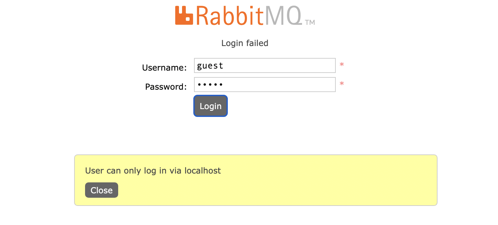
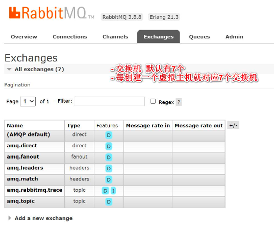
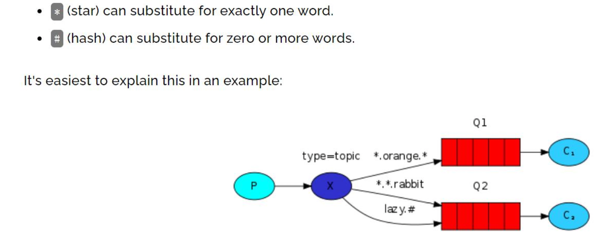

RabbitMq

官网:https://www.rabbitmq.com/

### 1.概述

**1**、**RabbitMQ** **是一个流行的开源消息中间件，它实现了高级消息队列协议(**AMQP**)，为 分布式应用程序提供了可靠的、异步的消息传递机制。**

**2**、**RabbitMQ** **可以在多个进程、多个主机之间传递消息，因此它经常用于解耦分布式应 用程序中的各个组件，或者实现任务队列和日志收集等应用场景**

**3**、RabbitMQ **的核心概念是生产者、消费者和队列。
** **(1)** **生产者将消息发布到队列中
** **(2)** **消费者从队列中获取消息并进行处理
** **(3) RabbitMQ** **的优点包括可靠性、灵活性和可扩展性。它使用消息确认机制确保消息能**够成功传递，同时提供多种交换机类型和绑定方式，以支持不同的消息路由场景

**(4) RabbitMQ** **可以满足高负载、高可用性和可扩展性的要求**

**3**、**RabbitMQ** **提供了丰富的客户端库，包括** **Java**、**Python**、Ruby**、**C# **等，这些库可以 方便地集成到各种编程语言和框架中，以实现高效的消息传递。因此，**RabbitMQ **在大规 模分布式系统中得到了广泛的应用**。

### 2.安装

环境:centos7

rabbitmq需要erlang环境

```shell
rpm -ivh erlang-21.3-1.el7.x86_64.rpm
# rabbitmq 需要的依赖包, 需要联网
yum install socat -y
rpm -ivh rabbitmq-server-3.8.8-1.el7.noarch.rpm
```

**启动**

```shell
# 添加开机启动 RabbitMQ 服务
chkconfig rabbitmq-server on
# 启动服务
/sbin/service rabbitmq-server start
# 查看服务状态
/sbin/service rabbitmq-server status
# 停止服务指令
/sbin/service rabbitmq-server stop
```

web管理插件

```shell
# 开启 web 管理插件
rabbitmq-plugins enable rabbitmq_management
```

开放防火墙端口(15672,**web** 管控台访问端口)

```shell
firewall-cmd --zone=public --add-port=15672/tcp --permanent
firewall-cmd --reload
# 查看端口
firewall-cmd --list-ports
```

访问 **http://192.168.2.85:15672 **

账号/密码: guest/guest



提示不能远程登录, 修改配置,让guest可以远程登录

**-** **在**/etc/rabbitmq** **目录下创建** **rabbitmq.config**, 内容如下

```shell
[{rabbit,[{loopback_users,[]}]}].
```

重启服务

```shell
systemctl restart rabbitmq-server.service
```

guest




**-** **添加用户**


添加虚拟主机


设置test用户可以访问虚拟主机/test, 在admin菜单栏选择test用户点击进入即可


### 3.springboot集成RabbitMQ


**P :** **消息的发送者生产者**

**C :** **消息的接受者消费者**

**中间表示队列**

引入mq的依赖

```xml
<!--rabbitmq-需要的 AMQP 依赖-->
<dependency>
    <groupId>org.springframework.boot</groupId>
    <artifactId>spring-boot-starter-amqp</artifactId>
</dependency>
```

springboot配置文件

```properties
#rabbitmq
spring.rabbitmq.host=192.168.2.85
spring.rabbitmq.port=5672
spring.rabbitmq.username=guest
spring.rabbitmq.password=guest
spring.rabbitmq.virtual-host=/
#启动时是否默认启动容器，默认为 true
spring.rabbitmq.listener.simple.auto-startup=true
#消费者最小数量
spring.rabbitmq.listener.simple.concurrency=10
#消费者最大数量
spring.rabbitmq.listener.simple.max-concurrency=10
#限制消费者每次只能处理一条消息, 处理完毕才能继续下一条数据
spring.rabbitmq.listener.simple.prefetch=1
#消息被拒绝后, 重新进入消息队列
spring.rabbitmq.listener.simple.default-requeue-rejected=true
#启用重试机制,默认false, 如果消失处理失败, 是否重试
spring.rabbitmq.template.retry.enabled=true
#设置初始化的重试的时间间隔
spring.rabbitmq.template.retry.initial-interval=1000ms
##重试最大次数，默认为 3 次
spring.rabbitmq.template.retry.max-attempts=3
##重试最大时间间隔，默认 10s
spring.rabbitmq.template.retry.max-interval=10s
# 重试的间隔乘数，配置2的话, 一二三次重试时间间隔[1 2 4] * 重试时间间隔
spring.rabbitmq.template.retry.multiplier=1
```

参考 https://blog.csdn.net/begefefsef/article/details/123790849

rabbitmq配置类

```java
@Configuration
public class RabbitMQConfig {
    private static final String QUEUE_NAME = "queue";
    /**
     * 1. 配置队列
     * 2. 队列名为 queue
     * 3. durable: 队列是否持久化。 队列默认是存放到内存中的，rabbitmq 重启则丢失，
     * 若想重启之后还存在则队列要持久化 则设置为true
     * 保存到 Erlang 自带的 Mnesia 数据库中，当 rabbitmq 重启之后会读取该数据库
     */
    @Bean
    public Queue queue() {
        return new Queue(QUEUE_NAME,true);
    }
}
```

发送者

```java
@Component
@Slf4j
public class MQSender {
    // 操作rabbitmq的模板,类似redisTemplate
    @Autowired
    private RabbitTemplate rabbitTemplate;
    // 发消息
    public void send(Object msg) {
        log.info("发送消息: {}", msg);
        // 向 queue 队列发送消息
        rabbitTemplate.convertAndSend("queue",msg);
    }
}
```

接收者

```java
@Component
@Slf4j
public class MQReceiver {
    // 接收消息
    @RabbitListener(queues = {"queue"})
    public void receive(Object msg) {
        log.info("接收到消息: {}", msg);
    }
}
```

测试

```java
@Controller
public class RabbitMQHandler {
    @Autowired
    private MQSender mqSender;
    @RequestMapping("/mq")
    @ResponseBody
    public void send() {
        mqSender.send("hello, rabbit mq");
    }
}
```

日志

```java
2025-04-12 15:00:48.672  INFO 10732 --- [p-nio-80-exec-4] org.xxx.seckill.rabbitmq.MQSender        : 发送消息: hello, rabbit mq
2025-04-12 15:00:48.692  INFO 10732 --- [ntContainer#0-9] org.xxx.seckill.rabbitmq.MQReceiver      : 接收到消息: (Body:'hello, rabbit mq' MessageProperties [headers={}, contentType=text/plain, contentEncoding=UTF-8, contentLength=0, receivedDeliveryMode=PERSISTENT, priority=0, redelivered=false, receivedExchange=, receivedRoutingKey=queue, deliveryTag=1, consumerTag=amq.ctag-UT1NL-DrQ-GsinuOItQoGQ, consumerQueue=queue])
```

**当前案例**走的是**默认交换机** **(AMQP Default)**

### 4.rabbitMQ的工作模式

#### fanout

fanout就是广播模式, 就是把交换机**(Exchange)**里的消息发送给所有绑定该交换机的 队列，忽略 **routingKey(**也就是路由**)**


**生产者把消息发送给指定的交换机**

**再把交换机的消息发送给所有绑定该交换机的队列**,**忽略** **routingKey/**路由

配置

```java
//-- fanout
private static final String QUEUE_FANOUT_01 = "queue_fanout_01";
private static final String QUEUE_FANOUT_02 = "queue_fanout_02";
private static final String FANOUT_EXCHANGE = "fanoutExchange";
@Bean
public Queue fanoutQueue01() {
    return new Queue(QUEUE_FANOUT_01);
}

@Bean
public Queue fanoutQueue02() {
    return new Queue(QUEUE_FANOUT_02);
}

// 创建fanout交换机
@Bean
public FanoutExchange fanoutExchange() {
    return new FanoutExchange(FANOUT_EXCHANGE);
}

// 将QUEUE_FANOUT_01绑定到fanout交换机
@Bean
public Binding binding01() {
    return  BindingBuilder.bind(fanoutQueue01()).to(fanoutExchange());
}

// 将QUEUE_FANOUT_02绑定到fanout交换机
@Bean
public Binding binding02() {
    return  BindingBuilder.bind(fanoutQueue02()).to(fanoutExchange());
}
```

发送者

```java
// fanout:发送消息到交换机
public void sendFanout(Object msg) {
    log.info("fanout:发送消息: {}", msg);
    rabbitTemplate.convertAndSend("fanoutExchange","", msg);
}
```

接收者

```java
// 接收fanout消息, fanout交换机绑了两个队列--01
@RabbitListener(queues = {"queue_fanout_01"})
public void receiveFanout01(Object msg) {
    log.info("[queue_fanout_01]接收到消息: {}", msg);
}

// 接收fanout消息, fanout交换机绑了两个队列--02
@RabbitListener(queues = {"queue_fanout_02"})
public void receiveFanout02(Object msg) {
    log.info("[queue_fanout_02]接收到消息: {}", msg);
}
```

测试代码: http://localhost/mqFanout

```java
@RequestMapping("/mqFanout")
@ResponseBody
public void sendFanout() {
    mqSender.sendFanout("Fanout, I am rabbit mq");
}
```

```java
2025-04-12 15:30:08.449  INFO 10961 --- [p-nio-80-exec-1] org.xxx.seckill.rabbitmq.MQSender        : fanout:发送消息: Fanout, I am rabbit mq
2025-04-12 15:30:08.481  INFO 10961 --- [ntContainer#0-1] org.xxx.seckill.rabbitmq.MQReceiver      : [queue_fanout_01]接收到消息: (Body:'Fanout, I am rabbit mq' MessageProperties [headers={}, contentType=text/plain, contentEncoding=UTF-8, contentLength=0, receivedDeliveryMode=PERSISTENT, priority=0, redelivered=false, receivedExchange=fanoutExchange, receivedRoutingKey=, deliveryTag=1, consumerTag=amq.ctag-R7DhgB01hO3L5LgIyCecXg, consumerQueue=queue_fanout_01])
2025-04-12 15:30:08.481  INFO 10961 --- [ntContainer#1-1] org.xxx.seckill.rabbitmq.MQReceiver      : [queue_fanout_02]接收到消息: (Body:'Fanout, I am rabbit mq' MessageProperties [headers={}, contentType=text/plain, contentEncoding=UTF-8, contentLength=0, receivedDeliveryMode=PERSISTENT, priority=0, redelivered=false, receivedExchange=fanoutExchange, receivedRoutingKey=, deliveryTag=1, consumerTag=amq.ctag-1_JI44EPk3doCKoCu1U9xw, consumerQueue=queue_fanout_02])
```

#### direct

**1**、**direct** 就是路由模式**,** 路由模式是在使用交换机的同时，生产者指定路由发送数据，消费者绑定路由接受数据。

**2** **、与广播模式不同的是，广播模式只要是绑定了交换机的队列都会收到生产者向交换 机推送过来的数据。而路由模式下加了一个路由设置，生产者向交换机发送数据时，会 声明发送给交换机下的哪个路由，并且只有当消费者的队列绑定了交换机并且声明了路 由，才会收到数据**


**- P** **:消息的生产者**

**- X** **:交换机**

**-** **红色:队列**

**- C1** **，** **C2** **:消息消费者**

**- error** **，** **info** **，** **warning** **:路由**

配置

```java
//- direct
private static final String QUEUE_DIRECT_01 = "queue_direct_01";
private static final String QUEUE_DIRECT_02 = "queue_direct_02";
private static final String DIRECT_EXCHANGE = "directExchange";
// 路由
private static final String ROUTING_KEY_01 = "queue.red";
private static final String ROUTING_KEY_02 = "queue.blue";

@Bean
public Queue directQueue01() {
  return new Queue(QUEUE_DIRECT_01);
}

@Bean
public Queue directQueue02() {
  return new Queue(QUEUE_DIRECT_02);
}

@Bean
public DirectExchange directExchange() {
  return new DirectExchange(DIRECT_EXCHANGE);
}

// 把队列绑定到交换机上, 同时配置了路由
// queue01绑定路由red
@Bean
public Binding binding03() {
  return BindingBuilder.bind(directQueue01()).to(directExchange()).with(ROUTING_KEY_01);
}

// queue02绑定路由blue
@Bean
public Binding binding04() {
  return BindingBuilder.bind(directQueue02()).to(directExchange()).with(ROUTING_KEY_02);
}
```

```java
// direct:发送消息到交换机-routingKey=queue.red
public void sendDirect01(Object msg) {
  log.info("direct:发送消息:queue.red: {}", msg);
  rabbitTemplate.convertAndSend("directExchange","queue.red", msg);
}

// direct:发送消息到交换机-routingKey=queue.blue
public void sendDirect02(Object msg) {
  log.info("direct:发送消息:queue.blue: {}", msg);
  rabbitTemplate.convertAndSend("directExchange","queue.blue", msg);
}
```

```java
// 接收direct消息, direct交换机绑了两个队列--01
@RabbitListener(queues = {"queue_direct_01"})
public void receiveDirect01(Object msg) {
  log.info("[queue_direct_01]接收到消息: {}", msg);
}

// 接收direct消息, direct交换机绑了两个队列--02
@RabbitListener(queues = {"queue_direct_02"})
public void receiveDirect02(Object msg) {
  log.info("[queue_direct_02]接收到消息: {}", msg);
}
```

test

```java
@RequestMapping("/mqDirect01")
@ResponseBody
public void sendDirect01() {
  mqSender.sendDirect01("Direct01, I am rabbit mq");
}

@RequestMapping("/mqDirect02")
@ResponseBody
public void sendDirect02() {
  mqSender.sendDirect02("Direct02, I am rabbit mq");
}
```

```java
2025-04-12 15:57:46.901  INFO 11137 --- [p-nio-80-exec-1] org.xxx.seckill.rabbitmq.MQSender        : direct:发送消息:queue.red: Direct01, I am rabbit mq
2025-04-12 15:57:46.927  INFO 11137 --- [ntContainer#3-1] org.xxx.seckill.rabbitmq.MQReceiver      : [queue_direct_01]接收到消息: (Body:'Direct01, I am rabbit mq' MessageProperties [headers={}, contentType=text/plain, contentEncoding=UTF-8, contentLength=0, receivedDeliveryMode=PERSISTENT, priority=0, redelivered=false, receivedExchange=directExchange, receivedRoutingKey=queue.red, deliveryTag=1, consumerTag=amq.ctag-3qVpS34COfrt0__WvgAj4Q, consumerQueue=queue_direct_01])
2025-04-12 15:58:39.316  INFO 11137 --- [p-nio-80-exec-2] org.xxx.seckill.rabbitmq.MQSender        : direct:发送消息:queue.blue: Direct02, I am rabbit mq
2025-04-12 15:58:39.336  INFO 11137 --- [ntContainer#4-1] org.xxx.seckill.rabbitmq.MQReceiver      : [queue_direct_02]接收到消息: (Body:'Direct02, I am rabbit mq' MessageProperties [headers={}, contentType=text/plain, contentEncoding=UTF-8, contentLength=0, receivedDeliveryMode=PERSISTENT, priority=0, redelivered=false, receivedExchange=directExchange, receivedRoutingKey=queue.blue, deliveryTag=1, consumerTag=amq.ctag-bFU_cmiuCdq_F1g_o0BKFQ, consumerQueue=queue_direct_02])
```


#### topic

**1**、**direct** 模式会造成路由 **RoutingKey** 太多**,** 而实际开发中往往是按照某个规则来进行路

由匹配的**, RabbitMQ** 提供了 **Topic** 模式**/**主题模式来适应这种需求**.
 2** **、** **Topic** **模式是** **direct** **模式上的一种扩展** **/** **叠加** **,** **扩展** **/** **叠加了模糊路由** **RoutingKey** **的模**

**式** **,** **可以理解为是模糊的路由匹配模式
** **1) **  *(星号):可以(只能)匹配一个单词

**2) #** **(井号):可以匹配多个单词(或者零个)**



quick.orange.rabbit 可以匹配到 Q1 Q2

lazy.orange.elephant 可以匹配到 Q1 Q2

lazy.brown.fox 可以匹配到Q2

quick.orange.fox 可以匹配到 Q1

quick.brown.fox 没有匹配-消息将会lost

quick.orange.new.rabbit 没有匹配-消息将会lost

lazy.orange.new.rabbit 可以匹配到 Q2, 消息发送到Q2

