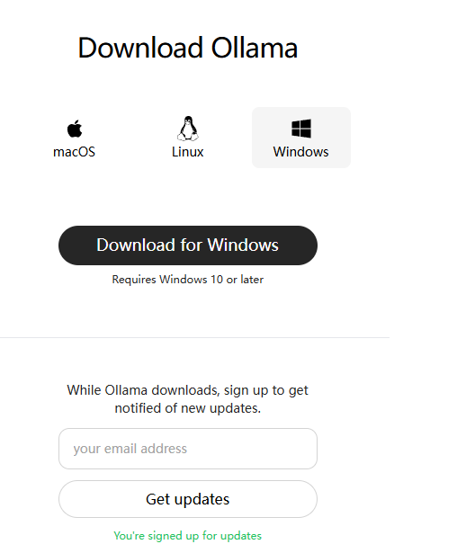
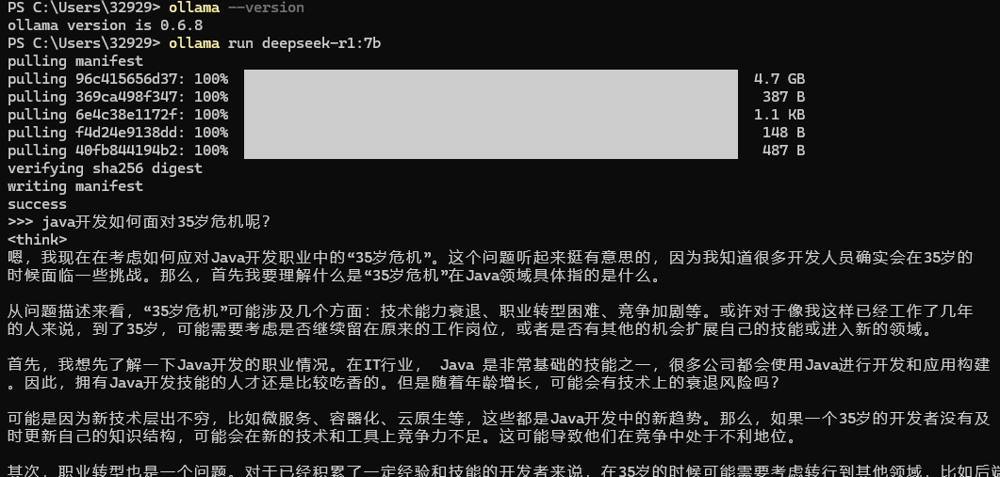

# 在本地部署deepseek

## 使用ollama方式

下载ollama https://ollama.com/download/windows



下载完成后安装，下一步即可

安装完成后，打开powershell (win+r,输powershell)

```shell
# 查看ollama版本号，如果安装成功的话，有输出的
ollama --version
# 安装deepseek模型
# deepseek-r1:7b的详细解释在下面
ollama run deepseek-r1:7b
# 然后就可以开始对话了
```




### 下载deepseek

在ollama上搜索deepseek

https://ollama.com/library?q=deepseek&sort=popular

挑选合适自己机器配置的deepseek模型

**可以直接问deepseek（在线版本），输入你的机型配置：显卡型号，CPU，内存，磁盘空间等，但是主要还是看显卡**

在 **Ollama** 上，DeepSeek 提供了多个模型，每个模型有不同的特点和适用场景。以下是它们的对比和推荐选择：

------

#### **1. 模型分类与推荐**

| 模型名称              | 类型           | 参数规模              | 适合场景                 | 显存需求（4-bit量化） | 推荐度（基于你的3060Ti 8GB） |
| :-------------------- | :------------- | :-------------------- | :----------------------- | :-------------------- | :--------------------------- |
| **deepseek-llm**      | **通用大模型** | 6.7B/67B              | 通用问答、文本生成       | ~6GB (6.7B-Q4)        | ⭐⭐⭐⭐（6.7B-Q4）              |
| **deepseek-v2**       | **通用大模型** | 16b236b               | 通用任务（可能比LLM新）  | 需测试                | ⭐⭐⭐（若显存足够）            |
| **deepseek-v3**       | **通用大模型** | 671B                  | 最新通用模型（可能更强） | 需测试                | ⭐⭐⭐⭐（优先尝试）             |
| **deepseek-coder**    | **代码专用**   | 1.3b6.7b33b           | 代码生成、补全、解释     | ~3GB (1.3B-Q4)        | ⭐⭐⭐⭐⭐（低显存友好）          |
| **deepseek-coder-v2** | **代码专用**   | 16/232B               | 代码任务（可能比v1强）   | 需测试                | ⭐⭐⭐⭐（优先v2）               |
| **deepseek-r1**       | **研究版？**   | 1.5b7b8b14b32b70b671b | 可能为实验性模型         | 不推荐新手            | ⭐⭐                           |
| **deepseek-v2.5**     | **中间版本？** | 236b                  | 可能是v2的改进版         | 需测试                |                              |


#### 2.参数规模

| **模型参数规模**  | **典型用途**             | **CPU 建议**                             | **GPU 建议**                                    | **内存建议 (RAM)** | **磁盘空间建议**  | **适用场景**                      |
| :---------------- | :----------------------- | :--------------------------------------- | :---------------------------------------------- | :----------------- | :---------------- | :-------------------------------- |
| **1.5b (15亿)**   | 小型推理、轻量级任务     | 4核以上 (Intel i5 / AMD Ryzen 5)         | 可选，入门级 GPU (如 NVIDIA GTX 1650, 4GB 显存) | 8GB                | 10GB 以上 SSD     | 小型 NLP 任务、文本生成、简单分类 |
| **7b (70亿)**     | 中等推理、通用任务       | 6核以上 (Intel i7 / AMD Ryzen 7)         | 中端 GPU (如 NVIDIA RTX 3060, 12GB 显存)        | 16GB               | 20GB 以上 SSD     | 中等规模 NLP、对话系统、文本分析  |
| **14b (140亿)**   | 中大型推理、复杂任务     | 8核以上 (Intel i9 / AMD Ryzen 9)         | 高端 GPU (如 NVIDIA RTX 3090, 24GB 显存)        | 32GB               | 50GB 以上 SSD     | 复杂 NLP、多轮对话、知识问答      |
| **32b (320亿)**   | 大型推理、高性能任务     | 12核以上 (Intel Xeon / AMD Threadripper) | 高性能 GPU (如 NVIDIA A100, 40GB 显存)          | 64GB               | 100GB 以上 SSD    | 大规模 NLP、多模态任务、研究用途  |
| **70b (700亿)**   | 超大规模推理、研究任务   | 16核以上 (服务器级 CPU)                  | 多 GPU 并行 (如 2x NVIDIA A100, 80GB 显存)      | 128GB              | 200GB 以上 SSD    | 超大规模模型、研究、企业级应用    |
| **671b (6710亿)** | 超大规模训练、企业级任务 | 服务器级 CPU (如 AMD EPYC / Intel Xeon)  | 多 GPU 集群 (如 8x NVIDIA A100, 320GB 显存)     | 256GB 或更高       | 1TB 以上 NVMe SSD | 超大规模训练、企业级 AI 平台      |

